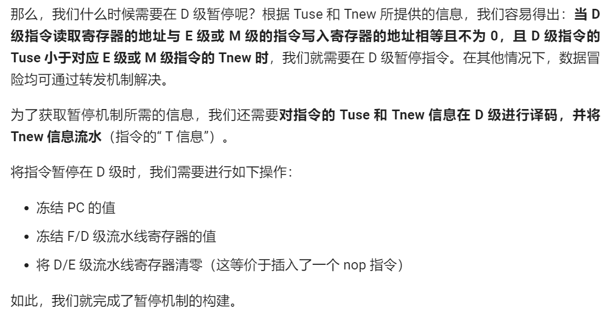

#Verilog流水线CPU设计文档

###一、 CPU设计方案综述

####（一） 总体设计概述

使用Verilog开发一个简单的流水线CPU，总体概述如下：

1. 此CPU为32位CPU

2. 此CPU为流水线设计

3. 此CPU支持的指令集为：

   {add, sub, ori, lw, sw, beq, lui, nop,jal,j,jr}

4. add, sub不支持溢出

####（二） 关键模块定义


## 主代码mips

```verilog
`timescale 1ns / 1ps
module mips(input clk,
            input reset);
    //////////////////////////////////////////////
    //datapath_for_wire_and_reg
    //datapath
    wire stall;
    //IFU
    wire [31:0] npc;
    wire [31:0] F_Instr;
    wire [31:0] F_PC8;
    wire [31:0] F_PC;
    
    //IF_ID
    wire [31:0] D_Instr;
    wire [31:0] D_PC8;
    wire [31:0] D_PC;
    //////////////////////////////////////////////
    //Grf
    wire [4:0]  d_rs;
    wire [4:0]  d_rt;
    wire [4:0]  d_A3;
    wire [31:0] WD;
    wire [31:0] d_RD1;
    wire [31:0] d_RD2;
    //EXT
    wire [2:0] d_SignExt;
    //NPC
    wire [31:0] ra;
    wire [31:0] d_imm32;
    wire [25:0] d_J_address;
    wire [3:0]  d_branch;
    wire d_ALU_change;
    //B_transfer
    wire [31:0] d_b_transfer1;
    wire [31:0] d_b_transfer2;
    wire [3:0] d_B_change;
    //Controller
    wire [5:0] d_opcode;
    wire [5:0] d_func;
    wire [4:0] d_rd;
    wire [4:0] d_shamt;
    wire [15:0] d_imm16;
    wire [6:0] d_ALUop;
    wire d_Wegrf;
    wire d_WeDm;
    wire [3:0] d_AluSrc1;
    wire [3:0] d_AluSrc2;
    wire [7:0] d_WhichtoReg;
    wire [3:0] d_RegDst;
    wire [3:0] d_DM_type;
    
    //ID_EX
    wire [1:0] d_Tnew;
    wire [31:0] e_RD1;
    wire [31:0] e_RD2;
    wire [4:0] e_shamt;
    wire [4:0] e_rs,e_rt,e_rd;
    wire [4:0]  e_A3;
    wire [31:0] e_imm32;
    wire [31:0] E_PC;
    wire [31:0] E_PC8;
    wire [1:0] e_Tnew;
    wire e_Wegrf;
    wire e_WeDm;
    wire [6:0] e_ALUop;
    wire [3:0] e_AluSrc1;
    wire [3:0] e_AluSrc2;
    wire [7:0] e_WhichtoReg;
    wire [3:0] e_RegDst;
    wire [3:0] e_DM_type;
    //////////////////////////////////////////////
    //ALU
    wire [31:0] e_A;
    wire [31:0] e_B;
    wire [31:0] e_res;
    //EX_MEM
    wire [31:0] m_RD2;
    wire [31:0] m_res;
    wire [4:0]  m_A3;
    wire [4:0] m_rt;
    wire [31:0] M_PC;
    wire [31:0] M_PC8;
    wire [1:0] m_Tnew;
    wire m_Wegrf;
    wire m_WeDm;
    wire [7:0] m_WhichtoReg;
    wire [3:0] m_RegDst;
    wire [3:0] m_DM_type;
    wire [31:0] m_imm32;
    //////////////////////////////////////////////
    //DM
    wire [31:0] m_Address;
    wire [31:0] m_RD;
    //MEM_WB
    wire [1:0] w_Tnew;
    wire [4:0]  w_A3;
    wire [31:0] w_res;
    wire [31:0] w_RD;
    wire [31:0] W_PC;
    wire [31:0] W_PC8;
    wire w_Wegrf;
    wire [7:0] w_WhichtoReg;
    wire [3:0] w_RegDst;
    wire [31:0] w_imm32;
    //////////////////////////////////////////////
    //main_part
    wire [1:0] D_Tuse_rs,D_Tuse_rt;
    wire [1:0] d_SelB_D1,d_SelB_D2,d_SelALU_A,d_SelALU_B;
    wire d_SelDM;
    wire [1:0] d_SelJr;
    wire [31:0] e_B_f;
    wire [31:0] M_WD_f;//DM
    //HazardUnit
    HazardUnit hzu(
    .D_A1(d_rs),
    .D_A2(d_rt),
    .E_A1(e_rs),
    .E_A2(e_rt),
    .M_A2(m_rt),
    .E_A3(e_A3),
    .M_A3(m_A3),
    .W_A3(w_A3),
    .E_Wegrf(e_Wegrf),
    .M_Wegrf(m_Wegrf),
    .W_Wegrf(w_Wegrf),
    
    
    .D_Tuse_rs(D_Tuse_rs),
    .D_Tuse_rt(D_Tuse_rt),
    .E_Tnew(e_Tnew),
    .M_Tnew(m_Tnew),
    .W_Tnew(w_Tnew),
    
    .SelB_D1(d_SelB_D1),
    .SelB_D2(d_SelB_D2),
    .SelALU_A(d_SelALU_A),
    .SelALU_B(d_SelALU_B),
    .SelDM(d_SelDM),
    .SelJr(d_SelJr),
    .stall(stall)
    );
    //////////////////////////////////////////////F//////////////////////////////////////////////////////////////////////////////////////////
    //IFU
    PC pc(
    .clk(clk),
    .reset(reset),
    .NPC(npc),
    .en(~stall),
    
    .Instr(F_Instr),
    //.PC8(F_PC8),
    .PC(F_PC)
    );
    //IF_ID
    IF F_reg(
    .clk(clk),
    .reset(reset),
    .en(~stall),
    .F_Instr(F_Instr),
    .F_PC(F_PC),
    //.F_PC8(F_PC8),
    
    .D_Instr(D_Instr),
    .D_PC(D_PC)
    //.D_PC8(D_PC8)
    );
    //////////////////////////////////////////////D//////////////////////////////////////////////////////////////////////////////////////////
    //Grf
    assign 	WD = (w_WhichtoReg == 4'b0001)?w_res:
    (w_WhichtoReg == 4'b0010)?w_RD:
    (w_WhichtoReg == 4'b0100)?w_imm32:
    W_PC8;
    GRF grf(
    .A1(d_rs),
    .A2(d_rt),
    .A3(w_A3),
    .WD(WD),
    .clk(clk),
    .reset(reset),
    .WE(w_Wegrf),
    .WPC(W_PC),
    
    .RD1(d_RD1),
    .RD2(d_RD2)
    );
    //EXT
    EXT ext(
    .imm16(d_imm16),
    .sign(d_SignExt),
    
    .imm32(d_imm32)
    );
    //NPC
    assign ra = (d_SelJr == 2'b10)&&(d_branch == 4'b1000)?E_PC8:
    (d_SelJr == 2'b01)&&(d_branch == 4'b1000)?M_PC8:
    d_b_transfer1;
    
    NPC Npc(
    .F_PC(F_PC),
    .D_PC(D_PC),
    .offset(d_imm32),
    .imm26(d_J_address),
    .ra(ra),
    .branch(d_branch),
    .ALU_change(d_ALU_change),
    
    .npc(npc),
    .PC8(D_PC8)
    );
    //B_transfer
    assign d_b_transfer1 = (d_SelB_D1 == 2'b00)?d_RD1:
    (d_SelB_D1 == 2'b01)?m_res:
    e_res;
    assign d_b_transfer2 = (d_SelB_D2 == 2'b00)?d_RD2:
    (d_SelB_D2 == 2'b01)?m_res:
    e_res;
    B_transfer b_trans(
    .A(d_b_transfer1),
    .B(d_b_transfer2),
    .Type(d_B_change),
    
    .ALU_change(d_ALU_change)
    );
    //controller
    assign 	d_opcode    = D_Instr[31:26];
    assign 	d_rs        = D_Instr[25:21];
    assign 	d_rt        = D_Instr[20:16];
    assign 	d_rd        = D_Instr[15:11];
    assign 	d_shamt     = D_Instr[10:6];
    assign 	d_func      = D_Instr[5:0];
    assign 	d_imm16     = D_Instr[15:0];
    assign 	d_J_address = D_Instr[25:0];
    Controller controller(
    .op(d_opcode),
    .func(d_func),
    
    .ALUop(d_ALUop),
    .Wegrf(d_Wegrf),
    .WeDm(d_WeDm),
    .branch(d_branch),
    .AluSrc1(d_AluSrc1),
    .AluSrc2(d_AluSrc2),
    .WhichtoReg(d_WhichtoReg),
    .RegDst(d_RegDst),
    .SignExt(d_SignExt),
    .B_change(d_B_change),
    .DM_type(d_DM_type),
    
    .D_Tuse_rs(D_Tuse_rs),
    .D_Tuse_rt(D_Tuse_rt),
    .D_Tnew(d_Tnew)
    );
    //ID_EX
    ID D_reg(
    .clk(clk),
    .reset(reset),
    .clr(stall),
    .D_RD1(d_b_transfer1),
    .D_RD2(d_b_transfer2),
    .D_instr_s(d_shamt),
    .D_A1(d_rs),
    .D_A2(d_rt),
    .D_A3(d_rd),
    .D_imm32(d_imm32),
    .D_PC(D_PC),
    .D_PC8(D_PC8),
    .D_Tnew(d_Tnew),
    .D_Wegrf(d_Wegrf),
    .D_WeDm(d_WeDm),
    .D_ALUop(d_ALUop),
    .D_AluSrc1(d_AluSrc1),
    .D_AluSrc2(d_AluSrc2),
    .D_WhichtoReg(d_WhichtoReg),
    .D_RegDst(d_RegDst),
    .D_DM_type(d_DM_type),
    
    .E_RD1(e_RD1),
    .E_RD2(e_RD2),
    .E_instr_s(e_shamt),
    .E_A1(e_rs),
    .E_A2(e_rt),
    .E_A3(e_rd),
    .E_imm32(e_imm32),
    .E_PC(E_PC),
    .E_PC8(E_PC8),
    .E_Tnew(e_Tnew),
    .E_Wegrf(e_Wegrf),
    .E_WeDm(e_WeDm),
    .E_ALUop(e_ALUop),
    .E_AluSrc1(e_AluSrc1),
    .E_AluSrc2(e_AluSrc2),
    .E_WhichtoReg(e_WhichtoReg),
    .E_RegDst(e_RegDst),
    .E_DM_type(e_DM_type)
    );
    //////////////////////////////////////////////E//////////////////////////////////////////////////////////////////////////////////////////
    assign 	e_A3 = (e_RegDst == 4'b0001)?e_rd:
    (e_RegDst == 4'b0010)?e_rt:
    5'b11111;
    //ALU
    assign e_A = 	(e_AluSrc1 == 4'b0001)?((d_SelALU_A == 2'b00)?e_RD1:
    ((d_SelALU_A == 2'b01)?WD:
    m_res)):
    e_B_f;
    
    
    assign e_B_f = ((d_SelALU_B == 2'b00)?e_RD2:
    (d_SelALU_B == 2'b01)?WD:
    m_res);
    
    
    assign e_B = 	(e_AluSrc2 == 4'b0001)?e_B_f:
    (e_AluSrc2 == 4'b0010)?e_imm32:
    ({{27{1'b0}},e_shamt});
    
    ALU alu(
    .A(e_A),
    .B(e_B),
    .ALUop(e_ALUop),
    
    .res(e_res)
    );
    //EX_MEM
    EX E_reg(
    .clk(clk),
    .reset(reset),
    .E_A2(e_rt),
    .E_A3(e_A3),
    .E_RD2(e_B_f),
    .E_ALUout(e_res),
    .E_PC(E_PC),
    .E_PC8(E_PC8),
    .E_Tnew(e_Tnew),
    .E_Wegrf(e_Wegrf),
    .E_WeDm(e_WeDm),
    .E_WhichtoReg(e_WhichtoReg),
    .E_RegDst(e_RegDst),
    .E_DM_type(e_DM_type),
    .E_imm32(e_imm32),
    
    .M_A2(m_rt),
    .M_A3(m_A3),
    .M_RD2(m_RD2),
    .M_ALUout(m_res),
    .M_PC(M_PC),
    .M_PC8(M_PC8),
    .M_Tnew(m_Tnew),
    .M_Wegrf(m_Wegrf),
    .M_WeDm(m_WeDm),
    .M_WhichtoReg(m_WhichtoReg),
    .M_RegDst(m_RegDst),
    .M_DM_type(m_DM_type),
    .M_imm32(m_imm32)
    );
    //////////////////////////////////////////////M//////////////////////////////////////////////////////////////////////////////////////////
    //DM
    assign m_Address = {m_res[31:2],{2{1'b0}}};
    assign M_WD_f    = (d_SelDM)?WD:m_RD2;
    DM dm(
    .Address(m_Address),
    .WD(M_WD_f),
    .clk(clk),
    .reset(reset),
    .pc(M_PC),
    .WE(m_WeDm),
    .DM_type(m_DM_type),
    
    .RD(m_RD)
    );
    //MEM_WE
    MEM M_reg(
    .clk(clk),
    .reset(reset),
    .M_A3(m_A3),
    .M_ALUout(m_res),
    .M_RD(m_RD),
    .M_PC(M_PC),
    .M_PC8(M_PC8),
    .M_Wegrf(m_Wegrf),
    .M_WhichtoReg(m_WhichtoReg),
    .M_RegDst(m_RegDst),
    .M_imm32(m_imm32),
    .M_Tnew(m_Tnew),
    
    .W_A3(w_A3),
    .W_ALUout(w_res),
    .W_RD(w_RD),
    .W_PC(W_PC),
    .W_PC8(W_PC8),
    .W_Wegrf(w_Wegrf),
    .W_WhichtoReg(w_WhichtoReg),
    .W_RegDst(w_RegDst),
    .W_imm32(w_imm32),
    .W_Tnew(w_Tnew)
    );
    //////////////////////////////////////////////W//////////////////////////////////////////////////////////////////////////////////////////
endmodule

```


## F级流水线

####1. PC

（1） 端口说明

<center>表1-IFU端口说明</center>

| 序号 | 信号名      | 方向 | 描述                                                        |
| ---- | ----------- | ---- | ----------------------------------------------------------- |
| 1    | clk         | I    | 时钟信号                                                    |
| 2    | reset       | I    | 同步复位信号，将PC值置为0x0000_3000：<br>0：无效<br>1：复位 |
| 3    | en          | I    | 使能信号，决定是否阻塞                                      |
| 4    | NPC[31:0]   | I    | 下一周期PC的地址                                            |
| 5    | instr[31:0] | O    | 将IM中，要执行的指令输出                                    |
| 6    | PC[31:0]    | O    | 当前执行的PC                                                |


（2） 功能定义

<center>表2-IFU功能定义</center>

| 序号 | 功能       | 描述                          |
| ---- | ---------- | ----------------------------- |
| 1    | 复位       | reset有效时，PC置为0x00000000 |
| 2    | 更新PC的值 | 将PC赋值为NPC                 |
| 3    | 输出指令   | 根据PC的值，取出IM中的指令    |

```verilog
`timescale 1ns / 1ps
`include "macro.v"
module PC(input clk,
          input reset,
          input en,
          input [31:0] NPC,
			 
          output [31:0] Instr,
         // output [31:0] PC8,
          output [31:0] PC
			 );
    reg [31:0] now_PC = `PC_Initial;
    wire [11:0] Address;
    //transfer
    always @(posedge clk)begin
        if (reset)begin
            now_PC <= `PC_Initial;
        end
        else begin
            if (en)begin
                now_PC <= NPC;
					 if(Instr!=0)begin
                //$display("%d Instr:%h,PC:%h",$time,Instr,PC);
					 end
            end
            else begin
                now_PC <= now_PC;
            end
        end
    end
    assign Address = now_PC[13:2];
    IM im(.Address(Address),.Instr(Instr));
    assign PC  = now_PC;
    //assign PC8  = now_PC+8;

endmodule

```

```verilog
//内置IM
`timescale 1ns / 1ps
module IM(input [11:0] Address,
          output [31:0] Instr);
    reg [31:0] _memory[12'hfff:12'hc00];
    integer i = 0;
    initial begin
        for(i=12'hc00;i<=12'hfff;i=i+1)begin
            _memory[i] = 0;
        end
			$readmemh("code.txt",_memory,(32'h3000>>2));
			//$readmemh("nop.txt",_memory,(32'h3000>>2));
			//$readmemh("test4.txt",_memory,(32'h3000>>2));
			//$readmemh("p5_code_1.txt",_memory,(32'h3000>>2));
		  	//$readmemh("block.txt",_memory,(32'h3000>>2));
			//$readmemh("transfer.txt",_memory,(32'h3000>>2));
			//$readmemh("test02.txt",_memory,(32'h3000>>2));
			//$readmemh("beq.txt",_memory,(32'h3000>>2));
         //$readmemh("add.txt",_memory,(32'h3000>>2));
    end
    assign Instr = _memory[Address];
endmodule


```

## D级流水线

####1. GRF

（1） 端口说明

<center>表3-GRF端口说明</center>

| 序号 | 信号名    | 方向 | 描述                                                         |
| ---- | --------- | ---- | ------------------------------------------------------------ |
| 1    | clk       | I    | 时钟信号                                                     |
| 2    | reset     | I    | 同步复位信号，将32个寄存器中全部清零<br>1：清零<br>0：无效   |
| 3    | WE        | I    | 写使能信号<br>1：可向GRF中写入数据<br>0：不能向GRF中写入数据 |
| 4    | A1[4:0]   | I    | 5位地址输入信号，指定32个寄存器中的一个，将其中存储的数据读出到RD1 |
| 5    | A2[4:0]   | I    | 5位地址输入信号，指定32个寄存器中的一个，将其中存储的数据读出到RD2 |
| 6    | A3[4:0]   | I    | 5位地址输入信号，指定32个寄存器中的一个，作为RD的写入地址    |
| 7    | WD[31:0]  | I    | 32位写入数据                                                 |
| 8    | WPC[31:0] | I    | 当前写入GRF的PC                                              |
| 9    | RD1[31:0] | O    | 输出A1指定的寄存器的32位数据                                 |
| 10   | RD2[31:0] | O    | 输出A2指定的寄存器的32位数据                                 |

 

（2） 功能定义

<center>表4-GRF功能定义</center>

| 序号 | 功能     | 描述                                                        |
| ---- | -------- | ----------------------------------------------------------- |
| 1    | 同步复位 | reset为1时，将所有寄存器清零                                |
| 2    | 读数据   | 将A1和A2地址对应的寄存器的值分别通过RD1和RD2读出            |
| 3    | 写数据   | 当WE为1且时钟上升沿来临时，将WD写入到A3对应的寄存器内部     |
| 4    | 内部转发 | 当A1和A2之一与A3相等且写入信号为1时，用WD代替RD1或RD2的输出 |

 ```verilog
`timescale 1ns / 1ps
module GRF(input [4:0] A1,
           input [4:0] A2,
           input [4:0] A3,
           input [31:0] WD,
           input clk,
           input reset,
           input WE,
           input [31:0] WPC,
           output [31:0] RD1,
           output [31:0] RD2);
    reg[31:0] RF[31:0];
    integer i = 0;
	 wire eq_A1,eq_A2;
	 assign eq_A1=(A1==A3)&&(A3!=0)&WE;	 
	 assign eq_A2=(A2==A3)&&(A3!=0)&WE;

    initial begin
        for(i=0;i<=31;i=i+1)begin
            RF[i] = 0;
        end
    end
    always@(posedge clk)begin
        if (reset)begin
            for(i=0;i<=31;i=i+1)begin
                RF[i] <= 0;
            end
        end
        else begin
            if (WE)begin
                RF[A3] <= WD;
                RF[0]  <= 0;
                if (A3!=0)begin
                    $display("%d@%h: $%d <= %h",$time, WPC, A3, WD);
                end
            end
            else begin
                RF[A3] <= RF[A3];
            end
        end
    end
    assign RD1 = eq_A1?WD:RF[A1];
    assign RD2 = eq_A2?WD:RF[A2];
endmodule

 ```

####2. EXT

(1) 端口说明

<center>表9-EXT端口说明</center>

| 序号 | 信号名      | 方向 | 描述                                                         |
| ---- | ----------- | ---- | ------------------------------------------------------------ |
| 1    | imm16[15:0] | I    | 代扩展的16位信号                                             |
| 2    | sign[2:0]   | I    | 无符号或符号扩展选择信号<br/>3'b001：无符号扩展<br/>3'b010：符号扩展<br>3'b100:   寄存到高位 |
| 3    | imm32[31:0] | O    | 扩展后的32位的信号                                           |

 

(2) 功能定义

<center>表10-EXT功能定义</center>

| 序号 | 功能       | 描述                                    |
| ---- | ---------- | --------------------------------------- |
| 1    | 无符号扩展 | 当sign为3’b001时，将imm16无符号扩展输出 |
| 2    | 符号扩展   | 当sign为3‘b010时，将imm16符号扩展输出   |
| 3    | 存储到高位 | 当sign为3’100时，将imm16存在高16位      |

 ```verilog
`timescale 1ns / 1ps
module EXT(input [15:0] imm16,
           input [2:0] sign,
           output reg [31:0] imm32);
    always @(*)begin
        if (sign == 3'b001)begin
            imm32 = {{16{1'b0}},imm16};
        end
        else if (sign == 3'b010)begin
            imm32 = {{16{imm16[15]}},imm16};
        end
        else begin
            imm32 = {imm16,{16{1'b0}}};
        end
    end
endmodule

 ```

####3. Controller

(1) 端口说明

<center>表11-Controller端口说明</center>

| 序号 | 信号名          | 方向 | 描述                                                         |
| ---- | --------------- | ---- | ------------------------------------------------------------ |
| 1    | op[5:0]         | I    | instr[31:26]6位控制信号                                      |
| 2    | func[5:0]       | I    | instr[5:0]6位控制信号                                        |
| 3    | AluOp[6:0]      | O    | ALU的控制信号                                                |
| 4    | WeGrf           | O    | GRF写使能信号<br/>0：禁止写入<br/>1：允许写入                |
| 5    | WeDm            | O    | DM的写入信号<br/>0：禁止写入<br/>1：允许写入                 |
| 6    | branch[3:0]     | O    | PC转移位置选择信号<br>4'b0001:其他情况<br>4'b0010:beq<br>4'b0100:j\|\|jal<br>4'b1000:jr; |
| 7    | AluSrc1[3:0]    | O    | 参与ALU运算的第一个数<br/>4'b0001：RD1<br/>4'b0010：RD2      |
| 8    | AluSrc2[3:0]    | O    | 参与ALU运算的第二个数，来自GRF还是imm<br/>4'b0001：RD2<br/>4'b0010：imm32<br/>4'b0100: offset |
| 9    | WhichtoReg[3:0] | O    | 将何种数据写入GRF？<br/>4'b0001：ALU计算结果<br/>4'b0010：DM读出信号<br/>4'b0100：upperImm<br/>4'b1000: PC+4 |
|10|RegDst[3:0]|O|写入GRF的哪个寄存器？<br>4'b0001:rd<br>4'b0010:rt<br>4'b0100:31号寄存器|
|11|SignExt[2:0]|O|拓展方式：<br>3'b001:0拓展<br>3'b010:符号拓展<br>3'b100:存储到高位|
|12|B_change[3:0]|O|B转移的类型<br>4'b0001:beq<br>4'b0010:slt<br>4'b0100:blez|
|13|DM_type[3:0]|O|存取指令类型：<br>4'b0001:lw/sw<br>4'b0010:lh/sh<br>4'b0100:lb/sb|
| 14 | D_Tuse_rs[1:0] | O | 指令的rs寄存器的值从第一次进入D级到被使用的周期数 |
| 15 | D_Tuse_rt[1:0] | O | 指令的rt寄存器的值从第一次进入D级到被使用的周期数 |
| 16 | D_Tnew[1:0] | O | 指令从进入D开始到产生运算结果需要的周期数 |


```verilog
`timescale 1ns / 1ps
module Controller(input [5:0] op,
                  input [5:0] func,
                  output [6:0] ALUop,
                  output Wegrf,
                  output WeDm,
                  output [3:0] branch,
                  output [3:0] AluSrc1,
                  output [3:0] AluSrc2,
                  output [7:0] WhichtoReg,
                  output [3:0] RegDst,
                  output [2:0]SignExt,
                  output [3:0] B_change,
                  output [3:0] DM_type,
                  output [1:0] D_Tuse_rs,
                  output [1:0] D_Tuse_rt,
                  output [1:0] D_Tnew);
//指令定义??
wire _addu,_subu,_ori,_lw,_sw,_lui,_beq,_andi,_jal,_j,_jr,_sll,_add,_sub,_slt,_lb,_sb,_lh,_sh,_addi,_and,_or,_sllv,_blez;
//R??
assign _addu = (op == 6'b000000)&&(func == 6'b100001);
assign _subu = (op == 6'b000000)&&(func == 6'b100011);
assign _add  = (op == 6'b000000)&&(func == 6'b100000);
assign _sub  = (op == 6'b000000)&&(func == 6'b100010);
assign _sll  = (op == 6'b000000)&&(func == 6'b000000);
assign _slt  = (op == 6'b000000)&&(func == 6'b101010);
assign _and  = (op == 6'b000000)&&(func == 6'b100100);
assign _or   = (op == 6'b000000)&&(func == 6'b100101);
assign _sllv = (op == 6'b000000)&&(func == 6'b000100);
assign _jr   = (op == 6'b000000)&&(func == 6'b001000);

//I??
assign _ori  = op == 6'b001101;
assign _lw   = op == 6'b100011;
assign _sw   = op == 6'b101011;
assign _lui  = op == 6'b001111;
assign _beq  = op == 6'b000100;
assign _andi = op == 6'b001100;
assign _addi = op == 6'b001000;
assign _lb   = op == 6'b100000;
assign _sb   = op == 6'b101000;
assign _lh   = op == 6'b100001;
assign _sh   = op == 6'b101001;
assign _blez = op == 6'b000110;

//_j
assign _jal = op == 6'b000011;
assign _j   = op == 6'b000010;
//输出定义
/////////////////////////////////////
//category
wire calc_r,calc_i,shift,shift_v,load,store,b_type,j_type;
assign calc_r  = _add||_sub||_addu||_subu||_and||_or||_slt;
assign calc_i  = _andi||_ori;
assign shift   = _sll;
assign shift_v = 1'b0;
assign load    = _lw||_lh||_lb;
assign store   = _sw||_sh||_sb;
assign b_type  = _beq;
assign j_type  = _jal||_j;
/////////////////////////////////////////////
wire ALUop_6,ALUop_5,ALUop_4,ALUop_3,ALUop_2,ALUop_1,ALUop_0;
assign ALUop_0 = ~ALUop_6&&~ALUop_5&&~ALUop_4&&~ALUop_3&&~ALUop_2&&~ALUop_1;
assign ALUop_1 = _subu||_sub;
assign ALUop_2 = _andi||_and;
assign ALUop_3 = _ori||_or;
assign ALUop_4 = _sll||_sllv;
assign ALUop_5 = 1'b0;
assign ALUop_6 = 1'b0;
/////////////////////////////////////////
wire branch_3,branch_2,branch_1,branch_0;
assign branch_0 = ~branch_3&&~branch_2&&~branch_1;
assign branch_1 = _beq||_blez;
assign branch_2 = _j||_jal;
assign branch_3 = _jr;
/////////////////////////////////////////
wire AluSrc1_3,AluSrc1_2,AluSrc1_1,AluSrc1_0;
assign AluSrc1_0 = ~AluSrc1_3&&~AluSrc1_2&&~AluSrc1_1;
assign AluSrc1_1 = _sll;
assign AluSrc1_2 = 1'b0;
assign AluSrc1_3 = 1'b0;
/////////////////////////////////////////
wire AluSrc2_3,AluSrc2_2,AluSrc2_1,AluSrc2_0;
assign AluSrc2_0   = ~AluSrc2_3&&~AluSrc2_2&&~AluSrc2_1;
assign AluSrc2_1   = _lw||_sw||_ori||_andi||_sb||_lb||_sh||_lh||_addi||_lui;
assign AluSrc2_2   = _sll;
//assign AluSrc2_2 = 1'b0;
assign AluSrc2_3   = _blez;
/////////////////////////////////////////
wire WhichtoReg_7,WhichtoReg_6,WhichtoReg_5,WhichtoReg_4,WhichtoReg_3,WhichtoReg_2,WhichtoReg_1,WhichtoReg_0;
assign WhichtoReg_0 = ~WhichtoReg_1&&~WhichtoReg_2&&~WhichtoReg_3&&~WhichtoReg_4&&~WhichtoReg_5&&~WhichtoReg_6&&~WhichtoReg_7;
assign WhichtoReg_1 = _lw||_lh||_lb;
assign WhichtoReg_2 = _lui;
assign WhichtoReg_3 = _jal;
assign WhichtoReg_4 = _slt;
assign WhichtoReg_5 = 1'b0;
assign WhichtoReg_6 = 1'b0;
assign WhichtoReg_7 = 1'b0;
/////////////////////////////////////////
wire RegDst_3,RegDst_2,RegDst_1,RegDst_0;
assign RegDst_0 = ~RegDst_1&&~RegDst_2&&~RegDst_3;
assign RegDst_1 = _beq||_lui||_lw||_sw||_ori||_andi||_sh||_lh||_sb||_lb||_addi;
assign RegDst_2 = _jal;
assign RegDst_3 = 1'b0;
/////////////////////////////////////////
wire SignExt_2,SignExt_1,SignExt_0;
assign SignExt_0 = ~SignExt_1&&~SignExt_2;
assign SignExt_1 = _lw||_sw||_beq||_andi||_lh||_sh||_lb||_sb||_blez||_addi;
assign SignExt_2 = _lui;
/////////////////////////////////////////
wire B_change_3,B_change_2,B_change_1,B_change_0;
assign B_change_0 = _beq;
assign B_change_1 = _slt;
assign B_change_2 = _blez;
assign B_change_3 = 1'b0;
/////////////////////////////////////////
wire DM_type_3,DM_type_2,DM_type_1,DM_type_0;
assign DM_type_0 = _lw||_sw;
assign DM_type_1 = _lh||_sh;
assign DM_type_2 = _lb||_sb;
assign DM_type_3 = 1'b0;
//////////////////////////////////////////////
wire D_Tuse_rs_1,D_Tuse_rs_0;
assign  D_Tuse_rs_1 = 1'b0;
assign  D_Tuse_rs_0 = calc_r||calc_i||shift_v||load||store;
//////////////////////////////////////////////
wire D_Tuse_rt_1,D_Tuse_rt_0;
assign  D_Tuse_rt_1 = store;
assign  D_Tuse_rt_0 = calc_r||shift||shift_v;
//////////////////////////////////////////////////
//输出结果??
assign ALUop      = {ALUop_6,ALUop_5,ALUop_4,ALUop_3,ALUop_2,ALUop_1,ALUop_0};
assign Wegrf      = _sub||_addu||_subu||_ori||_lui||_sll||_jal||_andi||_lw||_add;
assign WeDm       = _sw||_sh||_sb;
assign branch     = {branch_3,branch_2,branch_1,branch_0};
assign AluSrc1    = {AluSrc1_3,AluSrc1_2,AluSrc1_1,AluSrc1_0};
assign AluSrc2    = {AluSrc2_3,AluSrc2_2,AluSrc2_1,AluSrc2_0};
assign WhichtoReg = {WhichtoReg_7,WhichtoReg_6,WhichtoReg_5,WhichtoReg_4,WhichtoReg_3,WhichtoReg_2,WhichtoReg_1,WhichtoReg_0};
assign RegDst     = {RegDst_3,RegDst_2,RegDst_1,RegDst_0};
assign SignExt    = {SignExt_2,SignExt_1,SignExt_0};
assign B_change   = {B_change_3,B_change_2,B_change_1,B_change_0};
assign DM_type    = {DM_type_3,DM_type_2,DM_type_1,DM_type_0};
assign D_Tuse_rs  = {D_Tuse_rs_1,D_Tuse_rs_0};
assign D_Tuse_rt  = {D_Tuse_rt_1,D_Tuse_rt_0};
assign D_Tnew = (load)?2'd3:
(calc_i||calc_r||shift||shift_v)?2'd2:
(_lui)?2'd1:
2'd0;

endmodule

```

#### 4.NPC

#### NPC（下一指令计算单元）

 该模块根据当前pc（包括D级和F级）和其他控制信号（NPCOp，CMP输出信息），计算出下一指令所在的地址npc，传入IFU模块。

- **端口定义**

  | 信号名     | 方向 | 位宽 | 描述                                                         |
  | :--------- | :--- | :--- | :----------------------------------------------------------- |
  | F_pc       | I    | 32   | F级指令地址                                                  |
  | D_pc       | I    | 32   | D级指令地址                                                  |
  | offset     | I    | 32   | 地址偏移量，用于计算B类指令所要跳转的地址                    |
  | imm26      | I    | 26   | 当前指令数据的前26位（0~25），用于计算jal和j指令所要跳转的地址 |
  | ra         | I    | 32   | 储存在寄存器（$ra或是jalr指令中存储“PC+4”的寄存器）中的地址数据，用于实现jr和jalr指令 |
  | ALU_change | I    | 1    | B类指令判断结果 1：说明当前B类指令的判断结果为真 0：说明判断结果为假 |
  | branch     | I    | 4    | NPC功能选择 0x000：顺序执行 0x001：B类指令跳转 0x010: jal/j跳转 0x011: jr/jalr跳转 |
  | npc        | O    | 32   | 输出下一指令地址                                             |
  | PC8        | O    | 32   | jr指令时存储PC+8的值                                         |
  
  ```verilog
  `timescale 1ns / 1ps
  module NPC(input [31:0] F_PC,
             input [31:0] D_PC,
             input [31:0] offset,
             input [25:0] imm26,
             input [31:0] ra,
             input [3:0] branch,
             input ALU_change,
  			  
             output reg [31:0] npc,
  			  output [31:0] PC8
  			  );
  wire [31:0] PC4;
  //wire [31:0] PC8;
  assign PC4 = F_PC+4;
  assign PC8 = D_PC+8;
  always @(*)begin
      if (branch == 4'b0001)begin
          npc = PC4;
      end
      else if (branch == 4'b0010)begin
          if (ALU_change)begin
              npc = D_PC + 4 +{offset[29:0],{2{1'b0}}};
          end
          else begin
              npc = D_PC + 8;
          end
      end
  	 else if (branch == 4'b0100)begin
  	     npc = {D_PC[31:28],imm26,{2{1'b0}}};
  		  //F_Instr=0;
      end
      else begin
          npc = ra;
      end
  end
  
  endmodule
  
  ```
  
  

#### 5.B_transfer(B类指令比较单元)

 该单元根据输入的CMPOp信号对当前B指令的类型进行判断，进而对当前输入的数值进行相应比较，最后输出结果。

- **端口定义**

  | 信号名     | 方向 | 位宽 | 描述                                                         |
  | :--------- | :--- | :--- | :----------------------------------------------------------- |
  | A          | I    | 32   | 输入B_transfer单元的第一个数据                               |
  | B          | I    | 32   | 输入B_transfer单元的第二个数据                               |
  | Type       | I    | 4    | Type功能选择信号<br> 0x0001：beq判断<br> 0x0010：slt判断 <br>0x0100：blez判断 |
  | ALU_change | O    | 1    | 判断结果输出 <br>1: 判断结果为真<br> 0：判断结果为假         |
  
  ```verilog
  `timescale 1ns / 1ps
  module B_transfer(input [31:0] A,
                    input [31:0] B,
                    input [3:0] Type,
                    output ALU_change);
  wire eq,less,more;
  //calc ALU_change
  assign eq   = (A == B);
  assign less = $signed(A)<$signed(B);
  assign more = $signed(A)>$signed(B);
  //calc B
  wire beq,slt,blez;
  assign beq  = eq;
  assign slt  = less;
  assign blez = eq||less;
  //mux
  assign ALU_change = (Type == 4'b0001)?beq:
  (Type == 4'b0010)?slt:
  (Type == 4'b0100)?blez:
  1'b0;
  
  endmodule
  
  ```
  
  

## E级流水线

####1. ALU

(1) 端口说明

<center>表5-ALU端口说明</center>

| 序号 | 信号名     | 方向 | 描述                                                         |
| ---- | ---------- | ---- | ------------------------------------------------------------ |
| 1    | A[31:0]    | I    | 参与运算的第一个数                                           |
| 2    | B[31:0]    | I    | 参与运算的第二个数                                           |
| 3    | ALUop[6:0] | I    | 决定ALU做何种操作<br>7'b000001：无符号加<br/>7'b000010：无符号减<br/>7'b000100：与<br/>7'b001000：或<br/>7'b010000：左移位运算 |
| 4    | res        | O    | A与B做运算后的结果                                           |

 

(2) 功能定义

<center>表6-ALU功能定义</center>

| 序号 | 功能       | 描述         |
| ---- | ---------- | ------------ |
| 1    | 加运算     | res = A + B  |
| 2    | 减运算     | res = A - B  |
| 3    | 与运算     | res = A & B  |
| 4    | 或运算     | res = A \| B |
| 5    | 左移位运算 | Res=A<<B     |

 ```verilog
`timescale 1ns / 1ps
`include "macro.v"
module ALU(input [31:0] A,
           input [31:0] B,
           input [6:0] ALUop,
           output reg[31:0] res);
//calc res
always @(*)begin
    case(ALUop)
        `_ADD:
        res = A+B;
        `_SUB:
        res = A+~B+1;
        `_AND:
        res = A&B;
        `_OR:
        res = A|B;
        `_SLL:
        res         = A<<B;
        default:res = 32'd0;
    endcase
end

endmodule

 ```

## M级流水线

####1. DM

(1) 端口说明

<center>表7-DM端口说明</center>

| 序号 | 信号名        | 方向 | 描述                                                         |
| ---- | ------------- | ---- | ------------------------------------------------------------ |
| 1    | clk           | I    | 时钟信号                                                     |
| 2    | reset         | I    | 异步复位信号<br/>0：无效<br/>1：内存值全部清零               |
| 3    | WE            | I    | 写使能信号<br/>0：禁止写入<br/>1：允许写入                   |
| 4    | Address[31:0] | I    | 读取或写入信号地址                                           |
| 5    | WD[31:0]      | I    | 32为写入数据                                                 |
| 6    | pc[31:0]      | I    | 当前输入DM的PC值（用于测试）                                 |
| 7    | RD[31:0]      | O    | 32位读出数据                                                 |
| 8    | DM_type[3:0]  | O    | 决定存取指令类型<br>4'b0001 lw/sw<br>4'b0010 lh/sh<br>4'b0100 lb/sb |

(2) 功能定义

<center>表8-DM功能定义</center>

| 序号 | 功能     | 描述                                                      |
| ---- | -------- | --------------------------------------------------------- |
| 1    | 异步复位 | 当reset为1时，DM中所有数据清零                            |
| 2    | 写入数据 | 当WE有效时，时钟上升沿来临时，WD中数据写入A对应的DM地址中 |
| 3    | 读出数据 | RD永远读出A对应的DM地址中的值                             |

 ```verilog
`timescale 1ns / 1ps
module DM(input [31:0] Address,
          input [31:0] WD,
          input clk,
          input reset,
          input WE,
          input [3:0] DM_type,
          input [31:0] pc,
          output [31:0] RD);
    wire [1:0] low2;
    wire [31:0] new_h,new_b,DM_input,DM_output;
    reg [31:0]dm[3071:0];
    assign low2 = Address[1:0];
    integer i   = 0;
    initial begin
        for(i=0;i<=3071;i=i+1)begin
            dm[i] = 0;
        end
    end
    always @(posedge clk)begin
        if (reset)begin
            for(i=0;i<=3071;i=i+1)begin
                dm[i] <= 0;
            end
        end
        else begin
            if (WE)begin
                dm[Address[13:2]]    <= DM_input;
                $display("%d@%h: *%h <= %h",$time, pc, Address,DM_input);
            end
            else begin
                dm[Address[13:2]] <= dm[Address[13:2]];
            end
        end
    end
    DM_In din(.low2(low2),.WD(WD),.RD(DM_output),.new_h(new_h),.new_b(new_b));
    assign DM_input = (DM_type == 4'b0001)?WD:
    (DM_type == 4'b0010)?new_h:
    new_b;
    assign DM_output = dm[Address[13:2]];
    DM_Out dot(.low2(low2),.DM_type(DM_type),.DM_output(DM_output),.RD(RD));
    
endmodule

 ```

```verilog
//DM_In DM输入信号
`timescale 1ns / 1ps
module DM_In(input [1:0] low2,
             input [31:0] WD,
             input [31:0] RD,
             output [31:0] new_h,
             output [31:0] new_b);
//initial
wire [7:0] WD0,WD1,WD2,WD3,RD0,RD1,RD2,RD3;
assign WD0 = WD[7:0];
assign WD1 = WD[15:8];
assign WD2 = WD[23:16];
assign WD3 = WD[31:24];
assign RD0 = RD[7:0];
assign RD1 = RD[15:8];
assign RD2 = RD[23:16];
assign RD3 = RD[31:24];

//lb,sb
wire [7:0] new_b3,new_b2,new_b1,new_b0;
assign new_b0 = (low2 == 2'b00)?WD0:RD0;
assign new_b1 = (low2 == 2'b01)?WD1:RD1;
assign new_b2 = (low2 == 2'b10)?WD2:RD2;
assign new_b3 = (low2 == 2'b11)?WD3:RD3;
assign new_b  = {new_b3,new_b2,new_b1,new_b0};
//lh,sh
wire [7:0] new_h3,new_h2,new_h1,new_h0;
assign new_h0 = (low2 == 2'b00)?WD0:RD0;
assign new_h1 = (low2 == 2'b00)?WD1:RD1;
assign new_h2 = (low2 == 2'b10)?WD2:RD2;
assign new_h3 = (low2 == 2'b10)?WD3:RD3;
assign new_h  = {new_h3,new_h2,new_h1,new_h0};


endmodule

```

```verilog
//DM_Out DM输出信号
`timescale 1ns / 1ps
module DM_Out(input [1:0] low2,
              input [3:0] DM_type,
              input [31:0] DM_output,
              output [31:0] RD);
    wire DM_output_3,DM_output_2,DM_output_1,DM_output_0;
    assign DM_output_0 = DM_output[7:0];
    assign DM_output_1 = DM_output[15:8];
    assign DM_output_2 = DM_output[23:16];
    assign DM_output_3 = DM_output[31:24];
    wire [31:0] out_h,out_b;
    //sb,lb
    wire [7:0] low_b;
    assign low_b = (low2 == 2'b00)?DM_output_0:
    (low2 == 2'b01)?DM_output_1:
    (low2 == 2'b10)?DM_output_2:
    DM_output_3;
    assign out_b = {{24{1'b0}},low_b};
    //sh,lh
    wire [15:0] low_h;
    assign low_h = (low2 == 2'b00)?{DM_output_1,DM_output_0}:
    {DM_output_3,DM_output_2};
    assign out_h = {{16{1'b0}},low_h};
    //output
    assign RD = (DM_type == 4'b0001)?DM_output:
    (DM_type == 4'b0010)?out_h:
    out_b;
    
endmodule

```


## 各级流水线寄存器

#### 1.IF_ID

#### D_Reg（IF/ID流水寄存器）

- **端口定义**

  | 方向 | 信号名  | 位宽 | 描述              | 输入来源        |
  | :--- | :------ | :--- | :---------------- | :-------------- |
  | I    | clk     | 1    | 时钟信号          | mips.v中的clk   |
  | I    | reset   | 1    | 同步复位信号      | mips.v中的reset |
  | I    | en      | 1    | D级寄存器使能信号 | stall信号取反   |
  | I    | F_instr | 32   | F级instr输入      | IFU_instr       |
  | I    | F_pc    | 32   | F级pc输入         | IFU_pc          |
  | I    | F_pc8   | 32   | F级pc8输入        | IFU_pc + 8      |
  | O    | D_instr | 32   | D级instr输出      |                 |
  | O    | D_pc    | 32   | D级pc输出         |                 |
  | O    | D_pc8   | 32   | D级pc8输出        |                 |
  
  ```verilog
  `timescale 1ns / 1ps
  `include "macro.v"
  module IF(input clk,
            input reset,
            input en,
            input [31:0] F_Instr,
            input [31:0] F_PC,
           // input [31:0] F_PC8,
            output reg [31:0] D_Instr,
            output reg [31:0] D_PC
            //output reg [31:0] D_PC8
  			 );
      always @(posedge clk)begin
          if (reset)begin
              D_Instr <= 0;
              D_PC    <= `PC_Initial;
             // D_PC8   <= 0;
          end
          else begin
              if (en)begin
                  D_Instr <= F_Instr;
                  D_PC    <= F_PC;
                 // D_PC8   <= F_PC8;
              end
  				else begin
  					 D_Instr <= D_Instr;
                  D_PC    <= D_PC;
                //  D_PC8   <= D_PC8;
  				end
              //$display("%d F_Instr:%h F_PC:%h",$time,F_Instr,F_PC);
          end
      end
  endmodule
  
  ```
  
  

#### 2.ID_EX

#### E_Reg（ID/EX流水寄存器）

- **端口定义**

  | 方向 | 信号名       | 位宽 | 描述              | 输入来源                    |
  | :--- | :----------- | :--- | :---------------- | :-------------------------- |
  | I    | clk          | 1    | 时钟信号          | mips.v中的clk               |
  | I    | reset        | 1    | 同步复位信号      | mips.v中的reset             |
  | I    | clr          | 1    | E级寄存器清空信号 | HazardUnit中stall信号       |
  | I    | D_RD1        | 32   | D级GRF输出RD1     | 通过B_transfer_D1转发的数据 |
  | I    | D_RD2        | 32   | D级GRF输出RD2     | 通过B_transfer_D2转发的数据 |
  | I    | D_instr_s    | 5    | D级instr的shamt   | D_instr的s域数据            |
  | I    | D_A1         | 5    | D级A1输入         | D_instr的rs域数据           |
  | I    | D_A2         | 5    | D级A2输入         | D_instr的rt域数据           |
  | I    | D_A3         | 5    | D级A3输入         | 通过MUX_A3选择出的数据      |
  | I    | D_imm32      | 32   | D级imm32输入      | 通过EXT模块扩展出的数据     |
  | I    | D_PC         | 32   | D级PC输入         | 前一级相同信号              |
  | I    | D_PC8        | 32   | D级PC8输入        | 前一级相同信号              |
  | I    | Tnew_D       | 2    | D级指令的Tnew输入 | 前一级相同信号              |
  | I    | D_Wegrf      | 1    | D级控制信号输入   | 前一级相同信号              |
  | I    | D_WeDm       | 1    | D级控制信号输入   | 前一级相同信号              |
  | I    | D_ALUop      | 7    | D级控制信号输入   | 前一级相同信号              |
  | I    | D_AluSrc1    | 4    | D级控制信号输入   | 前一级相同信号              |
  | I    | D_AluSrc2    | 4    | D级控制信号输入   | 前一级相同信号              |
  | I    | D_WhichtoReg | 8    | D级控制信号输入   | 前一级相同信号              |
  | I    | D_RegDst     | 4    | D级控制信号输入   | 前一级相同信号              |
  | I    | D_DM_type    | 4    | D级控制信号输入   | 前一级相同信号              |
  | O    | E_RD1        | 32   | E级RD1输出        |                             |
  | O    | E_RD2        | 32   | E级RD2输出        |                             |
  | O    | E_instr_s    | 5    | 移位指令的位移数  |                             |
  | O    | E_A1         | 5    | E级A1输出         |                             |
  | O    | E_A2         | 5    | E级A2输出         |                             |
  | O    | E_A3         | 5    | E级A3输出         |                             |
  | O    | E_imm32      | 32   | E级imm32输出      |                             |
  | O    | E_PC         | 32   | E级PC输出         |                             |
  | O    | E_PC8        | 32   | E级PC8输出        |                             |
  | O    | E_Tnew       | 2    | E级指令的Tnew输出 |                             |
  | O    | E_Wegrf      | 1    | E级控制信号输出   |                             |
  | O    | E_WeDm       | 1    | E级控制信号输出   |                             |
  | O    | E_ALUop      | 7    | E级控制信号输出   |                             |
  | O    | E_AluSrc1    | 4    | E级控制信号输出   |                             |
  | O    | E_AluSrc2    | 1    | E级控制信号输出   |                             |
  | O    | E_WhichtoReg | 1    | E级控制信号输出   |                             |
  | O    | E_RegDst     | 3    | E级控制信号输出   |                             |
  | O    | E_DM_type    | 4    | E级控制信号输出   |                             |


- **运算功能**

  Tnew\_E = (Tnew\_D > 0) ? Tnew\_D - 1: 0Tnew_E=(Tnew_D>0)?Tnew_D−1:0
  
  ```verilog
  `timescale 1ns / 1ps
  module ID(input clk,
            input reset,
            input clr,
            input [31:0] D_RD1,
            input [31:0] D_RD2,
            input [4:0] D_instr_s,
            input [4:0] D_A1,
            input [4:0] D_A2,
            input [4:0] D_A3,
            input [31:0] D_imm32,
            input [31:0] D_PC,
            input [31:0] D_PC8,
            input [1:0] D_Tnew,
            input D_Wegrf,
            input D_WeDm,
            input [6:0] D_ALUop,
            input [3:0] D_AluSrc1,
            input [3:0] D_AluSrc2,
            input [7:0] D_WhichtoReg,
            input [3:0] D_RegDst,
            input [3:0] D_DM_type,
  
            output reg [31:0] E_RD1,
            output reg [31:0] E_RD2,
            output reg [4:0] E_instr_s,
            output reg [4:0] E_A1,
            output reg [4:0] E_A2,
            output reg [4:0] E_A3,
            output reg [31:0] E_imm32,
            output reg [31:0] E_PC,
            output reg [31:0] E_PC8,
            output reg [1:0] E_Tnew,
            output reg E_Wegrf,
            output reg E_WeDm,
            output reg [6:0] E_ALUop,
            output reg [3:0] E_AluSrc1,
            output reg [3:0] E_AluSrc2,
            output reg [7:0] E_WhichtoReg,
            output reg [3:0] E_RegDst,
            output reg [3:0] E_DM_type
            );
      always @(posedge clk)begin
          if (reset || clr)begin
  		  //if(reset)begin
              E_instr_s    <= 0;
              E_RD1        <= 0;
              E_RD2        <= 0;
              E_A1         <= 0;
              E_A2         <= 0;
              E_A3         <= 0;
              E_imm32      <= 0;
              E_PC         <= 0;
              E_PC8        <= 0;
  				E_Tnew <=0;
              E_Wegrf      <= 0;
              E_WeDm       <= 0;
              E_ALUop      <= 7'b0000001;
              E_AluSrc1    <= 4'b0001;
              E_AluSrc2    <= 4'b0001;
              E_WhichtoReg <= 8'b00000001;
              E_RegDst     <= 4'b0001;
              E_DM_type    <= 4'b0001;
          end
          else begin
                E_instr_s    <= D_instr_s;
                E_RD1        <= D_RD1;
                E_RD2        <= D_RD2;
                E_A1         <= D_A1;
                E_A2         <= D_A2;
                E_A3         <= D_A3;
                E_imm32      <= D_imm32;
                E_PC         <= D_PC;
                E_PC8        <= D_PC8;
                E_Wegrf      <= D_Wegrf;
                E_WeDm       <= D_WeDm;
                E_ALUop      <= D_ALUop;
                E_AluSrc1    <= D_AluSrc1;
                E_AluSrc2    <= D_AluSrc2;
                E_WhichtoReg <= D_WhichtoReg;
                E_RegDst     <= D_RegDst;
                E_DM_type    <= D_DM_type;
  				  if(D_Tnew>0)begin
  				  E_Tnew<=D_Tnew-1;
  				  end
  				  else E_Tnew<=0;
                //$display("%d D_RD1:%d ,D_RD2:%d ,D_imm32:%d,D_PC:%h",$time,D_RD1,D_RD2,D_imm32,D_PC);
          end
      end
      //assign E_Tnew = (D_Tnew>0)?D_Tnew-1:0;
      
  endmodule
  
  ```
  
  

##### 3.EX_MEM

#### M_Reg（EX/MEM流水寄存器）

- 端口定义

  | 方向 | 信号名       | 位宽 | 描述                    | 输入来源              |
  | :--- | :----------- | :--- | :---------------------- | :-------------------- |
  | I    | clk          | 1    | 时钟信号                | mips.v中的clk         |
  | I    | reset        | 1    | 同步复位信号            | mips.v中的reset       |
  | I    | E_A2         | 5   | E级A2输入              | ALU_out数据           |
  | I    | E_A3         | 5   | E级A3输入（转发值）   | MUX_ALU选择出来的数据 |
  | I    | E_RD2        | 32   | E级RD2输入              | 前一级相同信号        |
  | I    | E_ALUout     | 32   | E级res输入             | 前一级相同信号        |
  | I    | E_PC         | 32   | E级PC输入              | 前一级相同信号        |
  | I    | E_PC8        | 32   | E级PC8输入          | 前一级相同信号        |
  | I    | E_Tnew       | 2    | E级Tnew输入             | 前一级相同信号        |
  | I    | E_Wegrf      | 1    | E级控制信号输入         | 前一级相同信号        |
  | I    | E_WeDm       | 1    | E级控制信号输入        | 前一级相同信号        |
  | I    | E_WhichtoReg | 8    | E级控制信号输入        | 前一级相同信号        |
  | I    | E_RegDst     | 4    | E级控制信号输入        | 前一级相同信号        |
  | I    | E_DM_type    | 4    | E级控制信号输入        | 前一级相同信号        |
  | I    | E_imm32      | 32   | E级imm32输入 | 前一级相同信号 |
  | O    | M_A2         | 5   | M级A2输出               |                       |
  | O    | M_A3         | 5   | M级A3输出               |                       |
  | O    | M_RD2      | 32   | M级RD2输出             |                       |
  | O    | M_ALUout     | 32   | M级res输出             |                       |
  | O    | M_PC         | 32   | M级PC输出             |                       |
  | O    | M_PC8        | 32   | M级PC8输出          |                       |
  | O    | M_Tnew       | 2    | M级Tnew输出         |                       |
|O|M_Wegrf|1|M级Tnew输出||
|O|M_WeDm|1|M级控制信号输出||
|O|M_WhichtoReg|8|M级控制信号输出||
|O|M_RegDst|4|M级控制信号输出||
|O|M_DM_type|4|M级控制信号输出||
|O|M_imm32|32|M级imm32输出||

- **运算功能**

  Tnew\_M = (Tnew\_E > 0) ? Tnew\_E - 1: 0Tnew_M=(Tnew_E>0)?Tnew_E−1:0
  
  ```verilog
  `timescale 1ns / 1ps
  module EX(input clk,
            input reset,
            input [4:0] E_A2,
            input [4:0] E_A3,
            input [31:0] E_RD2,
            input [31:0] E_ALUout,
            input [31:0] E_PC,
            input [31:0] E_PC8,
            input [1:0] E_Tnew,
            input E_Wegrf,
            input E_WeDm,
            input [7:0] E_WhichtoReg,
            input [3:0] E_RegDst,
            input [3:0] E_DM_type,
            input [31:0] E_imm32,
            //input E_SelDM,
  
            output reg [4:0] M_A2,
            output reg [4:0] M_A3,
            output reg [31:0] M_RD2,
            output reg [31:0] M_ALUout,
            output reg [31:0] M_PC,
            output reg [31:0] M_PC8,
            output reg [1:0] M_Tnew,
            output reg M_Wegrf,
            output reg M_WeDm,
            output reg [7:0] M_WhichtoReg,
            output reg [3:0] M_RegDst,
            output reg [3:0] M_DM_type,
            output reg [31:0] M_imm32
            //output reg M_SelDM
            );
      always @(posedge clk)begin
          if (reset)begin
              M_A2         <= 0;
              M_A3         <= 0;
              M_RD2        <= 0;
              M_ALUout     <= 0;
              M_PC         <= 0;
              M_PC8        <= 0;
              M_Wegrf      <= 0;
              M_WeDm       <= 0;
              M_WhichtoReg <= 8'b0000_0001;
              M_RegDst     <= 4'b0001;
              M_DM_type    <= 4'b0001;
              M_imm32      <= 0;
  				M_Tnew<=0;
            //  M_SelDM<=0;
          end
          else begin
              M_A2         <= E_A2;
              M_A3         <= E_A3;
              M_RD2        <= E_RD2;
              M_ALUout     <= E_ALUout;
              M_PC         <= E_PC;
              M_PC8        <= E_PC8;
              M_Wegrf      <= E_Wegrf;
              M_WeDm       <= E_WeDm;
              M_WhichtoReg <= E_WhichtoReg;
              M_RegDst     <= E_RegDst;
              M_DM_type    <= E_DM_type;
              M_imm32      <= E_imm32;
  				if(E_Tnew>0)begin
  				  M_Tnew<=E_Tnew-1;
  				  end
  				  else M_Tnew<=0;
              //M_SelDM<=E_SelDM;
              //$display("%d E_A3: %d,E_ALUout:%d ,E_RD2:%d ,E_PC:%h",$time,E_A3,E_ALUout,E_RD2,E_PC);
              
          end
      end
     // assign M_Tnew = (E_Tnew>0)?E_Tnew-1:0;
  endmodule
  
  ```
  
  

##### 4.MEM_WB

#### W_Reg（MEM/WB流水寄存器）

- **接口定义**

  | 方向 | 信号名       | 位宽 | 描述                    | 输入来源        |
  | :--- | :----------- | :--- | :---------------------- | :-------------- |
  | I    | clk          | 1    | 时钟信号                | mips.v中的clk   |
  | I    | reset        | 1    | 同步复位信号            | mips.v中的reset |
  | I    | M_A3         | 5   | M级A3输入              | 前一级相同信号  |
  | I    | M_RD         | 32   | M级RD输入             | 前一级相同信号  |
  | I    | M_PC        | 32   | M级PC输入             | 前一级相同信号  |
  | I    | M_PC8        | 32   | M级PC8输入            | 前一级相同信号  |
  | I    | M_Wegrf      | 1 | M级控制信号输入      | 前一级相同信号  |
  | I    | M_WhichtoReg | 1    | M级控制信号输入         | 前一级相同信号  |
  | I    | M_RegDst     | 4    | M级控制信号输入         | 前一级相同信号  |
  | I    | M_imm32      | 32   | M级imm32输入  | 前一级相同信号 |
  | I    | M_Tnew       | 2 | M级Tnew输入    | 前一级相同信号 |
  | O    | W_A3         | 5    | W级A3输出               |                 |
  | O    | W_ALUout     | 32   | W级res输出             |                 |
  | O    | W_RD         | 32   | W级RD输出             |                 |
  | O    | W_PC         | 32   | W级PC输出 |                 |
  | O    | W_PC8        | 32   | W级PC8输出 |                 |
|O|W_Wegrf|1|W级控制信号输出||
|O|W_WhichtoReg|8|W级控制信号输出||
|O|W_RegDst|4|W级控制信号输出||
|O|W_imm32|32|W级imm32输出||
|O|W_Tnew|2|W级Tnew输出||
```verilog
`timescale 1ns / 1ps
module MEM(input clk,
           input reset,
           input [4:0] M_A3,
           input [31:0] M_ALUout,
           input [31:0] M_RD,
           input [31:0] M_PC,
           input [31:0] M_PC8,
           input M_Wegrf,
           input [7:0] M_WhichtoReg,
           input [3:0] M_RegDst,
           input [31:0] M_imm32,
           input [1:0] M_Tnew,
           output reg [4:0] W_A3,
           output reg [31:0] W_ALUout,
           output reg [31:0] W_RD,
           output reg [31:0] W_PC,
           output reg [31:0] W_PC8,
           output reg W_Wegrf,
           output reg [7:0] W_WhichtoReg,
           output reg [3:0] W_RegDst,
           output reg [31:0] W_imm32,
           output reg [1:0] W_Tnew);
    always @(posedge clk)begin
        if (reset)begin
            W_A3         <= 0;
            W_ALUout     <= 0;
            W_RD         <= 0;
            W_PC         <= 0;
            W_PC8        <= 0;
            W_Wegrf      <= 0;
            W_WhichtoReg <= 8'b0000_0001;
            W_RegDst     <= 4'b0001;
            W_imm32      <= 0;
				W_Tnew<=0;
        end
        else begin
            W_A3         <= M_A3;
            W_ALUout     <= M_ALUout;
            W_RD         <= M_RD;
            W_PC         <= M_PC;
            W_PC8        <= M_PC8;
            W_Wegrf      <= M_Wegrf;
            W_WhichtoReg <= M_WhichtoReg;
            W_RegDst     <= M_RegDst;
            W_imm32      <= M_imm32;
				if(M_Tnew>0)begin
				  W_Tnew<=M_Tnew-1;
				  end
				  else W_Tnew<=0;
            //$display("%d M_ALUout:%d ,M_RD:%d ,M_PC:%h",$time,M_ALUout,M_RD,M_PC);
        end
    end
    //assign W_Tnew = (M_Tnew>0)?M_Tnew-1:0;
endmodule

```


## 暂停、转发处理及相关多路选择器

### （一）.冲突综合单元（HazardUnit)


|方向|信号名|位宽|描述|
| :--- | :----------- | :--- | :---------------------- |
|I|D_A1|5|D级A1端输入|
|I|D_A2|5|D级A2端输入|
|I|E_A1|5|E级A1端输入|
|I|E_A2|5|E级A2端输入|
|I|M_A2|5|M级A2端输入|
|I|E_A3|5|E级A3端输入|
|I|M_A3|5|M级A3端输入|
|I|W_A3|5|W级A3端输入|
|I|D_Tuse_rs|2|D_Tuse_rs输入|
|I|D_Tuse_rt|2|D_Tuse_rt输入|
|I|E_Tnew|2|E级Tnew输入|
|I|M_Tnew|2|M级Tnew输入|
|I|W_Tnew|2|W级Tnew输入|
|I|E_Wegrf|1|E级Wegrf输入|
|I|M_Wegrf|1|M级Wegrf输入|
|I|W_Wegrf|1|W级Wegrf输入|
|O|SelB_D1|2|B_transfer的D1输入转发信号|
|O|SelB_D2|2|B_transfer的D2输入转发信号|
|O|SelALU_A|2|ALU输入A转发信号|
|O|SelALU_B|2|ALU输入B转发信号|
|O|SelDM|1|DM写入WD转发信号|
|O|SelJr|2|Jr转发信号|
|O|stall|1|冲突信号|
```verilog
`timescale 1ns / 1ps
module HazardUnit(input [4:0] D_A1,
                  input [4:0] D_A2,
                  input [4:0] E_A1,
                  input [4:0] E_A2,
                  input [4:0] M_A2,
                  input [4:0] E_A3,
                  input [4:0] M_A3,
                  input [4:0] W_A3,
                  input [1:0] D_Tuse_rs,
                  input [1:0] D_Tuse_rt,
                  input [1:0] E_Tnew,
                  input [1:0] M_Tnew,
                  input [1:0] W_Tnew,
                  input E_Wegrf,
                  input M_Wegrf,
                  input W_Wegrf,
                  output [1:0] SelB_D1,
                  output [1:0] SelB_D2,
                  output [1:0] SelALU_A,
                  output [1:0] SelALU_B,
                  output SelDM,
                  output [1:0] SelJr,
                  output stall);


//stall
wire stall_rs,stall_rt;
//stop
assign stall_rs = (D_A1!= 0)&&((D_Tuse_rs<E_Tnew)&&(D_A1 == E_A3)&&E_Wegrf||
						(D_Tuse_rs<M_Tnew)&&(D_A1 == M_A3)&&M_Wegrf||
						(D_Tuse_rs<W_Tnew)&&(D_A1 == W_A3)&&W_Wegrf);


assign stall_rt = (D_A2!= 0)&&((D_Tuse_rt<E_Tnew)&&(D_A2 == E_A3)&&E_Wegrf||
						(D_Tuse_rt<M_Tnew)&&(D_A2 == M_A3)&&M_Wegrf||
						(D_Tuse_rt<W_Tnew)&&(D_A2 == W_A3)&&W_Wegrf);

//output
assign SelB_D1 = 	(D_A1 == E_A3)&&(E_Tnew == 0)&&D_A1&&E_Wegrf?2'b10:
						(D_A1 == M_A3)&&(M_Tnew == 0)&&D_A1&&M_Wegrf?2'b01:
						2'b00;;


assign SelB_D2 = 	(D_A2 == E_A3)&&(E_Tnew == 0)&&D_A2&&E_Wegrf?2'b10:
						(D_A2 == M_A3)&&(M_Tnew == 0)&&D_A2&&M_Wegrf?2'b01:
						2'b00;


assign SelALU_A = (E_A1 == M_A3)&&(M_Tnew == 0)&&E_A1&&M_Wegrf?2'b10:
						(E_A1 == W_A3)&&(W_Tnew == 0)&&E_A1&&W_Wegrf?2'b01:
						2'b00;
//assign SelALU_A = 2'b00;


assign SelALU_B = (E_A2 == M_A3)&&(M_Tnew == 0)&&E_A2&&M_Wegrf?2'b10:
						(E_A2 == W_A3)&&(W_Tnew == 0)&&E_A2&&W_Wegrf?2'b01:
						2'b00;


assign SelDM   = (M_A3 == W_A3)&&M_A3&&(W_Tnew == 0)&&W_Wegrf;
//assign SelDM = 1'b0;

assign SelJr = (D_A1 == E_A3)&&(E_Tnew == 0)&&(D_A1 == 5'd31)&&E_Wegrf?2'b10:
					(D_A1 == M_A3)&&(M_Tnew == 0)&&(D_A1 == 5'd31)&&M_Wegrf?2'b01:
					2'b00;

assign stall = stall_rs||stall_rt;

endmodule

```

###（二）.控制和冒险简述

- 对于控制冒险，本实验要求大家实现**比较过程前移至 D 级**，并**采用延迟槽**。

- 对于数据冒险，两大策略及其应用：

  ```markdown
  假设当前我需要的数据，其实已经计算出来，只是还没有进入寄存器堆，那么我们可以用**转发**( Forwarding )来解决，即不引用寄存器堆的值，而是直接从后面的流水级的供给者把计算结果发送到前面流水级的需求者来引用。如果我们需要的数据还没有算出来。则我们就只能**暂停**( Stall )，让流水线停止工作，等到我们需要的数据计算完毕，再开始下面的工作。
  ```

  

### (三）.冒险处理

冒险处理我们均通过“A_T”法实现——

#### 转发（forward）

当前面的指令要写寄存器但还未写入，而后面的指令需要用到没有被写入的值时，这时候会产生**数据冒险**，我们首先考虑进行转发。我们**假设所有的数据冒险均可通过转发解决**。也就是说，当某一指令前进到必须使用某一寄存器的值的流水阶段时，这个寄存器的值一定已经产生，并**存储于后续某个流水线寄存器中**。

在这一阶段，我们不管需要的值有没由计算出，都要进行转发，即暴力转发。为实现这一机制，我们要清楚哪些模块需要转发后的数据（**需求者**）和保存着写入值的流水寄存器（**供应者**）

- **供应者及其产生的数据**

  | 流水级 | 产生数据                                 | MUX名&选择信号名 | MUX输出名 |
  | :----- | :--------------------------------------- | :--------------- | :-------- |
  | E      | E_imm32，<br/>E_PC8                                       | 直接流水线传递 |直接流水线传递|
  | M      | M_ALUout，<br/>M_PC8                                     | 直接流水线传递 |直接流水线传递|
  | W      | w_res，<br/>w_RD，<br/>w_imm32,<br>W_PC8 | w_WhichtoReg     | WD        |

  注：当M级指令为读hi和lo的指令时， M_AO中的结果是从上一周期在乘除槽中读取的hi或lo的值；如果是其他指令，M_AO是上一周期ALU的计算结果。

- **需求者及其产生的数据**

  | 接收端口      | 选择数据                         | HMUX名&选择信号名 | MUX输出名     |
  | :------------ | :------------------------------- | :---------------- | :------------ |
  | B_transfer_D1 | D_V1,<br/>M_out,<br/>E_out       | SelB_D1           | d_b_transfer1 |
  | B_transfer_D2 | d_RD2,<br>m_res,<br>e_res        | SelB_D2           | d_b_transfer2 |
  | ALU_A         | e_RD1，<br/> WD，<br/>m_res      | SelALU_A          | e_A           |
  | ALU_B         | e_RD2，<br/>WD，<br/>m_res       | SelALU_B          | e_B           |
  | DM_WD         | m_RD2，<br/> WD                  | SelDM             | M_WD_f        |
  | NPC_ra        | D_V1_f ,<br/> E_PC8 ,<br/> M_PC8 | SelJr             | ra            |

从上表可以看出，W级中的数据没有转发到D级，原因是我们在GRF内实现了内部转发机制，将GRF输入端的数据（还未写入）及时反映到RD1或这RD2，判断条件为`A3 == A2`或者`A3 == A1`。

此时为了生成HMUX的选择信号，我们需要向HCU（冒险控制器）输入”A”数据，然后进行选择信号的计算，执行转发的条件为——

- **前位点的读取寄存器地址和某转发输入来源的写入寄存器地址相等且不为 0**

- **写使能信号有效**

  #### 转发的构造

  


#### 暂停（stall）

接下来，我们来处理通过转发不能处理的数据冒险。在这种情况下，新的数据还未来得及产生。我们只能暂停流水线，等待新的数据产生。为了方便处理，我们仅仅为D级的指令进行暂停处理。

我们把Tuse和Tnew作为暂停的判断依据——

- Tuse：指令进入 **D 级**后，其后的某个功能部件**再**经过多少时钟周期就**必须**要使用寄存器值。对于有两个操作数的指令，其**每个操作数的 Tuse 值可能不等**（如 store 型指令 rs、rt 的 Tuse 分别为 1 和 2 ）。
- Tnew：位于 **E 级及其后各级**的指令，再经过多少周期就能够产生要写入寄存器的结果。在我们目前的 CPU 中，W 级的指令Tnew 恒为 0；对于同一条指令，Tnew@M = max(Tnew@E - 1, 0)、

在这一阶段，我们找到D级生成的Tuse_rs和Tuse_rt和在E,M,W级寄存器中流水的Tnew_D，Tnew_M，Tnew_W，如下表所示

- **Tuse表和计算表达式**

  | 指令类型   | Tuse_rs | Tuse_rt |
  | :--------- | :------ | :------ |
  | calc_R     | 1       | 1       |
  | calc_I     | 1       | X       |
  | shift      | X       | 1       |
  | shiftv     | 1       | 1       |
  | load       | 1       | X       |
  | store      | 1       | 2       |
  | md         | 1       | 1       |
  | mt         | 1       | X       |
  | mf         | X       | X       |
  | branch     | 0       | 0       |
  | j / jr     | X       | X       |
  | jal / jalr | 0       | X       |
  | lui        | X       | X       |


- **Tnew表和计算表达式**

  | 指令类型   | Tnew_D | Tnew_E | Tnew_M | Tnew_W |
  | :--------- | :----- | :----- | :----- | :----- |
  | calc_R     | 2      | 1      | 0      | 0      |
  | calc_I     | 2      | 1      | 0      | 0      |
  | shift      | 2      | 1      | 0      | 0      |
  | shiftv     | 2      | 1      | 0      | 0      |
  | load       | 3      | 2      | 1      | 0      |
  | store      | X      | X      | X      | X      |
  | md         | X      | X      | X      | X      |
  | mt         | X      | X      | X      | X      |
  | mf         | 2      | 1      | 0      | 0      |
  | branch     | X      | X      | X      | X      |
  | jal / jalr | 0      | 0      | 0      | 0      |
  | j / jr     | X      | X      | X      | X      |
  | lui        | 1      | 0      | 0      | 0      |


然后我们Tnew和Tuse传入HCU（冒险控制器中），然后进行stall信号的计算。如果满足以下条件则stall有效——

- **Tnew > Tuse**

- **前位点的读取寄存器地址和某转发输入来源的写入寄存器地址相等且不为 0**

- **写使能信号有效**

- **当E级延迟槽在进行运算（`start | busy`）时，D级为md、mt、mf指令**

-  #### **阻塞的构造（D级）**

  

  ### (四）.**需求时间——供给时间模型**

  - **Tuse**（对于数据需求）：这条指令位于 D 级的时候，再经过多少个时钟周期就必须要使用相应的数据。

  

  - **Tnew**（对于数据产出）：位于某个流水级的某个指令，它经过多少个时钟周期可以算出结果并且存储到流水级寄存器里。

    

  - 用这两个定义来描述数据冒险：

    


##真值表

|    端口    | addu     | subu    | ori     | lw      | sw      | lui     | beq     |
| :--------: | -------- | ------- | ------- | ------- | ------- | ------- | ------- |
|     op     | 000000   | 000000  | 001101  | 100011  | 101011  | 001111  | 000100  |
|    func    | 100001   | 100011  |         |         |         |         |         |
|   AluOp    | 0000001  | 0000010 | 0001000 | 0000000 | 0000000 | 0000000 | 0000000 |
|   WeGrf    | 1        | 1       | 1       | 1       | 0       | 1       | 0       |
|    WeDm    | 0        | 0       | 0       | 0       | 1       | 0       | 0       |
|   branch   | 0001     | 0001    | 0001    | 0001    | 0001    | 0001    | 0010    |
|  AluSrc1   | 0001     | 0001    | 0001    | 0001    | 0001    | 0001    | 0001    |
|  AluSrc2   | 0001     | 0001    | 0010    | 0010    | 0010    | 0001    | 0001    |
| WhichtoReg | 0001     | 0001    | 0001    | 0010    | 0001    | 0100    | 0001    |
|   RegDst   | 0001     | 0001    | 0010    | 0010    | 0010    | 0010    | 1010    |
|  SignExt   | 0        | 0       | 0       | 1       | 1       | 0       | 1       |
|  **端口**  | **andi** | **jal** | **j**   | **jr**  | **sll** | **add** | **sub** |
|     op     | 001100   | 000011  | 000010  | 000000  | 000000  | 000000  | 000000  |
|    func    |          |         |         | 001000  | 000000  | 100000  | 100010  |
|   AluOp    | 0000100  | 0000000 | 0000000 | 0000000 | 0010000 | 0000000 | 0000001 |
|   WeGrf    | 1        | 1       | 0       | 0       | 1       | 1       | 1       |
|    WeDm    | 0        | 0       | 0       | 0       | 0       | 0       | 0       |
|   branch   | 0001     | 0100    | 0100    | 1000    | 0001    | 0001    | 0001    |
|  AluSrc1   | 0001     | 0001    | 0001    | 0001    | 0010    | 0001    | 0001    |
|  AluSrc2   | 0010     | 0001    | 0001    | 0001    | 0100    | 0001    | 0001    |
| WhichtoReg | 0001     | 1000    | 0001    | 0001    | 0001    | 0001    | 0001    |
|   RegDst   | 0010     | 0100    | 0001    | 0001    | 0001    | 0001    | 0001    |
|  SignExt   | 1        | 0       | 0       | 0       | 0       | 0       | 0       |

 

###二、 测试方案

（1） 测试代码：

.text

ori \$a0,\$0,0x100<br>
ori \$a1,\$a0,0x123<br>
lui \$a2,456<br>
lui \$a3,0xffff<br>
ori \$a3,\$a3,0xffff<br>
addu \$s0,\$a0,\$a2<br>
addu \$s1,\$a0,\$a3<br>
addu \$s4,\$a3,\$a3<br>
subu \$s2,\$a0,\$a2<br>
subu \$s3,\$a0,\$a3<br>
sw \$a0,0(\$0)<br>
sw \$a1,4(\$0)<br>
sw \$a2,8(\$0)<br>
sw \$a3,12(\$0)<br>
sw \$s0,16(\$0)<br>
sw \$s1,20(\$0)<br>
sw \$s2,24(\$0)<br>
sw \$s3,44(\$0)<br>
sw \$s4,48(\$0)<br>
lw \$a0,0(\$0)<br>
lw \$a1,12(\$0)<br>
sw \$a0,28(\$0)<br>
sw \$a1,32(\$0)<br>
ori \$a0,\$0,1<br>
ori \$a1,\$0,2<br>
ori \$a2,\$0,1<br>
beq \$a0,\$a1,loop1<br>
beq \$a0,\$a2,loop2<br>
loop1: sw \$a0,36(\$t0)<br>
loop2: sw \$a1,40(\$t0)<br>
jal loop3<br>
jal loop3<br>
sw \$s5,64(\$t0)<br>
ori \$a1,\$a1,4<br>
jal loop4<br>
loop3:sw \$a1,56(\$t0)<br>
sw \$ra,60(\$t0)<br>
ori \$s5,\$s5,5<br>
jr \$ra<br>
loop4: sw \$a1,68(\$t0)<br>
sw \$ra,72(\$t0)<br>

（2） 该CPU运行结果

@00003000: \$ 4 <= 00000100
@00003004: \$ 5 <= 00000123
@00003008: \$ 6 <= 01c80000
@0000300c: \$ 7 <= ffff0000
@00003010: \$ 7 <= ffffffff
@00003014: \$16 <= 01c80100
@00003018: \$17 <= 000000ff
@0000301c: \$20 <= fffffffe
@00003020: \$18 <= fe380100
@00003024: \$19 <= 00000101
@00003028: *00000000 <= 00000100
@0000302c: *00000004 <= 00000123
@00003030: *00000008 <= 01c80000
@00003034: *0000000c <= ffffffff
@00003038: *00000010 <= 01c80100
@0000303c: *00000014 <= 000000ff
@00003040: *00000018 <= fe380100
@00003044: *0000002c <= 00000101
@00003048: *00000030 <= fffffffe
@0000304c: \$ 4 <= 00000100
@00003050: \$ 5 <= ffffffff
@00003054: *0000001c <= 00000100
@00003058: *00000020 <= ffffffff
@0000305c: \$ 4 <= 00000001
@00003060: \$ 5 <= 00000002
@00003064: \$ 6 <= 00000001
@00003074: *00000028 <= 00000002
@00003078: \$31 <= 0000307c
@0000308c: *00000038 <= 00000002
@00003090: *0000003c <= 0000307c

```verilog
//testbench模块
`timescale 1ns / 1ps
module mips_tb;

	// Inputs
	reg clk;
	reg reset;

	// Instantiate the Unit Under Test (UUT)
	mips uut (
		.clk(clk), 
		.reset(reset)
	);
	always #2 clk=~clk;
	initial begin
		// Initialize Inputs
		clk = 0;
		reset = 1;
		#10;
		reset=0;
		// Wait 100 ns for global reset to finish
		#200;
        
		// Add stimulus here
	end
      
endmodule

```


###三、 思考题

####（一）我们使用提前分支判断的方法尽早产生结果来减少因不确定而带来的开销，但实际上这种方法并非总能提高效率，请从流水线冒险的角度思考其原因并给出一个指令序列的例子。

```markdown
ori $t0,10
ori $t1,11
add $t2,$t0,$t1
beq $t2,$t1,else
addi $t4,$t4,1
else:
```

​		在类似上述指令的前提下，由于$t2的值还没有生成，所以beq指令会在D级暂停一个周期，之后后面一条指令进入D级。

​		但如果在E级进行beq判断，则beq在D级不需要暂停就可以直接通过转发进入E级，在beq执行后其后面一条延迟槽指令可以直接进入E级参与计算。

​		综上所述，在这种情况之下，addi（延迟槽无关指令）的数据提前一个周期完成了计算。

####（二） 因为延迟槽的存在，对于 jal 等需要将指令地址写入寄存器的指令，要写回 PC + 8，请思考为什么这样设计？

​		因为，jal和jalr后一步会是延迟槽，是必做的一步，所以jr跳回来的是jal和jalr后两步的地方，因此jal和jalr存入RF中的PC+8。

####（三）我们要求大家所有转发数据都来源于流水寄存器而不能是功能部件（如 DM 、 ALU ），请思考为什么？

​		由于流水线寄存器为时序逻辑电路，在工业实际生产时数据来源于流水线寄存器时更加稳定，这样有利于转发更有效的进行。同时，从流水线寄存器中获取数据有利于我们更好地掌握不同数据来自的流水线的级数，有利于效率提高。

####（四） 我们为什么要使用 GPR 内部转发？该如何实现？

​		通过GPR的内部转发，我们可以将要存入GPR的值提前一个轮回带入了计算，这样也就省略了GRF两个输入对数据外部转发的需要，且实现起来相对简单。

​		GPR 是一个特殊的部件，它既可以视为 D 级的一个部件，**也可以视为 W 级之后的流水线寄存器**。基于这一特性，我们将对 GPR 采用**内部转发**机制。也就是说，当前 GPR 被写入的值会即时反馈到读取端上。

​		具体的说，当读寄存器时的地址与同周期写寄存器的地址相同时，我们将读取的内容改为写寄存器的内容，而不是该地址可以索引到的寄存器文件中的值。

####（五）我们转发时数据的需求者和供给者可能来源于哪些位置？共有哪些转发数据通路？

只有 RS 和 RT 会被转发。有四个位点是转发的接受端：

1. NPC 的 RS 输入端

2. CMP 的两个输入端

3. ALU 的输入端

4. DM 的输入端

   所以共有6条转发路径，见上方转发说明具体路径。

####（六）在课上测试时，我们需要你现场实现新的指令，对于这些新的指令，你可能需要在原有的数据通路上做哪些扩展或修改？提示：你可以对指令进行分类，思考每一类指令可能修改或扩展哪些位置。

总体而言，添加新指令 有以下几个步骤：

1.添加指令前判断所添加指令的数据通路。

2.添加指令前需要判断各指令的D_Tuse_rs，D_Tuse_rt和D_Tnew，之后从而判断其是否需要转发和阻塞的需求，如果需要 转发则确定转发的数据来源。

3.按照各种控制信号的需求修改Controller的编码和相关控制信号的设置。

4.到新指令所要操作的元器件去完成相关指令的功能。

5.完成相关测试及debug

####（七）简要描述你的译码器架构，并思考该架构的优势以及不足。

​		我的译码器为集中式布局。

​		**集中式译码**：在取指令（F 级）时或者读取寄存器阵列信息（D 级）前，将所有的控制信号全部解析出，然后让其随着流水往后逐级传递。使用这种方法，只需要在初始对指令进行一次译码，减少了后续流水级的逻辑复杂度，但流水级之间需要传递的信号数量很大。

​		集中式译码即在 `F` 或 `D` 级进行译码，然后将控制信号流水传递，即 P3/P4 采用的译码方式；分布式译码则只流水传递指令，控制信号在每一级单独译码。

​		集中式译码的好处在于速度更快，关键路径更短；分布式译码关键路径更长，速度较慢（差不了很多）但是译码信息模块化，不需要流水传递控制信号，更适合应试和学习。

###选做题

#### （一）请详细描述你的测试方案及测试数据构造策略。

​        写了一个随机数生成器来生成一定长度的代码（较短），之后对代码顺序进行优化后测试。相关结果通过与同学对拍来确定是否正确。

​		数据构造策略为确定数据生成的范围之后通过随机数生成器进行大量测试。若出现bug则手动修改类似数据进行进一步测试。

#### （二）请评估我们给出的覆盖率分析模型的合理性，如有更好的方案，可一并提出。

​		由于转发比阻塞的效率更高，所以我们在编码时的基本原则是尽可能转发，而在这个模型中，转发的得分明显高于阻塞，合理。

​		本覆盖率分析模型的指令集按需分类，更有利于集中式处理，使效率更高。

### 四.自动化测试模块

```python
import random
# 指令集
R_type = ['add', 'sub', 'addu', 'subu']
# R型指令
I_type = ['ori', 'andi', 'lui', 'lw', 'sw', 'beq']
# I型指令
J_type = ['jal', 'j']
# J型指令
filename = "D:\\coding_file\\study\\Lesson\\co_lesson\\lesson\\p4\\test.asm"
# 输出文件位置
label = [0]
# 输出label的编号范围，事先存入0防止在第一次输出标签前出现跳转指令
cnt = 0
# 可执行代码的行数
flag = 1
# 当前所标出过的编号号码
jal = []
# 使用过的jal对应标签编号
R_num = len(R_type)
I_num = len(I_type)
J_num = len(J_type)
num = R_num+I_num+J_num


class get_Code:
    def __init__(self):
        # 对应指令生成随机数
        self.rs = random.randint(0, 31)
        self.rt = random.randint(0, 31)
        self.rd = random.randint(0, 31)
        self.imm16 = random.randint(0, (1 << 16)-1)
        self.imm26 = random.randint(0, (1 << 26)-1)
        self.mem = random.randint(0, 3071)
        # 存储指令类型
        self.list = []
        # get函数
        self.get_R()
        self.get_I()
        self.get_J()
        self.get_Label()
        self.main()

    def get_R(self):
        random1 = random.randint(0, R_num - 1)
        type1 = R_type[random1]
        self.list.append(type1)

    def get_I(self):
        random2 = random.randint(0, I_num - 1)
        type2 = I_type[random2]
        self.list.append(type2)

    def get_J(self):
        random3 = random.randint(0, J_num - 1)
        type3 = J_type[random3]
        self.list.append(type3)

    def get_Label(self):
        random4 = random.randint(0, len(label)-1)
        ran = label[random4]
        return ran

    def main(self):
        sel = random.randint(0, num)
        # 控制参数类型
        if sel in range(0, R_num):
            # 通过控制随机数的范围来决定输出各种指令的频率,并用各种指令的数目保证各指令出现概率基本相同
            self.code = self.list[0] + ' ' + '$' + \
                str(self.rd) + ' ' + ',' + '$' + \
                str(self.rs) + ' ' + ',' + '$' + str(self.rt) + '\n'
        elif sel in range(R_num, R_num+I_num):
            if self.list[1] == 'lw' or self.list[1] == 'sw':
                self.code = self.list[1] + ' ' + '$' + \
                    str(self.rt) + ',' + str(self.imm16 << 2) + \
                    '(' + '$' + '0'+')'+'\n'
            elif self.list[1] == 'lui':
                self.code = self.list[1] + ' ' + \
                    '$' + str(self.rt) + ',' + str(self.imm16) + '\n'
            elif self.list[1] == 'beq':
                self.code = self.list[1] + ' ' + '$' + \
                    str(self.rt) + ',' + '$' + \
                    str(self.rs) + ',' + 'label_' + \
                    str(self.get_Label()) + '\n'
            else:
                self.code = self.list[1] + ' ' + '$' + \
                    str(self.rt) + ',' + '$' + \
                    str(self.rs) + ',' + str(self.imm16) + '\n'
        elif sel in range(R_num+I_num, num+1):
            if self.list[2] == 'jal':
                node = self.get_Label()
                self.code = self.list[2] + ' ' + 'label_' + str(node) + '\n'
                jal.append(node)
            elif self.list[2] == 'j':
                self.code = self.list[2] + ' ' + \
                    'label_' + str(self.get_Label()) + '\n'


with open(filename, 'w+') as f:
    f.write('label_0' + ':' + '\n')
    for cnt in range(0, 30):
        a = get_Code()
        f.write(a.code)
        if random.randint(0, 3) == 1 and label != []:
          # 通过控制random范围来决定标签和jr出现的概率
            f.write('label_' + str(flag) + ':' + '\n')
            label.append(flag)
            flag = flag+1
        if random.randint(0, num+1) == 1 and jal != []:
            f.write('jr $ra' + '\n')
            jal.pop(random.randint(0, len(jal) - 1))
        if random.randint(0, num+1) == 1:
            f.write('nop' + '\n')
    if jal != []:
        ran = random.randint(0, len(jal) - 1)
        f.write('jr $ra' + '\n')
        jal.pop(ran)
    f.close()
```

## 五、规范化编码

### 1、命名风格

- 各级之间使用`流水级_instr_方向`的方式，来有效地对它们进行区分，如：

  `D/E 寄存器的输入端口就可以命名为 D_instr_i`

- 在顶层模块中，我们需要实例化调用子模块，这个过程会产生很多负责接线的“中间变量”，推荐`流水级_wirename`的方式，并且将同级的信号尽可能都声明在一起。

### 2、模块逻辑排布（看图说话）


### 3、**常量、字面量与宏**

对于指令不同的字段，直接定义 wire 型变量如 op、rs 映射到 instr 的对应位上，直观且简短。

对于控制器译出的信号，如果仅在一个模块内使用，可以使用 localparam 定义。但有很多信号需要被多个模块跨文件使用到（如 alu 的控制信号需要同时在控制器与 alu 出现），并且，我们需要为工程的扩展做好准备，因此更推荐编写一个单独的**宏定义文件（如下）**来供其他的模块用 `include 引用。


### 4、译码方式


### 5、译码风格

- 指令驱动型：整体在一个 case 语句之下，通过判断指令的类型，来对所有的控制信号一一进行赋值。这种方法便于指令的添加，不易遗漏控制信号，但是整体代码量会随指令数量增多而显著增大。
- 
- **控制信号驱动型**：为每个指令定义一个 wire 型变量，使用或运算描述组合逻辑，对每个控制信号进行单独处理。这种方法在指令数量较多时适用，且代码量易于压缩，缺陷是如错添或漏添了某条指令，很难锁定出现错误的位置。
- 


