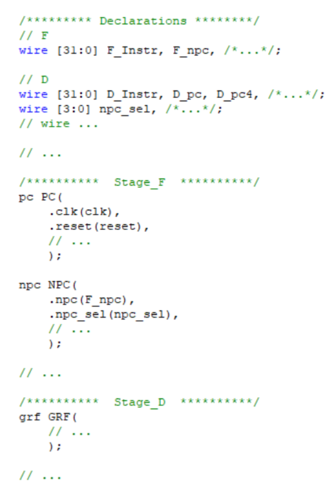

#Verilog流水线CPU设计文档

###一、 CPU设计方案综述

####（一） 总体设计概述

使用Verilog开发一个简单的流水线CPU，总体概述如下：

1. 此CPU为32位CPU

2. 此CPU为流水线设计

3. 此CPU支持的指令集为：

   {add, sub, ori, lw, sw, beq, lui, nop,jal,j,jr}

4. add, sub不支持溢出

####（二） 关键模块定义


## 主代码mips

```verilog
`timescale 1ns / 1ps
`include "macro.v"
module mips(input clk,
            input reset,
            input [31:0] i_inst_rdata,
            input [31:0] m_data_rdata,

            output [31:0] i_inst_addr,
            output [31:0] m_data_addr,
            output [31:0] m_data_wdata,
            output [3 :0] m_data_byteen,
            output [31:0] m_inst_addr,
            output w_grf_we,
            output [4:0] w_grf_addr,
            output [31:0] w_grf_wdata,
            output [31:0] w_inst_addr
            );
    /////////////////////////////////////////////////////////////////////////////////////////////////////////////////////////////////////////
    //datapath_for_wire_and_reg
    //datapath
    wire stall;
    //IFU
    wire [31:0] npc;
    wire [31:0] F_Instr;
    wire [31:0] F_PC;
    
    //IF_ID
    wire [31:0] D_Instr;
    wire [31:0] D_PC;
    ///////////////////////////////////////////////////
    //Grf
    wire [4:0]  d_rs;
    wire [4:0]  d_rt;
    wire [4:0]  d_A3;
    wire [31:0] WD;
    wire [31:0] d_RD1;
    wire [31:0] d_RD2;
    //EXT
    wire [2:0] d_SignExt;
    //NPC
    wire [31:0] ra;
    wire [31:0] d_imm32;
    wire [25:0] d_J_address;
    wire [3:0]  d_branch;
    wire [31:0] D_PC8;
    wire d_ALU_change;
    //B_transfer
    wire [31:0] d_b_transfer1;
    wire [31:0] d_b_transfer2;
    wire [3:0] d_B_change;
    //Controller
    wire [5:0] d_opcode;
    wire [5:0] d_func;
    wire [4:0] d_rd;
    wire [4:0] d_shamt;
    wire [15:0] d_imm16;
    wire [11:0] d_ALUop;
    wire d_Wegrf;
    wire d_WeDm;
    wire [3:0] d_AluSrc1;
    wire [3:0] d_AluSrc2;
    wire [7:0] d_WhichtoReg;
    wire [3:0] d_RegDst;
    wire [5:0] d_DM_type;
    
    //ID_EX
    wire [1:0] d_Tnew;
    wire [31:0] e_RD1;
    wire [31:0] e_RD2;
    wire [4:0] e_shamt;
    wire [4:0] e_rs,e_rt,e_rd;
    wire [4:0]  e_A3;
    wire [31:0] e_imm32;
    wire [31:0] E_PC;
    wire [31:0] E_PC8;
    wire [1:0] e_Tnew;
    wire e_Wegrf;
    wire e_WeDm;
    wire [11:0] e_ALUop;
    wire [3:0] e_AluSrc1;
    wire [3:0] e_AluSrc2;
    wire [7:0] e_WhichtoReg;
    wire [3:0] e_RegDst;
    wire [5:0] e_DM_type;
    wire e_ALU_change;

    wire d_mdu_en;
    ///////////////////////////////////////////////////
    //ALU
    wire [31:0] e_A;
    wire [31:0] e_B;
    wire [31:0] res;
    //MD_Unit
    wire [3:0] d_MDop,e_MDop;
    wire [31:0] HI,LO;
    wire [31:0] mdu_out;
    wire mdu_en,busy;
    //EX_MEM
    wire [31:0] e_res;
    wire [31:0] m_RD2;
    wire [31:0] m_res;
    wire [4:0]  m_A3;
    wire [4:0] m_rt;
    wire [31:0] M_PC;
    wire [31:0] M_PC8;
    wire [1:0] m_Tnew;
    wire m_Wegrf;
    wire m_WeDm;
    wire [7:0] m_WhichtoReg;
    wire [3:0] m_RegDst;
    wire [5:0] m_DM_type;
    wire [31:0] m_imm32;
    wire m_ALU_change;
    //////////////////////////////////////////////////////
    //DM
    wire [31:0] m_Address;
    wire [31:0] m_RD;
    wire [1:0] low2;
    wire [3:0] data_byteen ;
    wire [31:0] DM_input,DM_output;
    //MEM_WB
    wire [1:0] w_Tnew;
    wire [4:0]  w_A3;
    wire [31:0] w_res;
    wire [31:0] w_RD;
    wire [31:0] W_PC;
    wire [31:0] W_PC8;
    wire w_Wegrf;
    wire [7:0] w_WhichtoReg;
    wire [3:0] w_RegDst;
    wire [31:0] w_imm32;
    wire w_ALU_change;
    /////////////////////////////////////////////////////////////////////////////////////////////////////////////////////////////////////////
    //main_part
    wire [1:0] D_Tuse_rs,D_Tuse_rt;
    wire [2:0] d_SelB_D1,d_SelB_D2;
    wire [1:0] d_SelALU_A,d_SelALU_B;
    wire d_SelDM;
    wire [1:0] d_SelJr;
    wire [31:0] e_A_f,e_B_f;
    wire [31:0] M_WD_f;//DM
    //HazardUnit
    HazardUnit hzu(
    .D_A1(d_rs),
    .D_A2(d_rt),
    .E_A1(e_rs),
    .E_A2(e_rt),
    .M_A2(m_rt),
    .E_A3(e_A3),
    .M_A3(m_A3),
    .W_A3(w_A3),
    .E_Wegrf(e_Wegrf),
    .M_Wegrf(m_Wegrf),
    .W_Wegrf(w_Wegrf),
    
    
    .D_Tuse_rs(D_Tuse_rs),
    .D_Tuse_rt(D_Tuse_rt),
    .E_Tnew(e_Tnew),
    .M_Tnew(m_Tnew),
    .W_Tnew(w_Tnew),
    .E_WhichtoReg(e_WhichtoReg),
    .M_WhichtoReg(m_WhichtoReg),
    .start(mdu_en),
    .busy(busy),
    .MDU_en(d_mdu_en),
    
    .SelB_D1(d_SelB_D1),
    .SelB_D2(d_SelB_D2),
    .SelALU_A(d_SelALU_A),
    .SelALU_B(d_SelALU_B),
    .SelDM(d_SelDM),
    .stall(stall)
    );
    //////////////////////////////////////////////F//////////////////////////////////////////////////////////////////////////////////////////
    //IFU
    PC pc(
    .clk(clk),
    .reset(reset),
    .NPC(npc),
    .en(~stall),
    
    //.Instr(F_Instr),
    .PC(F_PC)
    );
    assign F_Instr=i_inst_rdata;
    //IF_ID
    IF F_reg(
    .clk(clk),
    .reset(reset),
    .en(~stall),
    .F_Instr(F_Instr),
    .F_PC(F_PC),
    
    .D_Instr(D_Instr),
    .D_PC(D_PC)
    );
    //////////////////////////////////////////////D//////////////////////////////////////////////////////////////////////////////////////////
    //Grf
    assign 	WD =  (w_WhichtoReg == 8'b0000_0001)?w_res:
                  (w_WhichtoReg == 8'b0000_0010)?w_RD:
                  (w_WhichtoReg == 8'b0000_0100)?w_imm32:
                  (w_WhichtoReg == 8'b0000_1000)?W_PC8:
                  w_ALU_change;//
    GRF grf(
    .A1(d_rs),
    .A2(d_rt),
    .A3(w_A3),
    .WD(WD),
    .clk(clk),
    .reset(reset),
    .WE(w_Wegrf),
    .WPC(W_PC),
    
    .RD1(d_RD1),
    .RD2(d_RD2)
    );
    //EXT
    EXT ext(
    .imm16(d_imm16),
    .sign(d_SignExt),
    
    .imm32(d_imm32)
    );
    //NPC
    assign ra = d_b_transfer1;
    //
    NPC Npc(
    .F_PC(F_PC),
    .D_PC(D_PC),
    .offset(d_imm32),
    .imm26(d_J_address),
    .ra(ra),
    .branch(d_branch),
    .ALU_change(d_ALU_change),
    
    .npc(npc),
    .PC8(D_PC8)
    );
    //B_transfer
    assign d_b_transfer1 =  (d_SelB_D1 == 3'b000)?d_RD1:
                            (d_SelB_D1 == 3'b001)?WD:
                            (d_SelB_D1 == 3'b010)?m_res:
                            (d_SelB_D1 == 3'b011)?M_PC8:
                            E_PC8;//
    assign d_b_transfer2 =  (d_SelB_D2 == 3'b000)?d_RD2:
                            (d_SelB_D2 == 3'b001)?WD:
                            (d_SelB_D2 == 3'b010)?m_res:
                            (d_SelB_D2 == 3'b011)?M_PC8:
                            E_PC8;
    B_transfer b_trans(
    .A(d_b_transfer1),
    .B(d_b_transfer2),
    .Type(d_B_change),
    
    .ALU_change(d_ALU_change)
    );
    //controller
    assign 	d_opcode    = D_Instr[31:26];
    assign 	d_rs        = D_Instr[25:21];
    assign 	d_rt        = D_Instr[20:16];
    assign 	d_rd        = D_Instr[15:11];
    assign 	d_shamt     = D_Instr[10:6];
    assign 	d_func      = D_Instr[5:0];
    assign 	d_imm16     = D_Instr[15:0];
    assign 	d_J_address = D_Instr[25:0];
    Controller controller(
    .op(d_opcode),
    .func(d_func),
    .rt(d_rt),
    
    .ALUop(d_ALUop),
    .Wegrf(d_Wegrf),
    .WeDm(d_WeDm),
    .branch(d_branch),
    .AluSrc1(d_AluSrc1),
    .AluSrc2(d_AluSrc2),
    .WhichtoReg(d_WhichtoReg),
    .RegDst(d_RegDst),
    .SignExt(d_SignExt),
    .B_change(d_B_change),
    .DM_type(d_DM_type),
    .MDop(d_MDop),
    
    .D_Tuse_rs(D_Tuse_rs),
    .D_Tuse_rt(D_Tuse_rt),
    .D_Tnew(d_Tnew)
    );
    //ID_EX
    ID D_reg(
    .clk(clk),
    .reset(reset),
    .clr(stall),
    .D_RD1(d_b_transfer1),
    .D_RD2(d_b_transfer2),
    .D_instr_s(d_shamt),
    .D_A1(d_rs),
    .D_A2(d_rt),
    .D_A3(d_rd),
    .D_imm32(d_imm32),
    .D_PC(D_PC),
    .D_PC8(D_PC8),
    .D_Tnew(d_Tnew),
    .D_Wegrf(d_Wegrf),
    .D_WeDm(d_WeDm),
    .D_ALUop(d_ALUop),
    .D_AluSrc1(d_AluSrc1),
    .D_AluSrc2(d_AluSrc2),
    .D_WhichtoReg(d_WhichtoReg),
    .D_RegDst(d_RegDst),
    .D_DM_type(d_DM_type),
    .D_ALU_change(d_ALU_change),
    .D_MDop(d_MDop),
    
    .E_RD1(e_RD1),
    .E_RD2(e_RD2),
    .E_instr_s(e_shamt),
    .E_A1(e_rs),
    .E_A2(e_rt),
    .E_A3(e_rd),
    .E_imm32(e_imm32),
    .E_PC(E_PC),
    .E_PC8(E_PC8),
    .E_Tnew(e_Tnew),
    .E_Wegrf(e_Wegrf),
    .E_WeDm(e_WeDm),
    .E_ALUop(e_ALUop),
    .E_AluSrc1(e_AluSrc1),
    .E_AluSrc2(e_AluSrc2),
    .E_WhichtoReg(e_WhichtoReg),
    .E_RegDst(e_RegDst),
    .E_DM_type(e_DM_type),
    .E_ALU_change(e_ALU_change),
    .E_MDop(e_MDop)
    );
    assign d_mdu_en=(d_MDop!=`nop_MDU);
    //////////////////////////////////////////////E//////////////////////////////////////////////////////////////////////////////////////////
    assign 	e_A3 =  (e_RegDst == 4'b0001)?e_rd:
                    (e_RegDst == 4'b0010)?e_rt:
                    5'b11111;
    //ALU
    assign e_A = 	(e_AluSrc1 == 4'b0001)?e_A_f://
                  e_B_f;
    
    assign e_A_f =  (d_SelALU_A == 2'b11)?M_PC8:
                    (d_SelALU_A == 2'b00)?e_RD1:
                    (d_SelALU_A == 2'b01)?WD:
                    m_res;//rs
    assign e_B_f =  (d_SelALU_B == 2'b11)?M_PC8:
                    (d_SelALU_B == 2'b00)?e_RD2:
                    (d_SelALU_B == 2'b01)?WD:
                    m_res;//rt
    
    
    assign e_B = 	(e_AluSrc2 == 4'b0001)?e_B_f:
                  (e_AluSrc2 == 4'b0010)?e_imm32://
                  (e_AluSrc2 == 4'b0100)?({{27{1'b0}},e_shamt}):
                  e_A_f;
    
    ALU alu(
    .A(e_A),
    .B(e_B),
    .ALUop(e_ALUop),
    
    .res(res)
    );
    //MD_Unit
    assign mdu_en=(e_MDop==`mult_MDU)||(e_MDop==`multu_MDU)||
                  (e_MDop==`div_MDU)||(e_MDop==`divu_MDU);
    MD_Unit mdu (
    .clk(clk), 
    .reset(reset), 
    .en(mdu_en), 
    .MDop(e_MDop), 
    .A(e_A), 
    .B(e_B),

    .HI(HI), 
    .LO(LO), 
    .out(mdu_out), 
    .busy(busy)
    );
    assign e_res=(e_MDop==`mfhi_MDU||e_MDop==`mflo_MDU)?mdu_out:
                                                        res;
    //EX_MEM
    EX E_reg(
    .clk(clk),
    .reset(reset),
    .E_A2(e_rt),
    .E_A3(e_A3),
    .E_RD2(e_B_f),
    .E_ALUout(e_res),
    .E_PC(E_PC),
    .E_PC8(E_PC8),
    .E_Tnew(e_Tnew),
    .E_Wegrf(e_Wegrf),
    .E_WeDm(e_WeDm),
    .E_WhichtoReg(e_WhichtoReg),
    .E_RegDst(e_RegDst),
    .E_DM_type(e_DM_type),
    .E_imm32(e_imm32),
    .E_ALU_change(e_ALU_change),
    
    .M_A2(m_rt),
    .M_A3(m_A3),
    .M_RD2(m_RD2),
    .M_ALUout(m_res),
    .M_PC(M_PC),
    .M_PC8(M_PC8),
    .M_Tnew(m_Tnew),
    .M_Wegrf(m_Wegrf),
    .M_WeDm(m_WeDm),
    .M_WhichtoReg(m_WhichtoReg),
    .M_RegDst(m_RegDst),
    .M_DM_type(m_DM_type),
    .M_imm32(m_imm32),
    .M_ALU_change(m_ALU_change)
    );
    //////////////////////////////////////////////M//////////////////////////////////////////////////////////////////////////////////////////
    //DM
    assign m_Address = m_res;
    assign M_WD_f    =  (d_SelDM)?WD:
                        m_RD2;
    // DM dm(
    // .Address(m_Address),
    // .WD(M_WD_f),
    // .clk(clk),
    // .reset(reset),
    // .pc(M_PC),
    // .WE(m_WeDm),
    // .DM_type(m_DM_type),
    
    // .RD(m_RD)
    // );
    assign low2=m_Address[1:0];
    DM_In din(.low2(low2),
              .WD(M_WD_f),
              .DM_type(m_DM_type),

              .data_byteen(data_byteen),
              .DM_input(DM_input)
              );
    assign DM_output=m_data_rdata;
    DM_Out dot( .low2(low2),
                .DM_type(m_DM_type),
                .DM_output(DM_output),

                .RD(m_RD));

    //MEM_WE
    MEM M_reg(
    .clk(clk),
    .reset(reset),
    .M_A3(m_A3),
    .M_ALUout(m_res),
    .M_RD(m_RD),
    .M_PC(M_PC),
    .M_PC8(M_PC8),
    .M_Wegrf(m_Wegrf),
    .M_WhichtoReg(m_WhichtoReg),
    .M_RegDst(m_RegDst),
    .M_imm32(m_imm32),
    .M_ALU_change(m_ALU_change),
    .M_Tnew(m_Tnew),
    
    .W_A3(w_A3),
    .W_ALUout(w_res),
    .W_RD(w_RD),
    .W_PC(W_PC),
    .W_PC8(W_PC8),
    .W_Wegrf(w_Wegrf),
    .W_WhichtoReg(w_WhichtoReg),
    .W_RegDst(w_RegDst),
    .W_imm32(w_imm32),
    .W_ALU_change(w_ALU_change),
    .W_Tnew(w_Tnew)
    );
    //////////////////////////////////////////////W//////////////////////////////////////////////////////////////////////////////////////////
    //output
    assign  i_inst_addr   = F_PC;
    assign  m_data_addr   = m_Address;
    assign  m_data_wdata  = DM_input;
    assign  m_data_byteen = (m_WeDm)?data_byteen:4'b0000;
    assign  m_inst_addr   = M_PC;
    assign  w_grf_we      = w_Wegrf;
    assign  w_grf_addr    = w_A3;
    assign  w_grf_wdata   = WD;
    assign  w_inst_addr   = W_PC;
endmodule

```

##宏的定义
```verilog
`timescale 1ns / 1ps
//alu
`define _ADD 12'b000000000001
`define _SUB 12'b000000000010
`define _AND 12'b000000000100
`define _OR  12'b000000001000
`define _XOR 12'b000000010000
`define _NOR 12'b000000100000
`define _SLL 12'b000001000000
`define _SRA 12'b000010000000
`define _SRL 12'b000100000000
`define _SLT 12'b001000000000
`define _SLTU 12'b010000000000
//ifu
`define PC_Initial 32'h0000_3000
//ext
`define Zero_Ext 3'b001
`define Sign_Ext 3'b010
`define Lui_Ext  3'b100
//NPC
`define PC4_NPC 4'b0001
`define B_transfer_NPC 4'b0010
`define J_transfer_NPC 4'b0100
`define Jr_NPC 4'b1000
//Controller_for_Reg
`define ALUop_Initial 7'b0000001
`define AluSrc1_Initial 4'b0001
`define AluSrc2_Initial 4'b0001
`define WhichtoReg_Initial 8'b00000001
`define RegDst_Initial 4'b0001
`define DM_type_Initial 6'b000001
//DM
`define Word_DM 6'b000001
`define Half_DM 6'b000010
`define Byte_DM 6'b000100
`define Unsigned_Half_DM 6'b001000
`define Unsigned_Byte_DM 6'b010000
//B_transfer
`define nop_B_trans 4'b0000
`define beq_B_trans 4'b0001
`define bgez_B_trans 4'b0010
`define bgtz_B_trans 4'b0011
`define blez_B_trans 4'b0100
`define bltz_B_trans 4'b0101
`define bne_B_trans 4'b0110
//MD_Unit
`define nop_MDU 4'b0000
`define mult_MDU 4'b0001
`define multu_MDU 4'b0010
`define div_MDU 4'b0011
`define divu_MDU 4'b0100
`define mfhi_MDU 4'b0101
`define mflo_MDU 4'b0110
`define mthi_MDU 4'b0111
`define mtlo_MDU 4'b1000
```

## F级流水线

####1. PC

（1） 端口说明

<center>表1-IFU端口说明</center>

| 序号 | 信号名    | 方向 | 描述                                                        |
| ---- | --------- | ---- | ----------------------------------------------------------- |
| 1    | clk       | I    | 时钟信号                                                    |
| 2    | reset     | I    | 同步复位信号，将PC值置为0x0000_3000：<br>0：无效<br>1：复位 |
| 3    | en        | I    | 使能信号，决定是否阻塞                                      |
| 4    | NPC[31:0] | I    | 下一周期PC的地址                                            |
| 6    | PC[31:0]  | O    | 当前执行的PC                                                |


（2） 功能定义

<center>表2-IFU功能定义</center>

| 序号 | 功能       | 描述                          |
| ---- | ---------- | ----------------------------- |
| 1    | 复位       | reset有效时，PC置为0x00003000 |
| 2    | 更新PC的值 | 将PC赋值为NPC                 |

```verilog
`timescale 1ns / 1ps
`include "macro.v"
module PC(input clk,
          input reset,
          input en,
          input [31:0] NPC,
			 
          output [31:0] PC
    		 );
    reg [31:0] now_PC = `PC_Initial;
    wire [11:0] Address;
    //transfer
    always @(posedge clk)begin
        if (reset)begin
            now_PC <= `PC_Initial;
        end
        else begin
            if (en)begin
                now_PC <= NPC;
            end
            else begin
                now_PC <= now_PC;
            end
        end
    end
    assign PC  = now_PC;

endmodule

```

## D级流水线

####1. GRF

（1） 端口说明

<center>表3-GRF端口说明</center>

| 序号 | 信号名    | 方向 | 描述                                                         |
| ---- | --------- | ---- | ------------------------------------------------------------ |
| 1    | clk       | I    | 时钟信号                                                     |
| 2    | reset     | I    | 同步复位信号，将32个寄存器中全部清零<br>1：清零<br>0：无效   |
| 3    | WE        | I    | 写使能信号<br>1：可向GRF中写入数据<br>0：不能向GRF中写入数据 |
| 4    | A1[4:0]   | I    | 5位地址输入信号，指定32个寄存器中的一个，将其中存储的数据读出到RD1 |
| 5    | A2[4:0]   | I    | 5位地址输入信号，指定32个寄存器中的一个，将其中存储的数据读出到RD2 |
| 6    | A3[4:0]   | I    | 5位地址输入信号，指定32个寄存器中的一个，作为RD的写入地址    |
| 7    | WD[31:0]  | I    | 32位写入数据                                                 |
| 8    | WPC[31:0] | I    | 当前写入GRF的PC                                              |
| 9    | RD1[31:0] | O    | 输出A1指定的寄存器的32位数据                                 |
| 10   | RD2[31:0] | O    | 输出A2指定的寄存器的32位数据                                 |

 

（2） 功能定义

<center>表4-GRF功能定义</center>

| 序号 | 功能     | 描述                                                        |
| ---- | -------- | ----------------------------------------------------------- |
| 1    | 同步复位 | reset为1时，将所有寄存器清零                                |
| 2    | 读数据   | 将A1和A2地址对应的寄存器的值分别通过RD1和RD2读出            |
| 3    | 写数据   | 当WE为1且时钟上升沿来临时，将WD写入到A3对应的寄存器内部     |
| 4    | 内部转发 | 当A1和A2之一与A3相等且写入信号为1时，用WD代替RD1或RD2的输出 |

 ```verilog
 `timescale 1ns / 1ps
module GRF(input [4:0] A1,
           input [4:0] A2,
           input [4:0] A3,
           input [31:0] WD,
           input clk,
           input reset,
           input WE,
           input [31:0] WPC,
           output [31:0] RD1,
           output [31:0] RD2);
    reg[31:0] RF[31:0];
    integer i = 0;
    integer file=0;
    wire eq_A1,eq_A2;
    assign eq_A1=(A1==A3)&&(A3!=0)&WE;	 
    assign eq_A2=(A2==A3)&&(A3!=0)&WE;

    initial begin
        for(i=0;i<=31;i=i+1)begin
            RF[i] = 0;
        end
    end
    always@(posedge clk)begin
        if (reset)begin
            for(i=0;i<=31;i=i+1)begin
                RF[i] <= 0;
            end
        end
        else begin
            if (WE)begin
                RF[A3] <= WD;
                RF[0]  <= 0;
                /* if (A3!=0)begin
                    $display("%d@%h: $%d <= %h",$time, WPC, A3, WD);
                end */
            end
            else begin
                RF[A3] <= RF[A3];
            end
        end
    end
    assign RD1 = eq_A1?WD:RF[A1];
    assign RD2 = eq_A2?WD:RF[A2];
endmodule

 ```

####2. EXT

(1) 端口说明

<center>表9-EXT端口说明</center>

| 序号 | 信号名      | 方向 | 描述                                                         |
| ---- | ----------- | ---- | ------------------------------------------------------------ |
| 1    | imm16[15:0] | I    | 代扩展的16位信号                                             |
| 2    | sign[2:0]   | I    | 无符号或符号扩展选择信号<br/>3'b001：无符号扩展<br/>3'b010：符号扩展<br>3'b100:   寄存到高位 |
| 3    | imm32[31:0] | O    | 扩展后的32位的信号                                           |

 

(2) 功能定义

<center>表10-EXT功能定义</center>

| 序号 | 功能       | 描述                                    |
| ---- | ---------- | --------------------------------------- |
| 1    | 无符号扩展 | 当sign为3’b001时，将imm16无符号扩展输出 |
| 2    | 符号扩展   | 当sign为3‘b010时，将imm16符号扩展输出   |
| 3    | 存储到高位 | 当sign为3’100时，将imm16存在高16位      |

 ```verilog
`timescale 1ns / 1ps
`include "macro.v"
module EXT(input [15:0] imm16,
           input [2:0] sign,
           output reg [31:0] imm32);
    always @(*)begin
        if (sign == `Zero_Ext)begin
            imm32 = {{16{1'b0}},imm16};
        end
        else if (sign == `Sign_Ext)begin
            imm32 = {{16{imm16[15]}},imm16};
        end
        else if(sign==`Lui_Ext) begin
            imm32 = {imm16,{16{1'b0}}};
        end
    end
endmodule

 ```

####3. Controller

(1) 端口说明

<center>表11-Controller端口说明</center>

| 序号 | 信号名          | 方向 | 描述                                                         |
| ---- | --------------- | ---- | ------------------------------------------------------------ |
| 1    | op[5:0]         | I    | instr[31:26]6位控制信号                                      |
| 2    | func[5:0]       | I    | instr[5:0]6位控制信号                                        |
| 3 | rt[4:0] | I | instr[20:16]5位控制信号 |
| 4   | AluOp[11:0]     | O    | ALU的控制信号                                                |
| 5   | WeGrf           | O    | GRF写使能信号<br/>0：禁止写入<br/>1：允许写入                |
| 6   | WeDm            | O    | DM的写入信号<br/>0：禁止写入<br/>1：允许写入                 |
| 7  | branch[3:0]     | O    | PC转移位置选择信号<br>4'b0001:其他情况<br>4'b0010:beq<br>4'b0100:j\|\|jal<br>4'b1000:jr; |
| 8   | AluSrc1[3:0]    | O    | 参与ALU运算的第一个数<br/>4'b0001：RD1<br/>4'b0010：RD2      |
| 9   | AluSrc2[3:0]    | O    | 参与ALU运算的第二个数，来自GRF还是imm<br/>4'b0001：RD2<br/>4'b0010：imm32<br/>4'b0100: offset |
| 10  | WhichtoReg[7:0] | O    | 将何种数据写入GRF？<br/>8'b0000_0001：ALU计算结果<br/>8'b0000_0010：DM读出信号<br/>8'b0000_0100：upperImm<br/>8'b0000_1000: PC+4 |
|11|RegDst[3:0]|O|写入GRF的哪个寄存器？<br>4'b0001:rd<br>4'b0010:rt<br>4'b0100:31号寄存器|
|12|SignExt[2:0]|O|拓展方式：<br>3'b001:0拓展<br>3'b010:符号拓展<br>3'b100:存储到高位|
|13|B_change[3:0]|O|B转移的类型<br>4'b0001:beq<br>4'b0010:slt<br>4'b0100:blez|
|14|DM_type[5:0]|O|存取指令类型：<br>6'b000001:lw/sw<br>6'b000010:lh/sh<br>6'b000100:lb/sb<br />6'b001000:lhu<br />6'b010000:lbu|
|15|MDop[3:0]|O|乘除指令选择信号：<br />4‘b0000:无操作<br />4’b0001:mult<br />4'b0010:multu<br />4'b0011:div<br />4'b0100:divu<br />4'b0101:mfhi<br />4'b0110:mflo<br />4'b0111:mthi<br />4'b1000:mtlo|
| 16 | D_Tuse_rs[1:0] | O | 指令的rs寄存器的值从第一次进入D级到被使用的周期数 |
| 17 | D_Tuse_rt[1:0] | O | 指令的rt寄存器的值从第一次进入D级到被使用的周期数 |
| 18 | D_Tnew[1:0] | O | 指令从进入D开始到产生运算结果需要的周期数 |


```verilog
`timescale 1ns / 1ps
`include "macro.v"
module Controller(input [5:0] op,
                  input [5:0] func,
                  input [4:0] rt,

                  output [11:0] ALUop,
                  output Wegrf,
                  output WeDm,
                  output [3:0] branch,
                  output [3:0] AluSrc1,
                  output [3:0] AluSrc2,
                  output [7:0] WhichtoReg,
                  output [3:0] RegDst,
                  output [2:0]SignExt,
                  output [3:0] B_change,
                  output [5:0] DM_type,
                  output [3:0] MDop,

                  output [1:0] D_Tuse_rs,
                  output [1:0] D_Tuse_rt,
                  output [1:0] D_Tnew
                  );
//calc_r
wire _add,_sub,_addu,_subu,_and,_or,_nor,_xor,_slt,_sltu;
assign _add  = (op == 6'b000000)&&(func == 6'b100000);
assign _sub  = (op == 6'b000000)&&(func == 6'b100010);
assign _addu = (op == 6'b000000)&&(func == 6'b100001);
assign _subu = (op == 6'b000000)&&(func == 6'b100011);
assign _and  = (op == 6'b000000)&&(func == 6'b100100);
assign _or   = (op == 6'b000000)&&(func == 6'b100101);
assign _nor   = (op == 6'b000000)&&(func == 6'b100111);
assign _xor   = (op == 6'b000000)&&(func == 6'b100110);
assign _slt  = (op == 6'b000000)&&(func == 6'b101010);
assign _sltu  = (op == 6'b000000)&&(func == 6'b101011);

//calc_i
wire _addi,_addiu,_andi,_ori,_xori,_slti,_sltiu;
assign _addi = op == 6'b001000;
assign _addiu = op == 6'b001001;
assign _andi = op == 6'b001100;
assign _ori  = op == 6'b001101;
assign _xori  = op == 6'b001110;
assign _slti  = op == 6'b001010;
assign _sltiu  = op == 6'b001011;

//shift
wire _sll,_sra,_srl;
assign _sll  = (op == 6'b000000)&&(func == 6'b000000);
assign _sra  = (op == 6'b000000)&&(func == 6'b000011);
assign _srl  = (op == 6'b000000)&&(func == 6'b000010);

//shift_v
wire _sllv,_srav,_srlv;
assign _sllv = (op == 6'b000000)&&(func == 6'b000100);
assign _srav  = (op == 6'b000000)&&(func == 6'b000111);
assign _srlv  = (op == 6'b000000)&&(func == 6'b000110);

//load
wire _lw,_lh,_lhu,_lb,_lbu;
assign _lw   = op == 6'b100011;
assign _lh   = op == 6'b100001;
assign _lhu   = op == 6'b100101;
assign _lb   = op == 6'b100000;
assign _lbu   = op == 6'b100100;

//store
wire _sw,_sh,_sb;
assign _sw   = op == 6'b101011;
assign _sh   = op == 6'b101001;
assign _sb   = op == 6'b101000;

//b_type
wire _beq,_bne,_bgtz,_blez,_bgez,_bltz;
assign _beq  = op == 6'b000100;
assign _bgez = (op == 6'b000001)&&(rt == 5'b00001);
assign _bgtz = op == 6'b000111;
assign _blez = op == 6'b000110;
assign _bltz = (op == 6'b000001)&&(rt == 5'b00000);
assign _bne = op == 6'b000101;

//j_type
wire _j,_jal,_jr,_jalr;
assign _j   = op == 6'b000010;
assign _jal = op == 6'b000011;
assign _jr   = (op == 6'b000000)&&(func == 6'b001000);
assign _jalr = (op == 6'b000000)&&(func == 6'b001001);

//lui
wire _lui;
assign _lui  = op == 6'b001111;

//md
wire _mult,_multu,_div,_divu;
assign _div = (op == 6'b000000)&&(func == 6'b011010);
assign _divu = (op == 6'b000000)&&(func == 6'b011011);
assign _mult = (op == 6'b000000)&&(func == 6'b011000);
assign _multu = (op == 6'b000000)&&(func == 6'b011001);

//mf
wire _mfhi,_mflo;
assign _mfhi = (op == 6'b000000)&&(func == 6'b010000);
assign _mflo = (op == 6'b000000)&&(func == 6'b010010);

//mt
wire _mthi,_mtlo;
assign _mthi = (op == 6'b000000)&&(func == 6'b010001);
assign _mtlo = (op == 6'b000000)&&(func == 6'b010011);

//
/////////////////////////////////////
//category
wire calc_r,calc_i,shift,shift_v,load,store,b_type,j_type,md_type,mf_type,mt_type;
assign calc_r  = _add||_sub||_addu||_subu||_and||_or||_nor||_xor||_slt||_sltu;
assign calc_i  = _addi||_addiu||_andi||_ori||_xori||_slti||_sltiu;
assign shift   = _sll||_sra||_srl;
assign shift_v = _sllv||_srav||_srlv;
assign load    = _lw||_lh||_lhu||_lb||_lbu;
assign store   = _sw||_sh||_sb;
assign b_type  = _beq||_bne||_bgtz||_blez||_bgez||_bltz;
assign j_type  = _jal||_j||_jr||_jalr;
assign md_type = _mult||_multu||_div||_divu;
assign mf_type = _mfhi||_mflo;
assign mt_type = _mthi||_mtlo;
/////////////////////////////////////////////
wire ALUop_11,ALUop_10,ALUop_9,ALUop_8,ALUop_7,ALUop_6,ALUop_5,ALUop_4,ALUop_3,ALUop_2,ALUop_1,ALUop_0;
assign ALUop_0 = ~ALUop_11&&~ALUop_10&&~ALUop_9&&~ALUop_8&&~ALUop_7&&~ALUop_6&&~ALUop_5&&~ALUop_4&&~ALUop_3&&~ALUop_2&&~ALUop_1;
assign ALUop_1 = _subu||_sub;
assign ALUop_2 = _andi||_and;
assign ALUop_3 = _ori||_or;
assign ALUop_4 = _xor||_xori;
assign ALUop_5 = _nor;
assign ALUop_6 = _sll||_sllv;
assign ALUop_7 = _sra||_srav;
assign ALUop_8 = _srl||_srlv;
assign ALUop_9 = _slt||_slti;
assign ALUop_10 = _sltu||_sltiu;
assign ALUop_11 = 1'b0;
/////////////////////////////////////////
wire branch_3,branch_2,branch_1,branch_0;
assign branch_0 = ~branch_3&&~branch_2&&~branch_1;
assign branch_1 = _beq||_blez||_bgez||_bgtz||_bltz||_bne;
assign branch_2 = _j||_jal||_jalr;
assign branch_3 = _jr;
/////////////////////////////////////////
wire AluSrc1_3,AluSrc1_2,AluSrc1_1,AluSrc1_0;
assign AluSrc1_0 = ~AluSrc1_3&&~AluSrc1_2&&~AluSrc1_1;//rs
assign AluSrc1_1 = _sll||_sllv||_sra||_srav||_srl||_srlv;//rt
assign AluSrc1_2 = 1'b0;
assign AluSrc1_3 = 1'b0;
/////////////////////////////////////////
wire AluSrc2_3,AluSrc2_2,AluSrc2_1,AluSrc2_0;
assign AluSrc2_0   = ~AluSrc2_3&&~AluSrc2_2&&~AluSrc2_1;//rt
assign AluSrc2_1   = _lw||_sw||_ori||_andi||_sb||_lb||_sh||_lh||
                     _addi||_lui||_addiu||_slti||_sltiu||_xori||_lbu||_lhu;//imm32
assign AluSrc2_2   = _sll||_sra||_srl;//shamt
assign AluSrc2_3   = _sllv||_srav||_srlv;//rs
/////////////////////////////////////////
wire WhichtoReg_7,WhichtoReg_6,WhichtoReg_5,WhichtoReg_4,WhichtoReg_3,WhichtoReg_2,WhichtoReg_1,WhichtoReg_0;
assign WhichtoReg_0 = ~WhichtoReg_1&&~WhichtoReg_2&&~WhichtoReg_3&&~WhichtoReg_4&&
                      ~WhichtoReg_5&&~WhichtoReg_6&&~WhichtoReg_7;//res
assign WhichtoReg_1 = _lw||_lh||_lb||_lbu||_lhu;//RD
assign WhichtoReg_2 = _lui;//imm32
assign WhichtoReg_3 = _jal||_jalr;//PC8
assign WhichtoReg_4 = 1'b0;//ALU_change
assign WhichtoReg_5 = 1'b0;
assign WhichtoReg_6 = 1'b0;
assign WhichtoReg_7 = 1'b0;
/////////////////////////////////////////
wire RegDst_3,RegDst_2,RegDst_1,RegDst_0;
assign RegDst_0 = ~RegDst_1&&~RegDst_2&&~RegDst_3;//rd
assign RegDst_1 = _lui||_lw||_sw||_ori||_andi||_sh||_lh||
                  _sb||_lb||_addi||_xori||_addiu||_slti||_sltiu||_lbu||
                  _lhu;//rt
assign RegDst_2 = _jal;//$31
assign RegDst_3 = 1'b0;
/////////////////////////////////////////
wire SignExt_2,SignExt_1,SignExt_0;
assign SignExt_0 = ~SignExt_1&&~SignExt_2;
assign SignExt_1 = _lw||_sw||_beq||_lh||_sh||_lb||_sb||_blez||
                   _addi||_sltiu||_slti||_bne||_bltz||_bgtz||_bgez||_addiu||
                   _lbu||_lhu;
assign SignExt_2 = _lui;
/////////////////////////////////////////
wire DM_type_5,DM_type_4,DM_type_3,DM_type_2,DM_type_1,DM_type_0;
assign DM_type_0 = _lw||_sw;
assign DM_type_1 = _lh||_sh;
assign DM_type_2 = _lb||_sb;
assign DM_type_3 = _lhu;
assign DM_type_4 = _lbu;
assign DM_type_5 = 1'b0;
//////////////////////////////////////////////
wire D_Tuse_rs_1,D_Tuse_rs_0;
assign  D_Tuse_rs_1 = 1'b0;
assign  D_Tuse_rs_0 = calc_r||calc_i||shift_v||load||store||md_type||mt_type;
//////////////////////////////////////////////
wire D_Tuse_rt_1,D_Tuse_rt_0;
assign  D_Tuse_rt_1 = store;
assign  D_Tuse_rt_0 = calc_r||shift||shift_v||md_type;
//////////////////////////////////////////////////
assign ALUop      = {ALUop_11,ALUop_10,ALUop_9,ALUop_8,ALUop_7,ALUop_6,ALUop_5,ALUop_4,ALUop_3,ALUop_2,ALUop_1,ALUop_0};
assign Wegrf      = _add||_sub||_addu||_subu||_addiu||_addi||_or||_ori||
                    _and||_andi||_xor||_xori||_nor||_sll||_sllv||_sra||
                    _srav||_srl||_srlv||_lui||
                    _lw||_lb||_lh||_lbu||_lhu||
                    _jal||_jalr||
                    _slt||_sltu||_slti||_sltiu||
                    _mfhi||_mflo;
assign WeDm       = _sw||_sh||_sb;
assign branch     = {branch_3,branch_2,branch_1,branch_0};
assign AluSrc1    = {AluSrc1_3,AluSrc1_2,AluSrc1_1,AluSrc1_0};
assign AluSrc2    = {AluSrc2_3,AluSrc2_2,AluSrc2_1,AluSrc2_0};
assign WhichtoReg = {WhichtoReg_7,WhichtoReg_6,WhichtoReg_5,WhichtoReg_4,WhichtoReg_3,WhichtoReg_2,WhichtoReg_1,WhichtoReg_0};
assign RegDst     = {RegDst_3,RegDst_2,RegDst_1,RegDst_0};
assign SignExt    = {SignExt_2,SignExt_1,SignExt_0};
assign B_change   = (_beq)?`beq_B_trans:
                    (_bgez)?`bgez_B_trans:
                    (_bgtz)?`bgtz_B_trans:
                    (_blez)?`blez_B_trans:
                    (_bltz)?`bltz_B_trans:
                    (_bne)?`bne_B_trans:
                    `nop_B_trans;
assign DM_type    = {DM_type_4,DM_type_3,DM_type_2,DM_type_1,DM_type_0};
assign MDop       = (_mult)?`mult_MDU:
                    (_multu)?`multu_MDU:
                    (_div)?`div_MDU:
                    (_divu)?`divu_MDU:
                    (_mfhi)?`mfhi_MDU:
                    (_mflo)?`mflo_MDU:
                    (_mthi)?`mthi_MDU:
                    (_mtlo)?`mtlo_MDU:
                    `nop_MDU;
//A_T
assign D_Tuse_rs  = {D_Tuse_rs_1,D_Tuse_rs_0};
assign D_Tuse_rt  = {D_Tuse_rt_1,D_Tuse_rt_0};
assign D_Tnew     = (load)?2'd3:
                    (calc_i||calc_r||shift||shift_v||mf_type)?2'd2:
                    (_lui)?2'd1:
                    2'd0;

endmodule

```

#### 4.NPC

#### NPC（下一指令计算单元）

 该模块根据当前pc（包括D级和F级）和其他控制信号（NPCOp，CMP输出信息），计算出下一指令所在的地址npc，传入IFU模块。

- **端口定义**

  | 信号名     | 方向 | 位宽 | 描述                                                         |
  | :--------- | :--- | :--- | :----------------------------------------------------------- |
  | F_pc       | I    | 32   | F级指令地址                                                  |
  | D_pc       | I    | 32   | D级指令地址                                                  |
  | offset     | I    | 32   | 地址偏移量，用于计算B类指令所要跳转的地址                    |
  | imm26      | I    | 26   | 当前指令数据的前26位（0~25），用于计算jal和j指令所要跳转的地址 |
  | ra         | I    | 32   | 储存在寄存器（$ra或是jalr指令中存储“PC+4”的寄存器）中的地址数据，用于实现jr和jalr指令 |
  | ALU_change | I    | 1    | B类指令判断结果 1：说明当前B类指令的判断结果为真 0：说明判断结果为假 |
  | branch     | I    | 4    | NPC功能选择 0x000：顺序执行 0x001：B类指令跳转 0x010: jal/j跳转 0x011: jr/jalr跳转 |
  | npc        | O    | 32   | 输出下一指令地址                                             |
  | PC8        | O    | 32   | jr指令时存储PC+8的值                                         |
  
  ```verilog
  `timescale 1ns / 1ps
  `include "macro.v"
  module NPC(input [31:0] F_PC,
             input [31:0] D_PC,
             input [31:0] offset,
             input [25:0] imm26,
             input [31:0] ra,
             input [3:0] branch,
             input ALU_change,
  			  
             output reg [31:0] npc,
  			     output [31:0] PC8
  			  );
  wire [31:0] PC4;
  assign PC4 = F_PC+4;
  assign PC8 = D_PC+8;
  always @(*)begin
      if (branch == `PC4_NPC)begin
          npc = PC4;
      end
      else if (branch == `B_transfer_NPC)begin
          if (ALU_change)begin
              npc = D_PC + 4 +{offset[29:0],{2{1'b0}}};
          end
          else begin
              npc = D_PC + 8;
          end
      end
  	 else if (branch == `J_transfer_NPC)begin
  	     npc = {D_PC[31:28],imm26,{2{1'b0}}};
      end
      else if(branch==`Jr_NPC)begin
          npc = ra;
      end
  end
  
  endmodule
  
  ```
  
  

#### 5.B_transfer(B类指令比较单元)

 该单元根据输入的CMPOp信号对当前B指令的类型进行判断，进而对当前输入的数值进行相应比较，最后输出结果。

- **端口定义**

  | 信号名     | 方向 | 位宽 | 描述                                                         |
  | :--------- | :--- | :--- | :----------------------------------------------------------- |
  | A          | I    | 32   | 输入B_transfer单元的第一个数据                               |
  | B          | I    | 32   | 输入B_transfer单元的第二个数据                               |
  | Type       | I    | 4    | Type功能选择信号<br> 0x0001：beq判断<br> 0x0010：slt判断 <br>0x0100：blez判断 |
  | ALU_change | O    | 1    | 判断结果输出 <br>1: 判断结果为真<br> 0：判断结果为假         |
  
  ```verilog
  `timescale 1ns / 1ps
  `include "macro.v"
  module B_transfer(input [31:0] A,
                    input [31:0] B,
                    input [3:0] Type,
                    output ALU_change);
  wire eq,less,more;
  //calc ALU_change
  assign eq   = (A == B);
  assign eq_zero   = (A == 0);
  assign less = $signed(A)<$signed(B);
  assign less_zero = $signed(A)<0;
  assign more = $signed(A)>$signed(B);
  assign more_zero = $signed(A)>0;
  //calc B
  wire beq,bgez,bgtz,blez,bltz,bne;
  assign beq  = eq;
  assign bgez = eq_zero||more_zero;
  assign bgtz = more_zero;
  assign blez = eq_zero||less_zero;
  assign bltz = less_zero;
  assign bne = ~eq;
  //mux
  assign ALU_change = (Type == `beq_B_trans)?beq:
                      (Type == `bgez_B_trans)?bgez:
                      (Type == `bgtz_B_trans)?bgtz:
                      (Type == `blez_B_trans)?blez:
                      (Type == `bltz_B_trans)?bltz:
                      (Type == `bne_B_trans)?bne:
                      1'b0;
  
  endmodule
  
  ```
  
  

## E级流水线

####1. ALU

(1) 端口说明

<center>表5-ALU端口说明</center>

| 序号 | 信号名      | 方向 | 描述                                                         |
| ---- | ----------- | ---- | ------------------------------------------------------------ |
| 1    | A[31:0]     | I    | 参与运算的第一个数                                           |
| 2    | B[31:0]     | I    | 参与运算的第二个数                                           |
| 3    | ALUop[11:0] | I    | 决定ALU做何种操作<br>12'b0000_0000_0001：无符号加<br/>12'b0000_0000_0010：无符号减<br/>12'b0000_0000_0100：与<br/>12'b0000_0000_1000：或<br/>12‘b0000_0001_0000:异或<br />12‘b0000_0010_0000:或非<br />12‘b0000_0100_0000:sll<br />12‘b0000_1000_0000:sra<br />12‘b0001_0000_0000:srl<br />12‘b0010_0000_0000:slt<br />12‘b0100_0000_0000:sltu |
| 4    | res         | O    | A与B做运算后的结果                                           |

 

(2) 功能定义

<center>表6-ALU功能定义</center>

| 序号 | 功能       | 描述         |
| ---- | ---------- | ------------ |
| 1    | 加运算     | res = A + B  |
| 2    | 减运算     | res = A - B  |
| 3    | 与运算     | res = A & B  |
| 4    | 或运算     | res = A \| B |
| 5    | 左移位运算 | Res=A<<B     |

 ```verilog
`timescale 1ns / 1ps
`include "macro.v"
module ALU(input [31:0] A,
           input [31:0] B,
           input [11:0] ALUop,
           output reg[31:0] res
           );
//calc res
always @(*)begin
    case(ALUop)
        `_ADD:
        res = A+B;
        `_SUB:
        res = A+~B+1;
        `_AND:
        res = A&B;
        `_OR:
        res = A|B;
        `_XOR:
        res = A^B;
        `_NOR:
        res = ~(A|B);
        `_SLL:
        res = A<<B;
        `_SRA:
        res = $signed($signed(A)>>>B) ;
        `_SRL:
        res = A>>B;
        `_SLT:
        res = ($signed(A)<$signed(B));
        `_SLTU:
        res = A<B;
        default:res = 32'd0;
    endcase
end

endmodule

 ```
 ####2.MD_Unit
 - **端口定义**

| 方向 | 信号名  | 位宽 | 描述              | 输入来源        |
| :--- | :------ | :--- | :---------------- | :-------------- |
| I    | clk     | 1    | 时钟信号          | mips.v中的clk   |
| I    | reset   | 1    | 同步复位信号      | mips.v中的reset |
| I    | en      | 1    | MD_Unit使能信号 | 判断是否为乘除计算 |
| I    | MDop | 4   | 指令选择信号 | Controller |
| I    | A    | 32   | 第一个计算数     | e_A        |
| I | B | 32 | 第二个计算数 | e_B |
| O | HI | 32 | HI寄存器输出 |  |
| O | LO | 32 | LO寄存器输出 |  |
| O    | out | 32   | 取出HI或LO的值 |                 |
| O    | busy  | 1  | 是否在进行乘除计算 |                 |

```verilog
`timescale 1ns / 1ps
`include "macro.v"
module MD_Unit(input clk,
               input reset,
               input en,
               input [3:0] MDop,
               input [31:0] A,
               input [31:0] B,
               output reg [31:0] HI,
               output reg [31:0] LO,
               output [31:0] out,
               output busy);
    reg [31:0] cnt     = 0;
    parameter MU_cycle = 5,D_cycle = 10;
    always @(posedge clk)begin
        if (reset)begin
            HI  <= 0;
            LO  <= 0;
            cnt <= 0;
        end
        else if (busy)begin
            cnt <= cnt-1;
        end
        else begin
            case(MDop)
                `nop_MDU:begin
                    
                end
                `mult_MDU:begin
                    if (en)begin
                        {HI,LO} <= $signed(A)*$signed(B);
                        cnt     <= MU_cycle;
                    end
                end
                `multu_MDU:begin
                    if (en)begin
                        {HI,LO} <= A*B;
                        cnt     <= MU_cycle;
                    end
                end
                `div_MDU:begin
                    if (en)begin
                        HI  <= $signed(A)%$signed(B);
                        LO  <= $signed(A)/$signed(B);
                        cnt <= D_cycle;
                    end
                end
                `divu_MDU:begin
                    if (en)begin
                        HI  <= A%B;
                        LO  <= A/B;
                        cnt <= D_cycle;
                    end
                end
                `mfhi_MDU:begin
                   //out <= HI;
                end
                `mflo_MDU:begin
                   //out <= LO;
                end
                `mthi_MDU:begin
                   HI <= A;
                end
                `mtlo_MDU:begin
                   LO <= A;
                end
            endcase
        end
    end
    assign busy = (cnt != 0);
    assign out= (MDop==`mflo_MDU)?LO:
                (MDop==`mfhi_MDU)?HI:
                32'b0;
endmodule

```


## M级流水线

####1. DM_In
 - **端口定义**

| 方向 | 信号名  | 位宽 | 描述              | 输入来源        |
| :--- | :------ | :--- | :---------------- | :-------------- |
| I    | low2  | 2   | 时钟信号          | Address低两位                                                |
| I    | WD  | 31   | 处理前写入结果  | 32位写入数据 |
| I    | DM_type | 6    | 决定存取指令类型 | 存取指令类型：<br/>6'b000001:lw/sw<br/>6'b000010:lh/sh<br/>6'b000100:lb/sb<br />6'b001000:lhu<br />6'b010000:lbu |
| O    | data_byteen | 4  | 字节使能信号 |                 |
| O    | DM_input | 32 | 处理后的写入结果 |                 |
```verilog
`timescale 1ns / 1ps
`include "macro.v"
module DM_In(input [1:0] low2,
             input [31:0] WD,
             input [5:0] DM_type,

             output [3:0] data_byteen,
             output [31:0] DM_input
             );
wire [7:0] new_b;
wire [15:0] new_h;
//initial
assign new_b=WD[7:0];
// assign new_b =  (low2 == 2'b00)?WD[7:0]:
                // (low2 == 2'b01)?WD[15:8]:
                // (low2 == 2'b10)?WD[23:16]:
                //                 WD[31:24];
// assign new_h = (low2[1] == 1'b1)? WD[31:16]:
//                                   WD[15:0];
assign new_h=WD[15:0];
//lb,sb
assign data_byteen =  (DM_type == `Word_DM)?4'b1111:
                      (DM_type == `Half_DM||DM_type == `Unsigned_Half_DM)?( (low2[1] == 1'b1)?4'b1100:4'b0011):
                      (DM_type == `Byte_DM||DM_type == `Unsigned_Byte_DM)?( (low2 == 2'b00)?4'b0001:
                                                                            (low2 == 2'b01)?4'b0010:
                                                                            (low2 == 2'b10)?4'b0100:
                                                                            4'b1000):
                                                                            4'b0000;
//lh,sh
assign DM_input =   (DM_type == `Word_DM)?WD:
                    (DM_type == `Half_DM||DM_type == `Unsigned_Half_DM)?((low2[1] == 1'b1)?{new_h,{16{1'b0}}}:{{16{1'b0}},new_h}):
                    (DM_type == `Byte_DM||DM_type == `Unsigned_Byte_DM)?((low2 == 2'b00)?{{24{1'b0}},new_b}:
                                                                        (low2 == 2'b01)?{{16{1'b0}},new_b,{8{1'b0}}}:
                                                                        (low2 == 2'b10)?{{8{1'b0}},new_b,{16{1'b0}}}:
                                                                        {new_b,{24{1'b0}}}):
                                                                        32'd0;
// assign DM_input = WD;

endmodule

```


####2.DM_Out

 - **端口定义**

| 方向 | 信号名  | 位宽 | 描述              | 输入来源        |
| :--- | :------ | :--- | :---------------- | :-------------- |
| I    | low2  | 2   | 时钟信号          | Address低两位                                                |
| I    | DM_output | 32  | 处理前读入信号 | 32位读入数据 |
| I    | DM_type | 6    | 决定存取指令类型 | 存取指令类型：<br/>6'b000001:lw/sw<br/>6'b000010:lh/sh<br/>6'b000100:lb/sb<br />6'b001000:lhu<br />6'b010000:lbu |
| O    | RD | 32 | 处理后的读入结果 |                 |

```verilog
`timescale 1ns / 1ps
`include "macro.v"
module DM_Out(input [1:0] low2,
              input [5:0] DM_type,
              input [31:0] DM_output,

              output [31:0] RD
              );
    wire [7:0] DM_output_3,DM_output_2,DM_output_1,DM_output_0;
    assign DM_output_0 = DM_output[7:0];
    assign DM_output_1 = DM_output[15:8];
    assign DM_output_2 = DM_output[23:16];
    assign DM_output_3 = DM_output[31:24];
    wire [31:0] out_h,out_b,out_hu,out_bu;
    //sb,lb
    assign out_bu = (low2 == 2'b00)?{{24{1'b0}},DM_output_0}:
                    (low2 == 2'b01)?{{16{1'b0}},DM_output_1,{8{1'b0}}}:
                    (low2 == 2'b10)?{{8{1'b0}},DM_output_2,{16{1'b0}}}:
                    {DM_output_3,{24{1'b0}}};
    assign out_b =  (low2 == 2'b00)?{{24{DM_output_0[7]}},DM_output_0}:
                    (low2 == 2'b01)?{{16{DM_output_1[7]}},DM_output_1,{8{1'b0}}}:
                    (low2 == 2'b10)?{{8{DM_output_2[7]}},DM_output_2,{16{1'b0}}}:
                    {DM_output_3,{24{1'b0}}};
    //sh,lh
    wire [15:0] low_h;
    assign low_h = (low2 == 2'b00)? {DM_output_1,DM_output_0}:
                                    {DM_output_3,DM_output_2};
    assign out_hu =(low2[1] == 1'b1)?{low_h,{16{1'b0}}}: 
                                    {{16{1'b0}},low_h};
    assign out_h = (low2[1] == 1'b1)? {low_h,{16{1'b0}}}:
                                    {{16{low_h[15]}},low_h};
    //output
    assign RD = (DM_type == `Word_DM)?DM_output:
                (DM_type == `Half_DM)?(out_h):
                (DM_type == `Byte_DM)?out_b:
                (DM_type == `Unsigned_Half_DM)?out_hu:
                (DM_type == `Unsigned_Byte_DM)?out_bu:
                32'b0;
endmodule

```


## 各级流水线寄存器

#### 1.IF_ID

#### D_Reg（IF/ID流水寄存器）

- **端口定义**

  | 方向 | 信号名  | 位宽 | 描述              | 输入来源        |
  | :--- | :------ | :--- | :---------------- | :-------------- |
  | I    | clk     | 1    | 时钟信号          | mips.v中的clk   |
  | I    | reset   | 1    | 同步复位信号      | mips.v中的reset |
  | I    | en      | 1    | D级寄存器使能信号 | stall信号取反   |
  | I    | F_instr | 32   | F级instr输入      | IFU_instr       |
  | I    | F_pc    | 32   | F级pc输入         | IFU_pc          |
  | O    | D_instr | 32   | D级instr输出      |                 |
  | O    | D_pc    | 32   | D级pc输出         |                 |
  
  ```verilog
  `timescale 1ns / 1ps
  `include "macro.v"
  module IF(input clk,
            input reset,
            input en,
            input [31:0] F_Instr,
            input [31:0] F_PC,
  
            output reg [31:0] D_Instr,
            output reg [31:0] D_PC
  			 );
      always @(posedge clk)begin
          if (reset)begin
              D_Instr <= 0;
              D_PC    <= `PC_Initial;
          end
          else begin
              if (en)begin
                  D_Instr <= F_Instr;
                  D_PC    <= F_PC;
              end
  				else begin
              D_Instr <= D_Instr;
              D_PC    <= D_PC;
  				end
              //$display("%d F_Instr:%h F_PC:%h",$time,F_Instr,F_PC);
          end
      end
  endmodule
  
  ```
  
  

#### 2.ID_EX

#### E_Reg（ID/EX流水寄存器）

- **端口定义**

  | 方向 | 信号名       | 位宽 | 描述              | 输入来源                    |
  | :--- | :----------- | :--- | :---------------- | :-------------------------- |
  | I    | clk          | 1    | 时钟信号          | mips.v中的clk               |
  | I    | reset        | 1    | 同步复位信号      | mips.v中的reset             |
  | I    | clr          | 1    | E级寄存器清空信号 | HazardUnit中stall信号       |
  | I    | D_RD1        | 32   | D级GRF输出RD1     | 通过B_transfer_D1转发的数据 |
  | I    | D_RD2        | 32   | D级GRF输出RD2     | 通过B_transfer_D2转发的数据 |
  | I    | D_instr_s    | 5    | D级instr的shamt   | D_instr的s域数据            |
  | I    | D_A1         | 5    | D级A1输入         | D_instr的rs域数据           |
  | I    | D_A2         | 5    | D级A2输入         | D_instr的rt域数据           |
  | I    | D_A3         | 5    | D级A3输入         | 通过MUX_A3选择出的数据      |
  | I    | D_imm32      | 32   | D级imm32输入      | 通过EXT模块扩展出的数据     |
  | I    | D_PC         | 32   | D级PC输入         | 前一级相同信号              |
  | I    | D_PC8        | 32   | D级PC8输入        | 前一级相同信号              |
  | I    | Tnew_D       | 2    | D级指令的Tnew输入 | 前一级相同信号              |
  | I    | D_Wegrf      | 1    | D级控制信号输入   | 前一级相同信号              |
  | I    | D_WeDm       | 1    | D级控制信号输入   | 前一级相同信号              |
  | I    | D_ALUop      | 7    | D级控制信号输入   | 前一级相同信号              |
  | I    | D_AluSrc1    | 4    | D级控制信号输入   | 前一级相同信号              |
  | I    | D_AluSrc2    | 4    | D级控制信号输入   | 前一级相同信号              |
  | I    | D_WhichtoReg | 8    | D级控制信号输入   | 前一级相同信号              |
  | I    | D_RegDst     | 4    | D级控制信号输入   | 前一级相同信号              |
  | I    | D_DM_type    | 6    | D级控制信号输入   | 前一级相同信号              |
  | I    | D_ALU_change | 1    | D级ALU_change输入 | 前一级相同信号              |
  | I    | D_MDop       | 4    | D级MDop输入       | 前一级相同信号              |
  | O    | E_RD1        | 32   | E级RD1输出        |                             |
  | O    | E_RD2        | 32   | E级RD2输出        |                             |
  | O    | E_instr_s    | 5    | 移位指令的位移数  |                             |
  | O    | E_A1         | 5    | E级A1输出         |                             |
  | O    | E_A2         | 5    | E级A2输出         |                             |
  | O    | E_A3         | 5    | E级A3输出         |                             |
  | O    | E_imm32      | 32   | E级imm32输出      |                             |
  | O    | E_PC         | 32   | E级PC输出         |                             |
  | O    | E_PC8        | 32   | E级PC8输出        |                             |
  | O    | E_Tnew       | 2    | E级指令的Tnew输出 |                             |
  | O    | E_Wegrf      | 1    | E级控制信号输出   |                             |
  | O    | E_WeDm       | 1    | E级控制信号输出   |                             |
  | O    | E_ALUop      | 7    | E级控制信号输出   |                             |
  | O    | E_AluSrc1    | 4    | E级控制信号输出   |                             |
  | O    | E_AluSrc2    | 1    | E级控制信号输出   |                             |
  | O    | E_WhichtoReg | 1    | E级控制信号输出   |                             |
  | O    | E_RegDst     | 3    | E级控制信号输出   |                             |
  | O    | E_DM_type    | 6    | E级控制信号输出   |                             |
  | O    | E_ALU_change | 1    | E级ALU_change输出 |                             |
  | O    | E_MDop       | 4    | E级MDop输出       |                             |


- **运算功能**

  Tnew\_E = (Tnew\_D > 0) ? Tnew\_D - 1: 0Tnew_E=(Tnew_D>0)?Tnew_D−1:0
  
  ```verilog
  `timescale 1ns / 1ps
  `include "macro.v"
  module ID(input clk,
            input reset,
            input clr,
            input [31:0] D_RD1,
            input [31:0] D_RD2,
            input [4:0] D_instr_s,
            input [4:0] D_A1,
            input [4:0] D_A2,
            input [4:0] D_A3,
            input [31:0] D_imm32,
            input [31:0] D_PC,
            input [31:0] D_PC8,
            input [1:0] D_Tnew,
            input D_Wegrf,
            input D_WeDm,
            input [11:0] D_ALUop,
            input [3:0] D_AluSrc1,
            input [3:0] D_AluSrc2,
            input [7:0] D_WhichtoReg,
            input [3:0] D_RegDst,
            input [5:0] D_DM_type,
            input       D_ALU_change,
            input [3:0] D_MDop,
  
  
            output reg [31:0] E_RD1,
            output reg [31:0] E_RD2,
            output reg [4:0] E_instr_s,
            output reg [4:0] E_A1,
            output reg [4:0] E_A2,
            output reg [4:0] E_A3,
            output reg [31:0] E_imm32,
            output reg [31:0] E_PC,
            output reg [31:0] E_PC8,
            output reg [1:0] E_Tnew,
            output reg E_Wegrf,
            output reg E_WeDm,
            output reg [11:0] E_ALUop,
            output reg [3:0] E_AluSrc1,
            output reg [3:0] E_AluSrc2,
            output reg [7:0] E_WhichtoReg,
            output reg [3:0] E_RegDst,
            output reg [5:0] E_DM_type,
            output reg       E_ALU_change,
            output reg [3:0] E_MDop
            );
      always @(posedge clk)begin
          if (reset || clr)begin
              //if(reset)begin
              E_instr_s    <= 0;
              E_RD1        <= 0;
              E_RD2        <= 0;
              E_A1         <= 0;
              E_A2         <= 0;
              E_A3         <= 0;
              E_imm32      <= 0;
              E_PC         <= 0;
              E_PC8        <= 0;
              E_Tnew       <= 0;
              E_Wegrf      <= 0;
              E_WeDm       <= 0;
              E_ALUop      <= `ALUop_Initial;
              E_AluSrc1    <= `AluSrc1_Initial;
              E_AluSrc2    <= `AluSrc2_Initial;
              E_WhichtoReg <= `WhichtoReg_Initial;
              E_RegDst     <= `RegDst_Initial;
              E_DM_type    <= `DM_type_Initial;
              E_ALU_change <= 0;
              E_MDop       <= 0;
          end
          else begin
              E_instr_s    <= D_instr_s;
              E_RD1        <= D_RD1;
              E_RD2        <= D_RD2;
              E_A1         <= D_A1;
              E_A2         <= D_A2;
              E_A3         <= D_A3;
              E_imm32      <= D_imm32;
              E_PC         <= D_PC;
              E_PC8        <= D_PC8;
              E_Wegrf      <= D_Wegrf;
              E_WeDm       <= D_WeDm;
              E_ALUop      <= D_ALUop;
              E_AluSrc1    <= D_AluSrc1;
              E_AluSrc2    <= D_AluSrc2;
              E_WhichtoReg <= D_WhichtoReg;
              E_RegDst     <= D_RegDst;
              E_DM_type    <= D_DM_type;
              if (D_Tnew>0)begin
                  E_Tnew <= D_Tnew-1;
              end
              else begin
                  E_Tnew <= 0;
              end
              E_ALU_change <= D_ALU_change;
              E_MDop       <= D_MDop;
              //$display("%d D_RD1:%d ,D_RD2:%d ,D_imm32:%d,D_PC:%h",$time,D_RD1,D_RD2,D_imm32,D_PC);
          end
      end
  endmodule
  
  ```
  
  

##### 3.EX_MEM

#### M_Reg（EX/MEM流水寄存器）

- 端口定义

| 方向 | 信号名       | 位宽 | 描述                    | 输入来源              |
| :--- | :----------- | :--- | :---------------------- | :-------------------- |
| I    | clk          | 1    | 时钟信号                | mips.v中的clk         |
| I    | reset        | 1    | 同步复位信号            | mips.v中的reset       |
| I    | E_A2         | 5   | E级A2输入              | ALU_out数据           |
| I    | E_A3         | 5   | E级A3输入（转发值）   | MUX_ALU选择出来的数据 |
| I    | E_RD2        | 32   | E级RD2输入              | 前一级相同信号        |
| I    | E_ALUout     | 32   | E级res输入             | 前一级相同信号        |
| I    | E_PC         | 32   | E级PC输入              | 前一级相同信号        |
| I    | E_PC8        | 32   | E级PC8输入          | 前一级相同信号        |
| I    | E_Tnew       | 2    | E级Tnew输入             | 前一级相同信号        |
| I    | E_Wegrf      | 1    | E级控制信号输入         | 前一级相同信号        |
| I    | E_WeDm       | 1    | E级控制信号输入        | 前一级相同信号        |
| I    | E_WhichtoReg | 8    | E级控制信号输入        | 前一级相同信号        |
| I    | E_RegDst     | 4    | E级控制信号输入        | 前一级相同信号        |
| I    | E_DM_type    | 6    | E级控制信号输入        | 前一级相同信号        |
| I | E_ALU_change | 1 | E级ALU_change输入 | 前一级相同信号 |
| I    | E_imm32      | 32   | E级imm32输入 | 前一级相同信号 |
| O    | M_A2         | 5   | M级A2输出               |                       |
| O    | M_A3         | 5   | M级A3输出               |                       |
| O    | M_RD2      | 32   | M级RD2输出             |                       |
| O    | M_ALUout     | 32   | M级res输出             |                       |
| O    | M_PC         | 32   | M级PC输出             |                       |
| O    | M_PC8        | 32   | M级PC8输出          |                       |
| O    | M_Tnew       | 2    | M级Tnew输出         |                       |
|O|M_Wegrf|1|M级Tnew输出||
|O|M_WeDm|1|M级控制信号输出||
|O|M_WhichtoReg|8|M级控制信号输出||
|O|M_RegDst|4|M级控制信号输出||
|O|M_DM_type|6|M级控制信号输出||
|O|M_ALU_change|1|M级ALU_change输出||
|O|M_imm32|32|M级imm32输出||

- **运算功能**

  Tnew\_M = (Tnew\_E > 0) ? Tnew\_E - 1: 0Tnew_M=(Tnew_E>0)?Tnew_E−1:0
  
  ```verilog
  `timescale 1ns / 1ps
  `include "macro.v"
  module EX(input clk,
            input reset,
            input [4:0] E_A2,
            input [4:0] E_A3,
            input [31:0] E_RD2,
            input [31:0] E_ALUout,
            input [31:0] E_PC,
            input [31:0] E_PC8,
            input [1:0] E_Tnew,
            input E_Wegrf,
            input E_WeDm,
            input [7:0] E_WhichtoReg,
            input [3:0] E_RegDst,
            input [5:0] E_DM_type,
            input       E_ALU_change,
            input [31:0] E_imm32,
  
            output reg [4:0] M_A2,
            output reg [4:0] M_A3,
            output reg [31:0] M_RD2,
            output reg [31:0] M_ALUout,
            output reg [31:0] M_PC,
            output reg [31:0] M_PC8,
            output reg [1:0] M_Tnew,
            output reg M_Wegrf,
            output reg M_WeDm,
            output reg [7:0] M_WhichtoReg,
            output reg [3:0] M_RegDst,
            output reg [5:0] M_DM_type,
            output reg       M_ALU_change,
            output reg [31:0] M_imm32
            );
      always @(posedge clk)begin
          if (reset)begin
              M_A2         <= 0;
              M_A3         <= 0;
              M_RD2        <= 0;
              M_ALUout     <= 0;
              M_PC         <= 0;
              M_PC8        <= 0;
              M_Wegrf      <= 0;
              M_WeDm       <= 0;
              M_WhichtoReg <= `WhichtoReg_Initial;
              M_RegDst     <= `RegDst_Initial;
              M_DM_type    <= `DM_type_Initial;
              M_imm32      <= 0;
              M_Tnew       <= 0;
              M_ALU_change <= 0;
          end
          else begin
              M_A2         <= E_A2;
              M_A3         <= E_A3;
              M_RD2        <= E_RD2;
              M_ALUout     <= E_ALUout;
              M_PC         <= E_PC;
              M_PC8        <= E_PC8;
              M_Wegrf      <= E_Wegrf;
              M_WeDm       <= E_WeDm;
              M_WhichtoReg <= E_WhichtoReg;
              M_RegDst     <= E_RegDst;
              M_DM_type    <= E_DM_type;
              M_imm32      <= E_imm32;
              if (E_Tnew>0)begin
                  M_Tnew <= E_Tnew-1;
              end
              else begin
                  M_Tnew <= 0;
              end
              M_ALU_change <= E_ALU_change;
              //$display("%d E_A3: %d,E_ALUout:%d ,E_RD2:%d ,E_PC:%h",$time,E_A3,E_ALUout,E_RD2,E_PC);
          end
      end
  endmodule
  
  ```
  
  

##### 4.MEM_WB

#### W_Reg（MEM/WB流水寄存器）

- **接口定义**

  | 方向 | 信号名       | 位宽 | 描述                    | 输入来源        |
  | :--- | :----------- | :--- | :---------------------- | :-------------- |
  | I    | clk          | 1    | 时钟信号                | mips.v中的clk   |
  | I    | reset        | 1    | 同步复位信号            | mips.v中的reset |
  | I    | M_A3         | 5   | M级A3输入              | 前一级相同信号  |
  | I    | M_RD         | 32   | M级RD输入             | 前一级相同信号  |
  | I    | M_PC        | 32   | M级PC输入             | 前一级相同信号  |
  | I    | M_PC8        | 32   | M级PC8输入            | 前一级相同信号  |
  | I    | M_Wegrf      | 1 | M级控制信号输入      | 前一级相同信号  |
  | I    | M_WhichtoReg | 1    | M级控制信号输入         | 前一级相同信号  |
  | I    | M_RegDst     | 4    | M级控制信号输入         | 前一级相同信号  |
  | I    | M_imm32      | 32   | M级imm32输入  | 前一级相同信号 |
  | I | M_ALU_change | 1 | M级ALU_change输入 | 前一级相同信号 |
  | I    | M_Tnew       | 2 | M级Tnew输入    | 前一级相同信号 |
  | O    | W_A3         | 5    | W级A3输出               |                 |
  | O    | W_ALUout     | 32   | W级res输出             |                 |
  | O    | W_RD         | 32   | W级RD输出             |                 |
  | O    | W_PC         | 32   | W级PC输出 |                 |
  | O    | W_PC8        | 32   | W级PC8输出 |                 |
  |O|W_Wegrf|1|W级控制信号输出||
  |O|W_WhichtoReg|8|W级控制信号输出||
  |O|W_RegDst|4|W级控制信号输出||
  |O|W_imm32|32|W级imm32输出||
  |O|W_ALU_change|1|W级ALU_change输出||
  |O|W_Tnew|2|W级Tnew输出||
```verilog
`timescale 1ns / 1ps
`include "macro.v"
module MEM(input clk,
           input reset,
           input [4:0] M_A3,
           input [31:0] M_ALUout,
           input [31:0] M_RD,
           input [31:0] M_PC,
           input [31:0] M_PC8,
           input M_Wegrf,
           input [7:0] M_WhichtoReg,
           input [3:0] M_RegDst,
           input [31:0] M_imm32,
           input       M_ALU_change,
           input [1:0] M_Tnew,

           output reg [4:0] W_A3,
           output reg [31:0] W_ALUout,
           output reg [31:0] W_RD,
           output reg [31:0] W_PC,
           output reg [31:0] W_PC8,
           output reg W_Wegrf,
           output reg [7:0] W_WhichtoReg,
           output reg [3:0] W_RegDst,
           output reg [31:0] W_imm32,
           output reg        W_ALU_change,
           output reg [1:0] W_Tnew
           );
    always @(posedge clk)begin
        if (reset)begin
            W_A3         <= 0;
            W_ALUout     <= 0;
            W_RD         <= 0;
            W_PC         <= 0;
            W_PC8        <= 0;
            W_Wegrf      <= 0;
            W_WhichtoReg <= `WhichtoReg_Initial;
            W_RegDst     <= `RegDst_Initial;
            W_imm32      <= 0;
            W_Tnew       <= 0;
            W_ALU_change <= 0;
        end
        else begin
            W_A3         <= M_A3;
            W_ALUout     <= M_ALUout;
            W_RD         <= M_RD;
            W_PC         <= M_PC;
            W_PC8        <= M_PC8;
            W_Wegrf      <= M_Wegrf;
            W_WhichtoReg <= M_WhichtoReg;
            W_RegDst     <= M_RegDst;
            W_imm32      <= M_imm32;
            if (M_Tnew>0)begin
                W_Tnew <= M_Tnew-1;
            end
            else begin
                W_Tnew <= 0;
            end
            W_ALU_change <= M_ALU_change;
            //$display("%d M_ALUout:%d ,M_RD:%d ,M_PC:%h",$time,M_ALUout,M_RD,M_PC);
        end
    end
endmodule

```


## 暂停、转发处理及相关多路选择器

### （一）.冲突综合单元（HazardUnit)


|方向|信号名|位宽|描述|
| :--- | :----------- | :--- | :---------------------- |
|I|D_A1|5|D级A1端输入|
|I|D_A2|5|D级A2端输入|
|I|E_A1|5|E级A1端输入|
|I|E_A2|5|E级A2端输入|
|I|M_A2|5|M级A2端输入|
|I|E_A3|5|E级A3端输入|
|I|M_A3|5|M级A3端输入|
|I|W_A3|5|W级A3端输入|
|I|D_Tuse_rs|2|D_Tuse_rs输入|
|I|D_Tuse_rt|2|D_Tuse_rt输入|
|I|E_Tnew|2|E级Tnew输入|
|I|M_Tnew|2|M级Tnew输入|
|I|W_Tnew|2|W级Tnew输入|
|I|E_Wegrf|1|E级Wegrf输入|
|I|M_Wegrf|1|M级Wegrf输入|
|I|W_Wegrf|1|W级Wegrf输入|
|I|E_WhichtoReg|8|E级WhichtoReg输入|
|I|M_WhichtoReg|8|M级WhichtoReg输入|
|I|start|1|乘除开始信号|
|I|busy|1|乘除忙碌信号|
|I|MDU_en|1|D级将进行乘除运算信号|
|O|SelB_D1|2|B_transfer的D1输入转发信号|
|O|SelB_D2|2|B_transfer的D2输入转发信号|
|O|SelALU_A|2|ALU输入A转发信号|
|O|SelALU_B|2|ALU输入B转发信号|
|O|SelDM|1|DM写入WD转发信号|
|O|stall|1|冲突信号|


```verilog
`timescale 1ns / 1ps
`include "macro.v"
module HazardUnit(input [4:0] D_A1,
                  input [4:0] D_A2,
                  input [4:0] E_A1,
                  input [4:0] E_A2,
                  input [4:0] M_A2,
                  input [4:0] E_A3,
                  input [4:0] M_A3,
                  input [4:0] W_A3,

                  input [1:0] D_Tuse_rs,
                  input [1:0] D_Tuse_rt,
                  input [1:0] E_Tnew,
                  input [1:0] M_Tnew,
                  input [1:0] W_Tnew,
                  input E_Wegrf,
                  input M_Wegrf,
                  input W_Wegrf,
                  input [7:0] E_WhichtoReg,
                  input [7:0] M_WhichtoReg,
                  input start,
                  input busy,
                  input MDU_en,

                  output [2:0] SelB_D1,
                  output [2:0] SelB_D2,
                  output [1:0] SelALU_A,
                  output [1:0] SelALU_B,
                  output SelDM,
                  output stall
                  );


//stall
wire stall_rs,stall_rt,stall_md;
//stop
assign stall_rs = (D_A1!= 0)&&((D_Tuse_rs<E_Tnew)&&(D_A1 == E_A3)&&E_Wegrf||
						(D_Tuse_rs<M_Tnew)&&(D_A1 == M_A3)&&M_Wegrf||
						(D_Tuse_rs<W_Tnew)&&(D_A1 == W_A3)&&W_Wegrf);


assign stall_rt = (D_A2!= 0)&&((D_Tuse_rt<E_Tnew)&&(D_A2 == E_A3)&&E_Wegrf||
						(D_Tuse_rt<M_Tnew)&&(D_A2 == M_A3)&&M_Wegrf||
						(D_Tuse_rt<W_Tnew)&&(D_A2 == W_A3)&&W_Wegrf);

assign stall_md=(start||busy)&&(MDU_en);

//output

assign SelB_D1 =(D_A1 == E_A3)&&(E_Tnew == 0)&&D_A1&&E_Wegrf&&(E_WhichtoReg==8'b0000_1000)?3'b100:
                (D_A1 == M_A3)&&(M_Tnew == 0)&&D_A1&&M_Wegrf&&(M_WhichtoReg==8'b0000_1000)?3'b011:
                (D_A1 == M_A3)&&(M_Tnew == 0)&&D_A1&&M_Wegrf?3'b010:
                (D_A1 == W_A3)&&(W_Tnew == 0)&&D_A1&&W_Wegrf?3'b001:
                3'b000;


assign SelB_D2 =(D_A2 == E_A3)&&(E_Tnew == 0)&&D_A2&&E_Wegrf&&(E_WhichtoReg==8'b0000_1000)?3'b100:
                (D_A2 == M_A3)&&(M_Tnew == 0)&&D_A2&&M_Wegrf&&(M_WhichtoReg==8'b0000_1000)?3'b011:
                (D_A2 == M_A3)&&(M_Tnew == 0)&&D_A2&&M_Wegrf?3'b010:
                (D_A2 == W_A3)&&(W_Tnew == 0)&&D_A2&&W_Wegrf?3'b001:
                3'b000;


assign SelALU_A = (E_A1 == M_A3)&&(M_Tnew == 0)&&E_A1&&M_Wegrf&&(M_WhichtoReg==8'b0000_1000)?2'b11:
                  (E_A1 == M_A3)&&(M_Tnew == 0)&&E_A1&&M_Wegrf?2'b10:
						      (E_A1 == W_A3)&&(W_Tnew == 0)&&E_A1&&W_Wegrf?2'b01:
						      2'b00;
//assign SelALU_A = 2'b00;


assign SelALU_B = (E_A2 == M_A3)&&(M_Tnew == 0)&&E_A2&&M_Wegrf&&(M_WhichtoReg==8'b0000_1000)?2'b11:
                  (E_A2 == M_A3)&&(M_Tnew == 0)&&E_A2&&M_Wegrf?2'b10:
						      (E_A2 == W_A3)&&(W_Tnew == 0)&&E_A2&&W_Wegrf?2'b01:
						      2'b00;


assign SelDM   = (M_A3 == W_A3)&&M_A3&&(W_Tnew == 0)&&W_Wegrf;
//assign SelDM = 1'b0;


assign stall = stall_rs||stall_rt||stall_md;

endmodule

```

###（二）.控制和冒险简述

- 对于控制冒险，本实验要求大家实现**比较过程前移至 D 级**，并**采用延迟槽**。

- 对于数据冒险，两大策略及其应用：

  ```markdown
  假设当前我需要的数据，其实已经计算出来，只是还没有进入寄存器堆，那么我们可以用**转发**( Forwarding )来解决，即不引用寄存器堆的值，而是直接从后面的流水级的供给者把计算结果发送到前面流水级的需求者来引用。如果我们需要的数据还没有算出来。则我们就只能**暂停**( Stall )，让流水线停止工作，等到我们需要的数据计算完毕，再开始下面的工作。
  ```

  

### (三）.冒险处理

冒险处理我们均通过“A_T”法实现——

#### 转发（forward）

当前面的指令要写寄存器但还未写入，而后面的指令需要用到没有被写入的值时，这时候会产生**数据冒险**，我们首先考虑进行转发。我们**假设所有的数据冒险均可通过转发解决**。也就是说，当某一指令前进到必须使用某一寄存器的值的流水阶段时，这个寄存器的值一定已经产生，并**存储于后续某个流水线寄存器中**。

在这一阶段，我们不管需要的值有没由计算出，都要进行转发，即暴力转发。为实现这一机制，我们要清楚哪些模块需要转发后的数据（**需求者**）和保存着写入值的流水寄存器（**供应者**）

- **供应者及其产生的数据**

  | 流水级 | 产生数据                                 | MUX名&选择信号名 | MUX输出名 |
  | :----- | :--------------------------------------- | :--------------- | :-------- |
  | E      | E_imm32，<br/>E_PC8                                       | 直接流水线传递 |直接流水线传递|
  | M      | M_ALUout，<br/>M_PC8                                     | 直接流水线传递 |直接流水线传递|
  | W      | w_res，<br/>w_RD，<br/>w_imm32,<br>W_PC8 | w_WhichtoReg     | WD        |

  注：当M级指令为读hi和lo的指令时， M_AO中的结果是从上一周期在乘除槽中读取的hi或lo的值；如果是其他指令，M_AO是上一周期ALU的计算结果。

- **需求者及其产生的数据**

  | 接收端口      | 选择数据                         | HMUX名&选择信号名 | MUX输出名     |
  | :------------ | :------------------------------- | :---------------- | :------------ |
  | B_transfer_D1 | D_V1,<br/>M_out,<br/>E_out       | SelB_D1           | d_b_transfer1 |
  | B_transfer_D2 | d_RD2,<br>m_res,<br>e_res        | SelB_D2           | d_b_transfer2 |
  | ALU_A         | e_RD1，<br/> WD，<br/>m_res      | SelALU_A          | e_A           |
  | ALU_B         | e_RD2，<br/>WD，<br/>m_res       | SelALU_B          | e_B           |
  | DM_WD         | m_RD2，<br/> WD                  | SelDM             | M_WD_f        |
  | NPC_ra        | D_V1_f ,<br/> E_PC8 ,<br/> M_PC8 | SelJr             | ra            |

从上表可以看出，W级中的数据没有转发到D级，原因是我们在GRF内实现了内部转发机制，将GRF输入端的数据（还未写入）及时反映到RD1或这RD2，判断条件为`A3 == A2`或者`A3 == A1`。

此时为了生成HMUX的选择信号，我们需要向HCU（冒险控制器）输入”A”数据，然后进行选择信号的计算，执行转发的条件为——

- **前位点的读取寄存器地址和某转发输入来源的写入寄存器地址相等且不为 0**

- **写使能信号有效**

  #### 转发的构造

  


#### 暂停（stall）

接下来，我们来处理通过转发不能处理的数据冒险。在这种情况下，新的数据还未来得及产生。我们只能暂停流水线，等待新的数据产生。为了方便处理，我们仅仅为D级的指令进行暂停处理。

我们把Tuse和Tnew作为暂停的判断依据——

- Tuse：指令进入 **D 级**后，其后的某个功能部件**再**经过多少时钟周期就**必须**要使用寄存器值。对于有两个操作数的指令，其**每个操作数的 Tuse 值可能不等**（如 store 型指令 rs、rt 的 Tuse 分别为 1 和 2 ）。
- Tnew：位于 **E 级及其后各级**的指令，再经过多少周期就能够产生要写入寄存器的结果。在我们目前的 CPU 中，W 级的指令Tnew 恒为 0；对于同一条指令，Tnew@M = max(Tnew@E - 1, 0)、

在这一阶段，我们找到D级生成的Tuse_rs和Tuse_rt和在E,M,W级寄存器中流水的Tnew_D，Tnew_M，Tnew_W，如下表所示

- **Tuse表和计算表达式**

  | 指令类型   | Tuse_rs | Tuse_rt |
  | :--------- | :------ | :------ |
  | calc_R     | 1       | 1       |
  | calc_I     | 1       | X       |
  | shift      | X       | 1       |
  | shiftv     | 1       | 1       |
  | load       | 1       | X       |
  | store      | 1       | 2       |
  | md         | 1       | 1       |
  | mt         | 1       | X       |
  | mf         | X       | X       |
  | branch     | 0       | 0       |
  | j / jr     | X       | X       |
  | jal / jalr | 0       | X       |
  | lui        | X       | X       |


- **Tnew表和计算表达式**

  | 指令类型   | Tnew_D | Tnew_E | Tnew_M | Tnew_W |
  | :--------- | :----- | :----- | :----- | :----- |
  | calc_R     | 2      | 1      | 0      | 0      |
  | calc_I     | 2      | 1      | 0      | 0      |
  | shift      | 2      | 1      | 0      | 0      |
  | shiftv     | 2      | 1      | 0      | 0      |
  | load       | 3      | 2      | 1      | 0      |
  | store      | X      | X      | X      | X      |
  | md         | X      | X      | X      | X      |
  | mt         | X      | X      | X      | X      |
  | mf         | 2      | 1      | 0      | 0      |
  | branch     | X      | X      | X      | X      |
  | jal / jalr | 0      | 0      | 0      | 0      |
  | j / jr     | X      | X      | X      | X      |
  | lui        | 1      | 0      | 0      | 0      |


然后我们Tnew和Tuse传入HCU（冒险控制器中），然后进行stall信号的计算。如果满足以下条件则stall有效——

- **Tnew > Tuse**

- **前位点的读取寄存器地址和某转发输入来源的写入寄存器地址相等且不为 0**

- **写使能信号有效**

- **当E级延迟槽在进行运算（`start | busy`）时，D级为md、mt、mf指令**

-  #### **阻塞的构造（D级）**

  

  ### (四）.**需求时间——供给时间模型**

  - **Tuse**（对于数据需求）：这条指令位于 D 级的时候，再经过多少个时钟周期就必须要使用相应的数据。

  

  - **Tnew**（对于数据产出）：位于某个流水级的某个指令，它经过多少个时钟周期可以算出结果并且存储到流水级寄存器里。

    

  - 用这两个定义来描述数据冒险：

    


##真值表

|    端口    | addu     | subu    | ori     | lw      | sw      | lui     | beq     |
| :--------: | -------- | ------- | ------- | ------- | ------- | ------- | ------- |
|     op     | 000000   | 000000  | 001101  | 100011  | 101011  | 001111  | 000100  |
|    func    | 100001   | 100011  |         |         |         |         |         |
|   AluOp    | 0000001  | 0000010 | 0001000 | 0000000 | 0000000 | 0000000 | 0000000 |
|   WeGrf    | 1        | 1       | 1       | 1       | 0       | 1       | 0       |
|    WeDm    | 0        | 0       | 0       | 0       | 1       | 0       | 0       |
|   branch   | 0001     | 0001    | 0001    | 0001    | 0001    | 0001    | 0010    |
|  AluSrc1   | 0001     | 0001    | 0001    | 0001    | 0001    | 0001    | 0001    |
|  AluSrc2   | 0001     | 0001    | 0010    | 0010    | 0010    | 0001    | 0001    |
| WhichtoReg | 0001     | 0001    | 0001    | 0010    | 0001    | 0100    | 0001    |
|   RegDst   | 0001     | 0001    | 0010    | 0010    | 0010    | 0010    | 1010    |
|  SignExt   | 0        | 0       | 0       | 1       | 1       | 0       | 1       |
|  **端口**  | **andi** | **jal** | **j**   | **jr**  | **sll** | **add** | **sub** |
|     op     | 001100   | 000011  | 000010  | 000000  | 000000  | 000000  | 000000  |
|    func    |          |         |         | 001000  | 000000  | 100000  | 100010  |
|   AluOp    | 0000100  | 0000000 | 0000000 | 0000000 | 0010000 | 0000000 | 0000001 |
|   WeGrf    | 1        | 1       | 0       | 0       | 1       | 1       | 1       |
|    WeDm    | 0        | 0       | 0       | 0       | 0       | 0       | 0       |
|   branch   | 0001     | 0100    | 0100    | 1000    | 0001    | 0001    | 0001    |
|  AluSrc1   | 0001     | 0001    | 0001    | 0001    | 0010    | 0001    | 0001    |
|  AluSrc2   | 0010     | 0001    | 0001    | 0001    | 0100    | 0001    | 0001    |
| WhichtoReg | 0001     | 1000    | 0001    | 0001    | 0001    | 0001    | 0001    |
|   RegDst   | 0010     | 0100    | 0001    | 0001    | 0001    | 0001    | 0001    |
|  SignExt   | 1        | 0       | 0       | 0       | 0       | 0       | 0       |

 

###二、 测试方案

（1） 测试代码：

.text

ori \$a0,\$0,0x100<br>
ori \$a1,\$a0,0x123<br>
lui \$a2,456<br>
lui \$a3,0xffff<br>
ori \$a3,\$a3,0xffff<br>
addu \$s0,\$a0,\$a2<br>
addu \$s1,\$a0,\$a3<br>
addu \$s4,\$a3,\$a3<br>
subu \$s2,\$a0,\$a2<br>
subu \$s3,\$a0,\$a3<br>
sw \$a0,0(\$0)<br>
sw \$a1,4(\$0)<br>
sw \$a2,8(\$0)<br>
sw \$a3,12(\$0)<br>
sw \$s0,16(\$0)<br>
sw \$s1,20(\$0)<br>
sw \$s2,24(\$0)<br>
sw \$s3,44(\$0)<br>
sw \$s4,48(\$0)<br>
lw \$a0,0(\$0)<br>
lw \$a1,12(\$0)<br>
sw \$a0,28(\$0)<br>
sw \$a1,32(\$0)<br>
ori \$a0,\$0,1<br>
ori \$a1,\$0,2<br>
ori \$a2,\$0,1<br>
beq \$a0,\$a1,loop1<br>
beq \$a0,\$a2,loop2<br>
loop1: sw \$a0,36(\$t0)<br>
loop2: sw \$a1,40(\$t0)<br>
jal loop3<br>
jal loop3<br>
sw \$s5,64(\$t0)<br>
ori \$a1,\$a1,4<br>
jal loop4<br>
loop3:sw \$a1,56(\$t0)<br>
sw \$ra,60(\$t0)<br>
ori \$s5,\$s5,5<br>
jr \$ra<br>
loop4: sw \$a1,68(\$t0)<br>
sw \$ra,72(\$t0)<br>

（2） 该CPU运行结果

@00003000: \$ 4 <= 00000100
@00003004: \$ 5 <= 00000123
@00003008: \$ 6 <= 01c80000
@0000300c: \$ 7 <= ffff0000
@00003010: \$ 7 <= ffffffff
@00003014: \$16 <= 01c80100
@00003018: \$17 <= 000000ff
@0000301c: \$20 <= fffffffe
@00003020: \$18 <= fe380100
@00003024: \$19 <= 00000101
@00003028: *00000000 <= 00000100
@0000302c: *00000004 <= 00000123
@00003030: *00000008 <= 01c80000
@00003034: *0000000c <= ffffffff
@00003038: *00000010 <= 01c80100
@0000303c: *00000014 <= 000000ff
@00003040: *00000018 <= fe380100
@00003044: *0000002c <= 00000101
@00003048: *00000030 <= fffffffe
@0000304c: \$ 4 <= 00000100
@00003050: \$ 5 <= ffffffff
@00003054: *0000001c <= 00000100
@00003058: *00000020 <= ffffffff
@0000305c: \$ 4 <= 00000001
@00003060: \$ 5 <= 00000002
@00003064: \$ 6 <= 00000001
@00003074: *00000028 <= 00000002
@00003078: \$31 <= 0000307c
@0000308c: *00000038 <= 00000002
@00003090: *0000003c <= 0000307c

```verilog
//testbench模块
`timescale 1ns/1ps

module mips_txt;

    reg clk;
    reg reset;

    wire [31:0] i_inst_addr;
    wire [31:0] i_inst_rdata;

    wire [31:0] m_data_addr;
    wire [31:0] m_data_rdata;
    wire [31:0] m_data_wdata;
    wire [3 :0] m_data_byteen;

    wire [31:0] m_inst_addr;

    wire w_grf_we;
    wire [4:0] w_grf_addr;
    wire [31:0] w_grf_wdata;

    wire [31:0] w_inst_addr;

    mips uut(
        .clk(clk),
        .reset(reset),

        .i_inst_addr(i_inst_addr),
        .i_inst_rdata(i_inst_rdata),

        .m_data_addr(m_data_addr),
        .m_data_rdata(m_data_rdata),
        .m_data_wdata(m_data_wdata),
        .m_data_byteen(m_data_byteen),

        .m_inst_addr(m_inst_addr),

        .w_grf_we(w_grf_we),
        .w_grf_addr(w_grf_addr),
        .w_grf_wdata(w_grf_wdata),

        .w_inst_addr(w_inst_addr)
    );

    integer i;
    reg [31:0] fixed_addr;
    reg [31:0] fixed_wdata;
    reg [31:0] data[0:4095];
    reg [31:0] inst[0:4095];

    assign m_data_rdata = data[m_data_addr >> 2];
    assign i_inst_rdata = inst[(i_inst_addr - 32'h3000) >> 2];

    initial begin
        $readmemh("code.txt", inst);
        for (i = 0; i < 4096; i = i + 1) data[i] <= 0;
    end

    initial begin
        clk = 0;
        reset = 1;
        #20 reset = 0;
    end

    always @(*) begin
        fixed_wdata = data[m_data_addr >> 2];
        fixed_addr = m_data_addr & 32'hfffffffc;
        if (m_data_byteen[3]) fixed_wdata[31:24] = m_data_wdata[31:24];
        if (m_data_byteen[2]) fixed_wdata[23:16] = m_data_wdata[23:16];
        if (m_data_byteen[1]) fixed_wdata[15: 8] = m_data_wdata[15: 8];
        if (m_data_byteen[0]) fixed_wdata[7 : 0] = m_data_wdata[7 : 0];
    end


    always @(posedge clk) begin
        if (~reset) begin
            if (w_grf_we && (w_grf_addr != 0)) begin
                $display("%d@%h: $%d <= %h", $time, w_inst_addr, w_grf_addr, w_grf_wdata);
            end
        end
    end

    always @(posedge clk) begin
        if (reset) for (i = 0; i < 4096; i = i + 1) data[i] <= 0;
        else if (|m_data_byteen) begin
            data[fixed_addr >> 2] <= fixed_wdata;
            $display("%d@%h: *%h <= %h", $time, m_inst_addr, fixed_addr, fixed_wdata);
        end
    end
    always #2 clk <= ~clk;

endmodule
```


###三、 思考题

####（一）为什么需要有单独的乘除法部件而不是整合进 ALU？为何需要有独立的 HI、LO 寄存器？

因为ALU在计算乘除延迟的周期中时依然可以支持如加减法之类的其他计算，如果将乘除法部件整合进ALU，将不利于乘除运算时的加减法运算，也不符合“高内聚，低耦合”的设计思想。

而增加独立的HI和LO寄存器，获得了更多的操作空间，将更有利于各种运算操作的实现。


####（二）真实的流水线 CPU 是如何使用实现乘除法的？请查阅相关资料进行简单说明。
​		真实的CPU是通过多次加减法来实现乘法和除法的，所以显而易见乘除法所消耗的时间明显长于加减法。

​		乘法的计算语言加法和左移运算，并通过另一个寄存器{HI,LO}来保留计算结果，而除法则是依靠减法和左移。由此可以很清晰的分析出为什么HI存储乘法高位及除法的余数，而LO存储乘法低位和除法的商。

####（三）请结合自己的实现分析，你是如何处理 Busy 信号带来的周期阻塞的？
​		当MDU处于Busy信号或者en信号时将进行乘除法运算，如果此时位于D级的指令为乘除运算，则我们会选择在HazardUnit中控制产生阻塞信号，从而形成周期阻塞。

####（四） 请问采用字节使能信号的方式处理写指令有什么好处？（提示：从清晰性、统一性等角度考虑）
​		这样的方式写入字节有利于保持字对齐，清晰度较高，而从统一性处理将一个字分成四个字节，将有利于对字，半字和字节的处理保持统一，有利于维护代码的运行及debug

####（五）请思考，我们在按字节读和按字节写时，实际从 DM 获得的数据和向 DM 写入的数据是否是一字节？在什么情况下我们按字节读和按字节写的效率会高于按字读和按字写呢？
​	不是，当按字节写和按字节读时那个字是非对齐的位置时会高于按字读和按字写。

####（六）为了对抗复杂性你采取了哪些抽象和规范手段？这些手段在译码和处理数据冲突的时候有什么样的特点与帮助？
​	增加更多的板块，如分出多路选择器等让代码实现“高内聚，低耦合”的要求。尽可能简化**每一个**模块的复杂度，尽量使他们彼此独立。将指令分析和模块的功能分离，让模块**只受**译码器给出的信号的控制。

​	除此之外，增加宏的定义，避免对相同常量段的重复修改，同时宏的定义也有利于使代码更加清晰。

####（七）在本实验中你遇到了哪些不同指令类型组合产生的冲突？你又是如何解决的？相应的测试样例是什么样的？
对于乘除模块的冲突我们是直接选择延迟的方式进行处理的，而对于其他方式则见上方冲突转发部分。		

####（八）如果你是手动构造的样例，请说明构造策略，说明你的测试程序如何保证覆盖了所有需要测试的情况；如果你是完全随机生成的测试样例，请思考完全随机的测试程序有何不足之处；如果你在生成测试样例时采用了特殊的策略，比如构造连续数据冒险序列，请你描述一下你使用的策略如何结合了随机性达到强测的效果。

我使用的是完全随机生成的测试样例，并对其缩小输出寄存器的范围，从而构造更多的数据冒险，但由于数据容易超出Mars的data区，这种方式不利于对 存储指令进行测试，需要单独设立板块进行测试。

为了达到强测效果，我们要尽可能的增加代码长度，并多设计冒险方式的代码段。


###选做题

#### （一）请评估我们给出的覆盖率分析模型的合理性，如有更好的方案，可一并提出。

​		由于转发比阻塞的效率更高，所以我们在编码时的基本原则是尽可能转发，而在这个模型中，转发的得分明显高于阻塞，合理。

​		本覆盖率分析模型的指令集按需分类，更有利于集中式处理，使效率更高。

### 四.自动化测试模块

```python
import random

#Calc_r = ['add']
Calc_r = ['add', 'sub', 'and', 'or', 'slt', 'sltu']
Calc_i = ['ori', 'addi', 'ori']
Load = ['lb']
# Load = ['lw', 'lb', 'lh']
Store = ['sb']
# Store = ['sw', 'sb', 'sh']
B_type = ['beq', 'bne']
J_type = ['jal']
Shift = []
Shift_v = []
md = ['mult', 'multu', 'div', 'divu']
mf_mt = ['mfhi', 'mflo', 'mthi', 'mtlo']

filename = "D:\\coding_file\\study\\Lesson\\co_lesson\\lesson\\p6\\statistic\\test.asm"
# 输出文件位置
label = [0]
# 输出label的编号范围，事先存入0防止在第一次输出标签前出现跳转指令
cnt = 0
# 可执行代码的行数
flag = 1
# 当前所标出过的编号号码
jal = []
# 使用过的jal对应标签编号
R_num = len(Calc_r)
I_num = len(Calc_i)
L_num = len(Load)
S_num = len(Store)
B_num = len(B_type)
J_num = len(J_type)
MD_num = len(md)
MF_num = len(mf_mt)
# 各类指令出现频率设置
f_R = 10*random.randint(1, 4)
f_I = 10*random.randint(1, 4)
f_L = 40*random.randint(1, 4)
f_S = 40*random.randint(1, 4)
f_B = 0*random.randint(1, 4)
f_J = 0*random.randint(1, 4)
f_md = 5*random.randint(1, 4)
f_mf = 5*random.randint(1, 4)
num = f_R*R_num+f_I*I_num+f_L*L_num+f_S*S_num + \
    f_B*B_num+f_J*J_num+f_md*MD_num+f_mf*MF_num+1
begin = 28
end = 31


class get_Ori:
    def __init__(self):
        # 对应指令生成随机数
        self.rs = random.randint(begin, end)
        self.rt = random.randint(begin, end)
        self.imm16 = random.randint(0, 1 << 16-1)
        self.main()

    def main(self):
        if self.rs == 28 or self.rs == 29 or self.rs == 30:
            self.rs = self.rs-3
        if self.rt == 28 or self.rt == 29 or self.rt == 30:
            self.rt = self.rt-3
        self.code = 'ori' + ' ' + '$' + \
            str(self.rt) + ',' + '$' + \
            str(self.rs) + ',' + str(self.imm16) + '\n'


class get_Code:
    def __init__(self):
        # 对应指令生成随机数
        self.rs = random.randint(begin, end)
        self.rt = random.randint(begin, end)
        self.rd = random.randint(begin, end)
        self.imm16 = random.randint(0, 1 << 8-1)
        self.imm26 = random.randint(0, 1 << 26-1)
        #self.mem = random.randint(0, 100)
        self.mem = random.randint(0, 3) << 6
        # self.mem = random.randint(0, 3)
        # 存储指令类型
        self.list = []
        # get函数
        self.get_R()
        self.get_I()
        self.get_L()
        self.get_S()
        self.get_B()
        self.get_J()
        self.get_MD()
        self.get_MF()
        self.get_Label()
        self.main()

    def get_R(self):
        random1 = random.randint(0, R_num - 1)
        type1 = Calc_r[random1]
        self.list.append(type1)

    def get_I(self):
        random2 = random.randint(0, I_num - 1)
        type2 = Calc_i[random2]
        self.list.append(type2)

    def get_L(self):
        random3 = random.randint(0, L_num - 1)
        type3 = Load[random3]
        self.list.append(type3)

    def get_S(self):
        random4 = random.randint(0, S_num - 1)
        type4 = Store[random4]
        self.list.append(type4)

    def get_B(self):
        random5 = random.randint(0, B_num - 1)
        type5 = B_type[random5]
        self.list.append(type5)

    def get_J(self):
        random6 = random.randint(0, J_num - 1)
        type6 = J_type[random6]
        self.list.append(type6)

    def get_MD(self):
        random7 = random.randint(0, MD_num - 1)
        type7 = md[random7]
        self.list.append(type7)

    def get_MF(self):
        random8 = random.randint(0, MF_num - 1)
        type8 = mf_mt[random8]
        self.list.append(type8)

    def get_Label(self):
        random9 = random.randint(0, len(label)-1)
        ran = label[random9]
        return ran

    def main(self):
        sel = random.randint(0, num+100)
        if self.rs == 28 or self.rs == 29 or self.rs == 30:
            self.rs = self.rs-3
        if self.rt == 28 or self.rt == 29 or self.rt == 30:
            self.rt = self.rt-3
        if self.rd == 28 or self.rd == 29 or self.rd == 30:
            self.rd = self.rd-3
        # 控制参数类型
        if sel in range(0, f_R*R_num):
            # 通过控制随机数的范围来决定输出各种指令的频率,并用各种指令的数目保证各指令出现概率基本相同
            self.code = self.list[0] + ' ' + '$' + \
                str(self.rd) + ' ' + ',' + '$' + \
                str(self.rs) + ' ' + ',' + '$' + str(self.rt) + '\n'
        elif sel in range(f_R*R_num, f_R*R_num+f_I*I_num):
            self.code = self.list[1] + ' ' + '$' + \
                str(self.rt) + ',' + '$' + \
                str(self.rs) + ',' + str(self.imm16) + '\n'
        elif sel in range(f_R*R_num+f_I*I_num, f_R*R_num+f_I*I_num+f_L*L_num):
            self.code = self.list[2] + ' ' + '$' + \
                str(self.rt) + ',' + str(self.mem) + \
                '(' + '$' + '0' + ')'+'\n'
        elif sel in range(f_R*R_num+f_I*I_num+f_L*L_num, f_R*R_num+f_I*I_num+f_L*L_num+f_S*S_num):
            self.code = self.list[3] + ' ' + '$' + \
                str(self.rt) + ',' + str(self.mem) + \
                '(' + '$' + '0' + ')'+'\n'
        elif sel in range(f_R*R_num+f_I*I_num+f_L*L_num+f_S*S_num, f_R*R_num+f_I*I_num+f_L*L_num+f_S*S_num+f_B*B_num):
            self.code = self.list[4] + ' ' + '$' + \
                str(self.rt) + ',' + '$' + \
                str(self.rs) + ',' + 'label_' + \
                str(self.get_Label()) + '\n'+'nop' + '\n'
        elif sel in range(f_R*R_num+f_I*I_num+f_L*L_num+f_S*S_num+f_B*B_num, f_R*R_num+f_I*I_num+f_L*L_num+f_S*S_num+f_B*B_num+f_J*J_num):
            if self.list[5] == 'jal':
                node = self.get_Label()
                self.code = self.list[5] + ' ' + \
                    'label_' + str(node) + '\n'+'nop' + '\n'
                jal.append(node)
            elif self.list[5] == 'j':
                self.code = self.list[5] + ' ' + \
                    'label_' + str(self.get_Label()) + '\n' + 'nop' + '\n'
        elif sel in range(f_R*R_num+f_I*I_num+f_L*L_num+f_S*S_num+f_B*B_num+f_J*J_num, f_R*R_num+f_I*I_num+f_L*L_num+f_S*S_num+f_B*B_num+f_J*J_num+f_md*MD_num):
            self.code = self.list[6] + ' ' + '$' + \
                str(self.rt) + ',' + '$' + \
                str(self.rs) + '\n'
        elif sel in range(f_R*R_num+f_I*I_num+f_L*L_num+f_S*S_num+f_B*B_num+f_J*J_num+f_md*MD_num, f_R*R_num+f_I*I_num+f_L*L_num+f_S*S_num+f_B*B_num+f_J*J_num+f_md*MD_num+f_mf*MF_num):
            self.code = self.list[7] + ' ' + '$' + \
                str(self.rs) + '\n'
        else:
            self.code = 'lui' + ' ' + \
                '$' + str(self.rt) + ',' + str(self.imm16) + '\n'


with open(filename, 'w+') as f:
    for cnt in range(2*begin, 2*end):
        b = get_Ori()
        f.write(b.code)

    cnt = 0
    for cnt in range(0, num):
        a = get_Code()
        f.write(a.code)
        if random.randint(0, num) == 1 and label != []:
            # 通过控制random范围来决定标签和jr出现的概率
            f.write('label_' + str(flag) + ':' + '\n')
            label.append(flag)
            flag = flag+1
            # f.write('jr $ra' + '\n')
            # f.write('nop' + '\n')
        # if cnt == 10:
        #     f.write('jr $ra' + '\n')
        #     f.write('nop' + '\n')
        if cnt == num-5:
            f.write('label_0' + ':' + '\n')
    f.close()

```

## 五、规范化编码

### 1、命名风格

- 各级之间使用`流水级_instr_方向`的方式，来有效地对它们进行区分，如：

  `D/E 寄存器的输入端口就可以命名为 D_instr_i`

- 在顶层模块中，我们需要实例化调用子模块，这个过程会产生很多负责接线的“中间变量”，推荐`流水级_wirename`的方式，并且将同级的信号尽可能都声明在一起。

### 2、模块逻辑排布（看图说话）



### 3、**常量、字面量与宏**

对于指令不同的字段，直接定义 wire 型变量如 op、rs 映射到 instr 的对应位上，直观且简短。

对于控制器译出的信号，如果仅在一个模块内使用，可以使用 localparam 定义。但有很多信号需要被多个模块跨文件使用到（如 alu 的控制信号需要同时在控制器与 alu 出现），并且，我们需要为工程的扩展做好准备，因此更推荐编写一个单独的**宏定义文件（如下）**来供其他的模块用 `include 引用。


### 4、译码方式


### 5、译码风格

- 指令驱动型：整体在一个 case 语句之下，通过判断指令的类型，来对所有的控制信号一一进行赋值。这种方法便于指令的添加，不易遗漏控制信号，但是整体代码量会随指令数量增多而显著增大。
- 
- **控制信号驱动型**：为每个指令定义一个 wire 型变量，使用或运算描述组合逻辑，对每个控制信号进行单独处理。这种方法在指令数量较多时适用，且代码量易于压缩，缺陷是如错添或漏添了某条指令，很难锁定出现错误的位置。
- 


