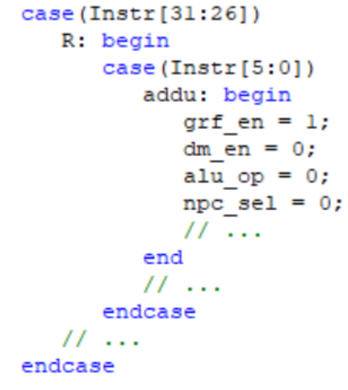
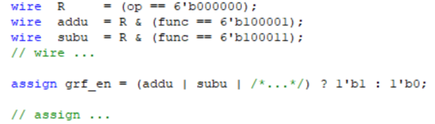

#Verilog流水线CPU设计文档

###一、 CPU设计方案综述

####（一） 总体设计概述

使用Verilog开发一个简单的流水线CPU，总体概述如下：

1. 此CPU为32位CPU

2. 此CPU为流水线设计

3. 此CPU支持的指令集为：

   mips-c指令集所有指令

4. add, sub不支持溢出

####（二） 关键模块定义


## 主代码mips

```verilog
`timescale 1ns / 1ps
`include "macro.v"
module mips(input clk,
            input reset,
            input interrupt,
            input [31:0] i_inst_rdata,//IM_RD
            input [31:0] m_data_rdata,//DM_RD

            output [31:0] macroscopic_pc,//PC
            output [31:0] i_inst_addr,//IM_Address
            output [31:0] m_data_addr,//DM_Address
            output [31:0] m_data_wdata,//DM_WD
            output [3:0] m_data_byteen,//DM_en
            output [31:0] m_int_addr,//Int_Address
            output [3:0] m_int_byteen,//Int_en
            output [31:0] m_inst_addr,//M_PC
            output w_grf_we,//Grf_en
            output [4:0] w_grf_addr,//Grf_Address
            output [31:0] w_grf_wdata,//Grf_WD
            output [31:0] w_inst_addr//W_PC
            );
    /////////////////////////////////////////////////////////////////////////////////////////////////////////////////////////////////////////
    ////cpu
    wire inter_T0,inter_T1;
    //Bridge
    wire [31:0] WD_out,RD_out;
    wire [31:0] Address_out;
    wire [3:0] DM_en;
    wire T0_WE,T1_WE;
    //TC
    wire [31:2] TC_Addr;
    wire [31:0] T0_RD,T1_RD;
    assign TC_Addr=Address_out[31:2];
    //interrupt
    //cpu
    cpu cpu (
    .clk(clk), //
    .reset(reset),// 
    .interrupt(interrupt), //
    .inter_T0(inter_T0), //
    .inter_T1(inter_T1), //

    .i_inst_rdata(i_inst_rdata),// 
    .Rdata(RD_out), //dm_read_data

    .macroscopic_pc(macroscopic_pc),//
    .i_inst_addr(i_inst_addr),// 
    .m_data_addr(m_data_addr), //
    .m_data_wdata(m_data_wdata), //dm_write_data
    .Byteen(m_data_byteen),// 
    .m_int_addr(m_int_addr),//Int_Address
    .m_int_byteen(m_int_byteen),//Int_en
    .m_inst_addr(m_inst_addr), 
    .w_grf_we(w_grf_we), //
    .w_grf_addr(w_grf_addr), //
    .w_grf_wdata(w_grf_wdata), //
    .w_inst_addr(w_inst_addr)//
    );

    //Bridge
    Bridge bridge (
    .Address_in(m_int_addr), 
    .WD_in(m_data_wdata), 
    .byteen(m_data_byteen), 
    .DM_RD(m_data_rdata), //
    .T0_RD(T0_RD), 
    .T1_RD(T1_RD),

    .DM_WE(DM_en),
    .T0_WE(T0_WE), 
    .T1_WE(T1_WE), 
    .Address_out(Address_out), 
    .WD_out(WD_out), //DM
    .RD_out(RD_out)
    );


    ////T0
    TC T0 (
    .clk(clk), 
    .reset(reset), 
    .Addr(TC_Addr), 
    .WE(T0_WE), 
    .Din(WD_out), 

    .Dout(T0_RD), 
    .IRQ(inter_T0)
    );

    ////T1
    TC T1 (
    .clk(clk), 
    .reset(reset), 
    .Addr(TC_Addr), 
    .WE(T1_WE), 
    .Din(WD_out), 

    .Dout(T1_RD), 
    .IRQ(inter_T1)
    );

endmodule
```


##宏的定义

```verilog
`timescale 1ns / 1ps
//alu
`define _ADD    12'b000000000001
`define _SUB    12'b000000000010
`define _AND    12'b000000000100
`define _OR     12'b000000001000
`define _XOR    12'b000000010000
`define _NOR    12'b000000100000
`define _SLL    12'b000001000000
`define _SRA    12'b000010000000
`define _SRL    12'b000100000000
`define _SLT    12'b001000000000
`define _SLTU   12'b010000000000
`define _ALUNew 12'b100000000000
//ifu
`define PC_Initial 32'h0000_3000
//ext
`define Zero_Ext 3'b001
`define Sign_Ext 3'b010
`define Lui_Ext  3'b100
//NPC
`define PC4_NPC         5'b00001
`define B_transfer_NPC  5'b00010
`define J_transfer_NPC  5'b00100
`define Jr_NPC          5'b01000
`define NEW_NPC         5'b10000
//Controller_for_Reg
`define ALUop_Initial       7'b0000001
`define AluSrc1_Initial     4'b0001
`define AluSrc2_Initial     4'b0001
`define WhichtoReg_Initial  8'b00000001
`define RegDst_Initial      4'b0001
`define DM_type_Initial     6'b000001
//DM
`define Word_DM           6'b000001
`define Half_DM           6'b000010
`define Byte_DM           6'b000100
`define Unsigned_Half_DM  6'b001000
`define Unsigned_Byte_DM  6'b010000
//B_transfer
`define nop_B_trans   4'b0000
`define beq_B_trans   4'b0001
`define bgez_B_trans  4'b0010
`define bgtz_B_trans  4'b0011
`define blez_B_trans  4'b0100
`define bltz_B_trans  4'b0101
`define bne_B_trans   4'b0110
//MD_Unit
`define nop_MDU   4'b0000
`define mult_MDU  4'b0001
`define multu_MDU 4'b0010
`define div_MDU   4'b0011
`define divu_MDU  4'b0100
`define mfhi_MDU  4'b0101
`define mflo_MDU  4'b0110
`define mthi_MDU  4'b0111
`define mtlo_MDU  4'b1000
//TC
`define IDLE 2'b00
`define LOAD 2'b01
`define CNT  2'b10
`define INT  2'b11
`define ctrl   mem[0]
`define preset mem[1]
`define count  mem[2]
//CP0
`define IM      SR[15:10]
`define EXL     SR[1]
`define IE      SR[0]
`define BD      Cause[31]
`define IP      Cause[15:10]
`define ExcCode Cause[6:2]
`define SR_Address    5'd12
`define Cause_Address 5'd13
`define EPC_Address   5'd14
//Bridge
`define Data_Begin    32'h0000_0000
`define Data_End      32'h0000_2fff
`define Text_Begin    32'h0000_3000
`define Text_End      32'h0000_6fff
`define Error_Entry   32'h0000_4180
`define T0_Begin      32'h0000_7f00
`define T0_End        32'h0000_7f0b
`define T1_Begin      32'h0000_7f10
`define T1_End        32'h0000_7f1b
`define Echo_Begin    32'h0000_7f20
`define Echo_End      32'h0000_7f23
//Error_Stream
`define Error_Int     5'd0
`define Error_AdEL    5'd4
`define Error_AdES    5'd5
`define Error_Syscall 5'd8
`define Error_RI      5'd10
`define Error_Ov      5'd12
```

## CPU模块

```verilog
`timescale 1ns / 1ps
`include "macro.v"
module cpu( input clk,
            input reset,
            input interrupt,
            input inter_T0,
            input inter_T1,

            input [31:0] i_inst_rdata,
            input [31:0] Rdata,

            output [31:0] macroscopic_pc,
            output [31:0] i_inst_addr,
            output [31:0] m_data_addr,
            output [31:0] m_data_wdata,
            output [3:0] Byteen,
            output [31:0] m_int_addr,//Int_Address
            output [3:0] m_int_byteen,//Int_en
            output [31:0] m_inst_addr,
            output w_grf_we,
            output [4:0] w_grf_addr,
            output [31:0] w_grf_wdata,
            output [31:0] w_inst_addr
            // output visited
            );
    /////////////////////////////////////////////////////////////////////////////////////////////////////////////////////////////////////////
    //datapath_for_wire_and_reg
    //datapath
    wire stall;
    //IFU
    wire en_PC;
	 wire [31:0] pc_in;
    wire [31:0] npc;
    wire [31:0] F_Instr;
    wire [31:0] F_PC;
    wire [31:0] F_PC_origin;
    
    //IF_ID
    wire [31:0] D_Instr;
    wire [31:0] D_PC;
    wire F_reg_clr;
    wire [4:0] f_ExcCode_in;
    wire [4:0] d_ExcCode_in;
    wire f_BD,d_BD;
    wire f_syscall;
    ///////////////////////////////////////////////////
    //Grf
    wire [4:0]  d_rs;
    wire [4:0]  d_rt;
    wire [4:0]  d_A3;
    wire [31:0] d_RD1;
    wire [31:0] d_RD2;
    //EXT
    wire [2:0] d_SignExt;
    //NPC
    wire [31:0] ra;
    wire [31:0] d_imm32;
    wire [25:0] d_J_address;
    wire [4:0]  d_branch;
    wire [31:0] D_PC8;
    wire d_ALU_change;
    //B_transfer
    wire [31:0] d_b_transfer1;
    wire [31:0] d_b_transfer2;
    wire [3:0] d_B_change;
    //Controller
    wire d_Wegrf_origin;
    wire [5:0] d_opcode;
    wire [5:0] d_func;
    wire [4:0] d_rd;
    wire [4:0] d_shamt;
    wire [15:0] d_imm16;
    wire [11:0] d_ALUop;
    wire d_Wegrf;
    wire d_WeDm;
    wire [3:0] d_AluSrc1;
    wire [3:0] d_AluSrc2;
    wire [7:0] d_WhichtoReg;
    wire [3:0] d_RegDst;
    wire [5:0] d_DM_type;
    wire d_check_new;
    wire d_excRI;
    wire d_mfc0,d_mtc0,d_eret,d_syscall;
    //ID_EX
    wire [4:0]  e_branch;
    wire [4:0] d_ExcCode_fixed;
    wire [4:0] e_ExcCode_in;
    wire [1:0] d_Tnew;
    wire [31:0] e_RD1;
    wire [31:0] e_RD2;
    wire [4:0] e_shamt;
    wire [4:0] e_rs,e_rt,e_rd;
    wire [4:0]  e_A3;
    wire [31:0] e_imm32;
    wire [31:0] E_PC;
    wire [31:0] E_PC8;
    wire [1:0] e_Tnew;
    wire e_Wegrf;
    wire e_WeDm;
    wire [11:0] e_ALUop;
    wire [3:0] e_AluSrc1;
    wire [3:0] e_AluSrc2;
    wire [7:0] e_WhichtoReg;
    wire [3:0] e_RegDst;
    wire [5:0] e_DM_type;
    wire e_check_new;
    wire e_ALU_change;
    wire e_BD;
    wire d_mdu_en;
    wire e_mfc0,e_mtc0,e_eret,e_syscall;
    ///////////////////////////////////////////////////
    //ALU
    wire [31:0] e_A;
    wire [31:0] e_B;
    wire [31:0] res;
    //MD_Unit
    wire [3:0] d_MDop,e_MDop;
    wire [31:0] HI,LO;
    wire [31:0] mdu_out;
    wire mdu_en,busy;
    //EX_MEM
    wire [4:0]  m_branch;
    wire [4:0] e_ExcCode_fixed;
    wire [4:0] m_ExcCode_in;
    wire [31:0] e_res;
    wire [31:0] m_RD2;
    wire [31:0] m_res;
    wire [4:0]  m_A3;
    wire [4:0] m_rd;
    wire [4:0] m_rt;
    wire [31:0] M_PC;
    wire [31:0] M_PC8;
    wire [1:0] m_Tnew;
    wire m_Wegrf;
    wire m_Wegrf_origin;
    wire m_WeDm;
    wire m_WeDm_origin;
    wire [7:0] m_WhichtoReg;
    wire [3:0] m_RegDst;
    wire [5:0] m_DM_type;
    wire m_check_new;
    wire [31:0] m_imm32;
    wire m_ALU_change;
    wire m_mfc0,m_mtc0,m_eret,m_syscall;
    wire m_BD;
    //////////////////////////////////////////////////////
    //DM
    wire [31:0] m_Address;
    wire [31:0] m_RD;
    wire [1:0] low2;
    wire [3:0] data_byteen ;
    wire [31:0] DM_input,DM_output;
    //CP0
    wire CP0_WE;
    wire [4:0] CP0_Address;
    wire [31:0] CP0_WD;
    wire BD_in;
    wire [31:0] VPC;
    wire [4:0] m_ExcCode_fixed;
    wire [7:2] HWInt;
    wire EXLClr;
    wire req;
    wire [31:0] EPC;
    wire [31:0] CP0_D_out;
    //MEM_WB
    wire [1:0] w_Tnew;
    wire [4:0]  w_A3;
    wire [31:0] w_res;
    wire [31:0] w_RD;
    wire [31:0] W_PC;
    wire [31:0] W_PC8;
    wire w_Wegrf;
    wire [7:0] w_WhichtoReg;
    wire [3:0] w_RegDst;
    wire [31:0] w_imm32;
    wire w_ALU_change;
    wire [4:0] m_A3_origin;
    /////////////////////////////////////////////////////////////////////////////////////////////////////////////////////////////////////////
    //main_part
    wire [1:0] D_Tuse_rs,D_Tuse_rt;
    wire [2:0] d_SelB_D1,d_SelB_D2;
    wire [2:0] d_SelALU_A,d_SelALU_B;
    wire d_SelDM;
    wire is_nop;
    wire [1:0] d_SelJr;
    wire [31:0] e_A_f,e_B_f;
    wire [31:0] M_WD_f;//DM
    wire [31:0] ED,MD,WD;
    //HazardUnit
    assign  is_nop=(D_Instr==0);
    HazardUnit hzu(
    .D_A1(d_rs),
    .D_A2(d_rt),
    .E_A1(e_rs),
    .E_A2(e_rt),
    .M_A2(m_rt),
    .E_A3(e_A3),
    .M_A3(m_A3),
    .W_A3(w_A3),
    .E_Wegrf(e_Wegrf),
    .M_Wegrf(m_Wegrf),
    .W_Wegrf(w_Wegrf),
    .D_check_new(d_check_new),
    .E_check_new(e_check_new),
    .M_check_new(m_check_new),
    
    
    .D_Tuse_rs(D_Tuse_rs),
    .D_Tuse_rt(D_Tuse_rt),
    .E_Tnew(e_Tnew),
    .M_Tnew(m_Tnew),
    .W_Tnew(w_Tnew),
    .E_WhichtoReg(e_WhichtoReg),
    .M_WhichtoReg(m_WhichtoReg),
    .start(mdu_en),
    .busy(busy),
    .MDU_en(d_mdu_en),
    .Is_nop(is_nop),

    .D_eret(d_eret),
    .E_mtc0(e_mtc0),
    .M_mtc0(m_mtc0),
    
    .SelB_D1(d_SelB_D1),
    .SelB_D2(d_SelB_D2),
    .SelALU_A(d_SelALU_A),
    .SelALU_B(d_SelALU_B),
    .SelDM(d_SelDM),
    .stall(stall)
    );
    //////////////////////////////////////////////F//////////////////////////////////////////////////////////////////////////////////////////
	 assign pc_in=(d_eret)?EPC+4:
                (req)?`Error_Entry:
                npc;
    // assign en_PC=~stall||m_eret||req;
    assign en_PC=~stall||req;
    //IFU
    PC pc(
    .clk(clk),
    .reset(reset),
    .NPC(pc_in),
    .en(en_PC),
    
    .PC(F_PC_origin)
    );
    wire F_error_range;
    assign F_Instr=(F_error_range)?0:i_inst_rdata;
    /////////////////////EXCEPTION/////////////////////////
    assign f_syscall=(F_Instr[31:26] == 6'b000000)&&(F_Instr[5:0] == 6'b001100);
    assign F_error_range=((F_PC<`Text_Begin)||(F_PC>`Text_End)||(|F_PC[1:0]))&&(!d_eret);
    assign f_ExcCode_in=(F_error_range)?`Error_AdEL:
                        (f_syscall)?`Error_Syscall:
                        5'd0;
    assign f_BD=(d_branch!=5'd1);
    ///////////////////////////////////////////////////////
    //IF_ID
    // assign F_reg_clr=d_check_new&&~d_ALU_change&&~stall;
    assign F_reg_clr=1'b0;
    assign F_PC=(d_eret)?EPC:F_PC_origin;
    IF F_reg(
    .clk(clk),
    .reset(reset),
    .en(en_PC),
    .clr(F_reg_clr),
    .req(req),
    .F_Instr(F_Instr),
    .F_PC(F_PC),
    .F_ExcCode(f_ExcCode_in),
    .F_BD(f_BD),
    
    .D_Instr(D_Instr),
    .D_PC(D_PC),
    .D_ExcCode(d_ExcCode_in),
    .D_BD(d_BD)
    );
    //////////////////////////////////////////////D//////////////////////////////////////////////////////////////////////////////////////////
    //Grf
    GRF grf(
    .A1(d_rs),
    .A2(d_rt),
    .A3(w_A3),
    .WD(WD),
    .clk(clk),
    .reset(reset),
    .WE(w_Wegrf),
    .WPC(W_PC),
    
    .RD1(d_RD1),
    .RD2(d_RD2)
    );
    //EXT
    EXT ext(
    .imm16(d_imm16),
    .sign(d_SignExt),
    
    .imm32(d_imm32)
    );
    //NPC
    assign ra = d_b_transfer1;
    //
    NPC Npc(
    .F_PC(F_PC),
    .D_PC(D_PC),
    .offset(d_imm32),
    .imm26(d_J_address),
    .ra(ra),
    .rt(d_b_transfer2),
    .branch(d_branch),
    .ALU_change(d_ALU_change),
    
    .npc(npc),
    .PC8(D_PC8)
    );
    //B_transfer
    assign d_b_transfer1 =  (d_SelB_D1 == 3'b000)?d_RD1:
                            (d_SelB_D1 == 3'b001)?WD:
                            (d_SelB_D1 == 3'b010)?MD:
                            ED;
    assign d_b_transfer2 =  (d_SelB_D2 == 3'b000)?d_RD2:
                            (d_SelB_D2 == 3'b001)?WD:
                            (d_SelB_D2 == 3'b010)?MD:
                            ED;
    B_transfer b_trans(
    .A(d_b_transfer1),
    .B(d_b_transfer2),
    .Type(d_B_change),
    
    .ALU_change(d_ALU_change)
    );
    //controller
    assign 	d_opcode    = D_Instr[31:26];
    assign 	d_rs        = D_Instr[25:21];
    assign 	d_rt        = D_Instr[20:16];
    assign 	d_rd        = D_Instr[15:11];
    assign 	d_shamt     = D_Instr[10:6];
    assign 	d_func      = D_Instr[5:0];
    assign 	d_imm16     = D_Instr[15:0];
    assign 	d_J_address = D_Instr[25:0];
    Controller controller(
    .op(d_opcode),
    .func(d_func),
    .rs(d_rs),
    .rt(d_rt),
    
    .ALUop(d_ALUop),
    .Wegrf(d_Wegrf),
    .WeDm(d_WeDm),
    .branch(d_branch),
    .AluSrc1(d_AluSrc1),
    .AluSrc2(d_AluSrc2),
    .WhichtoReg(d_WhichtoReg),
    .RegDst(d_RegDst),
    .SignExt(d_SignExt),
    .B_change(d_B_change),
    .DM_type(d_DM_type),
    .MDop(d_MDop),
    .check_new(d_check_new),
    .excRI(d_excRI),
    
    .D_Tuse_rs(D_Tuse_rs),
    .D_Tuse_rt(D_Tuse_rt),
    .D_Tnew(d_Tnew),

    .mfc0(d_mfc0),
    .mtc0(d_mtc0),
    .eret(d_eret),
    .syscall(d_syscall)
    );

    // assign d_Wegrf=d_check_new&&(d_branch!=`PC4_NPC)?(d_ALU_change?1'b1:1'b0):d_Wegrf_origin;
    assign d_Wegrf=d_Wegrf_origin;
    //submit for branch
    //////////////////////////////EXCEPTION/////////////////////////////////
    assign d_ExcCode_fixed= (d_excRI)?`Error_RI:
                            d_ExcCode_in;
    ////////////////////////////////////////////////////////////////////////
    //ID_EX
    ID D_reg(
    .clk(clk),
    .reset(reset),
    .clr(stall),
    .req(req),
    .D_RD1(d_b_transfer1),
    .D_RD2(d_b_transfer2),
    .D_instr_s(d_shamt),
    .D_A1(d_rs),
    .D_A2(d_rt),
    .D_A3(d_rd),
    .D_imm32(d_imm32),
    .D_PC(D_PC),
    .D_PC8(D_PC8),
    .D_Tnew(d_Tnew),
    .D_Wegrf(d_Wegrf),
    .D_WeDm(d_WeDm),
    .D_ALUop(d_ALUop),
    .D_AluSrc1(d_AluSrc1),
    .D_AluSrc2(d_AluSrc2),
    .D_WhichtoReg(d_WhichtoReg),
    .D_RegDst(d_RegDst),
    .D_DM_type(d_DM_type),
    .D_ALU_change(d_ALU_change),
    .D_MDop(d_MDop),
    .D_check_new(d_check_new),
    .D_branch(d_branch),
    .D_ExcCode(d_ExcCode_fixed),
    .D_BD(d_BD),
    .D_mfc0(d_mfc0),
    .D_mtc0(d_mtc0),
    .D_eret(d_eret),
    .D_syscall(d_syscall),
    
    .E_RD1(e_RD1),
    .E_RD2(e_RD2),
    .E_instr_s(e_shamt),
    .E_A1(e_rs),
    .E_A2(e_rt),
    .E_A3(e_rd),
    .E_imm32(e_imm32),
    .E_PC(E_PC),
    .E_PC8(E_PC8),
    .E_Tnew(e_Tnew),
    .E_Wegrf(e_Wegrf),
    .E_WeDm(e_WeDm),
    .E_ALUop(e_ALUop),
    .E_AluSrc1(e_AluSrc1),
    .E_AluSrc2(e_AluSrc2),
    .E_WhichtoReg(e_WhichtoReg),
    .E_RegDst(e_RegDst),
    .E_DM_type(e_DM_type),
    .E_ALU_change(e_ALU_change),
    .E_MDop(e_MDop),
    .E_check_new(e_check_new),
    .E_branch(e_branch),
    .E_ExcCode(e_ExcCode_in),
    .E_BD(e_BD),
    .E_mfc0(e_mfc0),
    .E_mtc0(e_mtc0),
    .E_eret(e_eret),
    .E_syscall(e_syscall)
    );
    assign d_mdu_en=(d_MDop!=`nop_MDU);
    //////////////////////////////////////////////E//////////////////////////////////////////////////////////////////////////////////////////
    assign 	e_A3 =  (e_RegDst == 4'b0001)?e_rd:
                    (e_RegDst == 4'b0010)?e_rt:
                    5'b11111;
    //ALU
    assign e_A = 	(e_AluSrc1 == 4'b0001)?e_A_f://
                  e_B_f;
    
    assign e_A_f =  (d_SelALU_A == 3'b010)?MD:
                    (d_SelALU_A == 3'b001)?WD:
                    e_RD1;//rs
    assign e_B_f =  (d_SelALU_B == 3'b010)?MD:
                    (d_SelALU_B == 3'b001)?WD:
                    e_RD2;//rt
    
    
    assign e_B = 	(e_AluSrc2 == 4'b0001)?e_B_f:
                  (e_AluSrc2 == 4'b0010)?e_imm32://
                  (e_AluSrc2 == 4'b0100)?({{27{1'b0}},e_shamt}):
                  e_A_f;
    ///////////EXCEPTION////////////////////
    wire Error_Ov_Alu;
    assign Error_Ov_Alu=overflow&&(e_DM_type==6'd0);
    wire Error_Ov_DM;
    assign Error_Ov_DM=overflow&&(e_DM_type!=6'd0);
    assign e_ExcCode_fixed= (Error_Ov_DM)?((e_WeDm)?`Error_AdES:`Error_AdEL):
                            (Error_Ov_Alu)?`Error_Ov:
                            e_ExcCode_in;
    ///////////////////////////////////////
    ALU alu(
    .A(e_A),
    .B(e_B),
    .ALUop(e_ALUop),
    
    .res(res),
    .overflow(overflow)
    );
    //MD_Unit
    assign mdu_en=(e_MDop==`mult_MDU)||(e_MDop==`multu_MDU)||
                  (e_MDop==`div_MDU)||(e_MDop==`divu_MDU);
    MD_Unit mdu (
    .clk(clk), 
    .reset(reset), 
    .en(mdu_en),
    .req(req), 
    .MDop(e_MDop), 
    .A(e_A), 
    .B(e_B),

    .HI(HI), 
    .LO(LO), 
    .out(mdu_out), 
    .busy(busy)
    );
    assign e_res=(e_MDop==`mfhi_MDU||e_MDop==`mflo_MDU)?mdu_out:
                                                        res;
    //EX_MEM
    assign 	ED =  (e_WhichtoReg == 8'b0000_0001)?e_res:
                  // (e_WhichtoReg == 8'b0000_0010)?e_RD:
                  (e_WhichtoReg == 8'b0000_0100)?e_imm32:
                  (e_WhichtoReg == 8'b0000_1000)?E_PC8:
                  e_ALU_change;//
    EX E_reg(
    .clk(clk),
    .reset(reset),
    .req(req),
    .E_A2(e_rt),
    .E_rd(e_rd),
    .E_A3(e_A3),
    .E_RD2(e_B_f),
    .E_ALUout(e_res),
    .E_PC(E_PC),
    .E_PC8(E_PC8),
    .E_Tnew(e_Tnew),
    .E_Wegrf(e_Wegrf),
    .E_WeDm(e_WeDm),
    .E_WhichtoReg(e_WhichtoReg),
    .E_RegDst(e_RegDst),
    .E_DM_type(e_DM_type),
    .E_imm32(e_imm32),
    .E_ALU_change(e_ALU_change),
    .E_check_new(e_check_new),
    .E_branch(e_branch),
    .E_ExcCode(e_ExcCode_fixed),
    .E_BD(e_BD),
    .E_mfc0(e_mfc0),
    .E_mtc0(e_mtc0),
    .E_eret(e_eret),
    .E_syscall(e_syscall),

    .M_A2(m_rt),
    .M_A3(m_A3_origin),
    .M_rd(m_rd),
    .M_RD2(m_RD2),
    .M_ALUout(m_res),
    .M_PC(M_PC),
    .M_PC8(M_PC8),
    .M_Tnew(m_Tnew),
    .M_Wegrf(m_Wegrf_origin),
    .M_WeDm(m_WeDm_origin),
    .M_WhichtoReg(m_WhichtoReg),
    .M_RegDst(m_RegDst),
    .M_DM_type(m_DM_type),
    .M_imm32(m_imm32),
    .M_ALU_change(m_ALU_change),
    .M_check_new(m_check_new),
    .M_branch(m_branch),
    .M_ExcCode(m_ExcCode_in),
    .M_BD(m_BD),
    .M_mfc0(m_mfc0),
    .M_mtc0(m_mtc0),
    .M_eret(m_eret),
    .M_syscall(m_syscall)
    );
    //////////////////////////////////////////////M//////////////////////////////////////////////////////////////////////////////////////////
    //DM
    assign m_Address = m_res;
    assign M_WD_f    =  (d_SelDM)?WD:
                        m_RD2;
    assign m_WeDm=(req)?0:m_WeDm_origin;
    //////////////////////////////////////////EXCEPTION///////////////////////
    wire is_DM;
    assign is_DM=(m_DM_type==`Word_DM)||(m_DM_type==`Half_DM)||(m_DM_type==`Unsigned_Half_DM)||(m_DM_type==`Byte_DM)||(m_DM_type==`Unsigned_Byte_DM);
    wire Is_Align;
    assign Is_Align=((m_DM_type==`Word_DM)&&(|low2))||
                    ((m_DM_type==`Half_DM||m_DM_type==`Unsigned_Half_DM)&&(low2[0]));
    wire Is_ErrorRange;
    assign Is_ErrorRange=!((m_Address>=`Data_Begin&&m_Address<=`Data_End)||
                          (m_Address >= `T0_Begin&&m_Address <= `T0_End)||
                          (m_Address >= `T1_Begin&&m_Address <= `T1_End)||
                          (m_Address >= `Echo_Begin&&m_Address <= `Echo_End));
    wire Error_Timer;
    assign Error_Timer=(m_DM_type!=`Word_DM)&&((m_Address >= `T0_Begin&&m_Address <= `T0_End)||
                          (m_Address >= `T1_Begin&&m_Address <= `T1_End));
    wire Error_Save_Timer;
    assign Error_Save_Timer=(m_Address>=32'h0000_7f08&&m_Address<=32'h0000_7f0b)||
                            (m_Address>=32'h0000_7f18&&m_Address<=32'h0000_7f1b);
    assign m_ExcCode_fixed=((is_DM&&Is_Align&&!m_WeDm_origin)||(is_DM&&Is_ErrorRange&&!m_WeDm_origin)||(is_DM&&Error_Timer&&!m_WeDm_origin))?`Error_AdEL:
                           ((is_DM&&Is_Align&&m_WeDm_origin)||(is_DM&&Is_ErrorRange&&m_WeDm_origin)||(is_DM&&Error_Timer&&m_WeDm_origin)||(is_DM&&Error_Save_Timer&&m_WeDm_origin))?`Error_AdES:
                           m_ExcCode_in;
    //////////////////////////////////////////////////////////////////////////
    assign low2=m_Address[1:0];
    wire [31:0] m_Rd_origin;
    DM_In din(.low2(low2),
              .WD(M_WD_f),
              .DM_type(m_DM_type),

              .data_byteen(data_byteen),
              .DM_input(DM_input)
              );
    assign DM_output=Rdata;
    DM_Out dot( .low2(low2),
                .DM_type(m_DM_type),
                .DM_output(DM_output),

                .RD(m_Rd_origin));
    assign 	MD =  (m_WhichtoReg == 8'b0000_0001)?m_res:
                  // (m_WhichtoReg == 8'b0000_0010)?m_RD:
                  (m_WhichtoReg == 8'b0000_0100)?m_imm32:
                  (m_WhichtoReg == 8'b0000_1000)?M_PC8:
                  m_ALU_change;//
    assign m_A3=m_A3_origin;//condition
    wire condition;
    assign condition=1'b0;
    // assign m_A3=m_check_new?(condition?5'd31:m_A3_origin):m_A3_origin;//condition
    ///////provide for condition///////////////
    

    //////////////////////////////////////////
    //CP0
    assign CP0_WE=m_mtc0;
    assign CP0_Address=m_rd;
    assign CP0_WD=M_WD_f;
    assign BD_in=m_BD;
    assign VPC=(m_branch==5'b00001)?M_PC:D_PC;
    assign HWInt={3'd0,interrupt,inter_T1,inter_T0};
    assign EXLClr=m_eret;
    CP0 cp0 (
    .clk(clk), 
    .reset(reset), 
    .WE(CP0_WE), 
    .Address(CP0_Address), 
    .WD(CP0_WD), 
    .BD_in(BD_in), 
    .VPC(VPC), 
    .ExcCode_in(m_ExcCode_fixed), 
    .HWInt(HWInt), 
    .EXLClr(EXLClr), 
    .req(req), 
    .EPC(EPC), 
    .D_out(CP0_D_out)
    );
    assign m_RD=(m_mfc0)?CP0_D_out:m_Rd_origin;
    assign m_Wegrf=(req)?0:m_Wegrf_origin;
    //MEM_WE
    MEM M_reg(
    .clk(clk),
    .reset(reset),
    .M_A3(m_A3),
    .M_ALUout(m_res),
    .M_RD(m_RD),
    .M_PC(M_PC),
    .M_PC8(M_PC8),
    .M_Wegrf(m_Wegrf),
    .M_WhichtoReg(m_WhichtoReg),
    .M_RegDst(m_RegDst),
    .M_imm32(m_imm32),
    .M_ALU_change(m_ALU_change),
    .M_Tnew(m_Tnew),
    
    .W_A3(w_A3),
    .W_ALUout(w_res),
    .W_RD(w_RD),
    .W_PC(W_PC),
    .W_PC8(W_PC8),
    .W_Wegrf(w_Wegrf),
    .W_WhichtoReg(w_WhichtoReg),
    .W_RegDst(w_RegDst),
    .W_imm32(w_imm32),
    .W_ALU_change(w_ALU_change),
    .W_Tnew(w_Tnew)
    );
    //////////////////////////////////////////////W//////////////////////////////////////////////////////////////////////////////////////////
    assign 	WD =  (w_WhichtoReg == 8'b0000_0001)?w_res:
                  (w_WhichtoReg == 8'b0000_0010)?w_RD:
                  (w_WhichtoReg == 8'b0000_0100)?w_imm32:
                  (w_WhichtoReg == 8'b0000_1000)?W_PC8:
                  w_ALU_change;//
    // output/////////////////////////////////////////////////////////////////////////
    assign  macroscopic_pc= M_PC;
    assign  i_inst_addr   = (d_eret)?EPC:F_PC;
    assign  m_data_addr   = m_Address;
    assign  m_data_wdata  = DM_input;
    assign  Byteen        = (m_WeDm)?data_byteen:4'b0000;
    assign  m_int_addr    = m_Address;//Int_Address
    assign  m_int_byteen  = (m_WeDm)?data_byteen:4'b0000;//Int_en
    assign  m_inst_addr   = M_PC;
    assign  w_grf_we      = w_Wegrf;
    assign  w_grf_addr    = w_A3;
    assign  w_grf_wdata   = WD;
    assign  w_inst_addr   = W_PC;
    // assign  visited       = (m_data_addr==32'h7f20);

endmodule
```


## <一>.F级流水线

####1. PC

（1） 端口说明

<center>表1-IFU端口说明</center>

| 序号 | 信号名    | 方向 | 描述                                                        |
| ---- | --------- | ---- | ----------------------------------------------------------- |
| 1    | clk       | I    | 时钟信号                                                    |
| 2    | reset     | I    | 同步复位信号，将PC值置为0x0000_3000：<br>0：无效<br>1：复位 |
| 3    | en        | I    | 使能信号，决定是否阻塞                                      |
| 4    | NPC[31:0] | I    | 下一周期PC的地址                                            |
| 6    | PC[31:0]  | O    | 当前执行的PC                                                |


（2） 功能定义

<center>表2-IFU功能定义</center>

| 序号 | 功能       | 描述                          |
| ---- | ---------- | ----------------------------- |
| 1    | 复位       | reset有效时，PC置为0x00003000 |
| 2    | 更新PC的值 | 将PC赋值为NPC                 |


## <二>.D级流水线

####1. GRF

（1） 端口说明

<center>表3-GRF端口说明</center>

| 序号 | 信号名    | 方向 | 描述                                                         |
| ---- | --------- | ---- | ------------------------------------------------------------ |
| 1    | clk       | I    | 时钟信号                                                     |
| 2    | reset     | I    | 同步复位信号，将32个寄存器中全部清零<br>1：清零<br>0：无效   |
| 3    | WE        | I    | 写使能信号<br>1：可向GRF中写入数据<br>0：不能向GRF中写入数据 |
| 4    | A1[4:0]   | I    | 5位地址输入信号，指定32个寄存器中的一个，将其中存储的数据读出到RD1 |
| 5    | A2[4:0]   | I    | 5位地址输入信号，指定32个寄存器中的一个，将其中存储的数据读出到RD2 |
| 6    | A3[4:0]   | I    | 5位地址输入信号，指定32个寄存器中的一个，作为RD的写入地址    |
| 7    | WD[31:0]  | I    | 32位写入数据                                                 |
| 8    | WPC[31:0] | I    | 当前写入GRF的PC                                              |
| 9    | RD1[31:0] | O    | 输出A1指定的寄存器的32位数据                                 |
| 10   | RD2[31:0] | O    | 输出A2指定的寄存器的32位数据                                 |

 

（2） 功能定义

<center>表4-GRF功能定义</center>

| 序号 | 功能     | 描述                                                        |
| ---- | -------- | ----------------------------------------------------------- |
| 1    | 同步复位 | reset为1时，将所有寄存器清零                                |
| 2    | 读数据   | 将A1和A2地址对应的寄存器的值分别通过RD1和RD2读出            |
| 3    | 写数据   | 当WE为1且时钟上升沿来临时，将WD写入到A3对应的寄存器内部     |
| 4    | 内部转发 | 当A1和A2之一与A3相等且写入信号为1时，用WD代替RD1或RD2的输出 |


####2. EXT

(1) 端口说明

<center>表9-EXT端口说明</center>

| 序号 | 信号名      | 方向 | 描述                                                         |
| ---- | ----------- | ---- | ------------------------------------------------------------ |
| 1    | imm16[15:0] | I    | 代扩展的16位信号                                             |
| 2    | sign[2:0]   | I    | 无符号或符号扩展选择信号<br/>3'b001：无符号扩展<br/>3'b010：符号扩展<br>3'b100:   寄存到高位 |
| 3    | imm32[31:0] | O    | 扩展后的32位的信号                                           |

 

(2) 功能定义

<center>表10-EXT功能定义</center>

| 序号 | 功能       | 描述                                    |
| ---- | ---------- | --------------------------------------- |
| 1    | 无符号扩展 | 当sign为3’b001时，将imm16无符号扩展输出 |
| 2    | 符号扩展   | 当sign为3‘b010时，将imm16符号扩展输出   |
| 3    | 存储到高位 | 当sign为3’100时，将imm16存在高16位      |

 

####3. Controller

(1) 端口说明

<center>表11-Controller端口说明</center>

| 序号 | 信号名          | 方向 | 描述                                                         |
| ---- | --------------- | ---- | ------------------------------------------------------------ |
| 1    | op[5:0]         | I    | instr[31:26]6位控制信号                                      |
| 2    | func[5:0]       | I    | instr[5:0]6位控制信号                                        |
| 3 | rt[4:0] | I | instr[20:16]5位控制信号 |
| 4   | AluOp[11:0]     | O    | ALU的控制信号                                                |
| 5   | WeGrf           | O    | GRF写使能信号<br/>0：禁止写入<br/>1：允许写入                |
| 6   | WeDm            | O    | DM的写入信号<br/>0：禁止写入<br/>1：允许写入                 |
| 7  | branch[3:0]     | O    | PC转移位置选择信号<br>4'b0001:其他情况<br>4'b0010:beq<br>4'b0100:j\|\|jal<br>4'b1000:jr; |
| 8   | AluSrc1[3:0]    | O    | 参与ALU运算的第一个数<br/>4'b0001：RD1<br/>4'b0010：RD2      |
| 9   | AluSrc2[3:0]    | O    | 参与ALU运算的第二个数，来自GRF还是imm<br/>4'b0001：RD2<br/>4'b0010：imm32<br/>4'b0100: offset |
| 10  | WhichtoReg[7:0] | O    | 将何种数据写入GRF？<br/>8'b0000_0001：ALU计算结果<br/>8'b0000_0010：DM读出信号<br/>8'b0000_0100：upperImm<br/>8'b0000_1000: PC+4 |
|11|RegDst[3:0]|O|写入GRF的哪个寄存器？<br>4'b0001:rd<br>4'b0010:rt<br>4'b0100:31号寄存器|
|12|SignExt[2:0]|O|拓展方式：<br>3'b001:0拓展<br>3'b010:符号拓展<br>3'b100:存储到高位|
|13|B_change[3:0]|O|B转移的类型<br>4'b0001:beq<br>4'b0010:slt<br>4'b0100:blez|
|14|DM_type[5:0]|O|存取指令类型：<br>6'b000001:lw/sw<br>6'b000010:lh/sh<br>6'b000100:lb/sb<br />6'b001000:lhu<br />6'b010000:lbu|
|15|MDop[3:0]|O|乘除指令选择信号：<br />4‘b0000:无操作<br />4’b0001:mult<br />4'b0010:multu<br />4'b0011:div<br />4'b0100:divu<br />4'b0101:mfhi<br />4'b0110:mflo<br />4'b0111:mthi<br />4'b1000:mtlo|
| 16 | D_Tuse_rs[1:0] | O | 指令的rs寄存器的值从第一次进入D级到被使用的周期数 |
| 17 | D_Tuse_rt[1:0] | O | 指令的rt寄存器的值从第一次进入D级到被使用的周期数 |
| 18 | D_Tnew[1:0] | O | 指令从进入D开始到产生运算结果需要的周期数 |


#### 4.NPC

#### NPC（下一指令计算单元）

 该模块根据当前pc（包括D级和F级）和其他控制信号（NPCOp，CMP输出信息），计算出下一指令所在的地址npc，传入IFU模块。

- **端口定义**

  | 信号名     | 方向 | 位宽 | 描述                                                         |
  | :--------- | :--- | :--- | :----------------------------------------------------------- |
  | F_pc       | I    | 32   | F级指令地址                                                  |
  | D_pc       | I    | 32   | D级指令地址                                                  |
  | offset     | I    | 32   | 地址偏移量，用于计算B类指令所要跳转的地址                    |
  | imm26      | I    | 26   | 当前指令数据的前26位（0~25），用于计算jal和j指令所要跳转的地址 |
  | ra         | I    | 32   | 储存在寄存器（$ra或是jalr指令中存储“PC+4”的寄存器）中的地址数据，用于实现jr和jalr指令 |
  | ALU_change | I    | 1    | B类指令判断结果 1：说明当前B类指令的判断结果为真 0：说明判断结果为假 |
  | branch     | I    | 4    | NPC功能选择 0x000：顺序执行 0x001：B类指令跳转 0x010: jal/j跳转 0x011: jr/jalr跳转 |
  | npc        | O    | 32   | 输出下一指令地址                                             |
  | PC8        | O    | 32   | jr指令时存储PC+8的值                                         |
  
  
  
  

#### 5.B_transfer(B类指令比较单元)

 该单元根据输入的CMPOp信号对当前B指令的类型进行判断，进而对当前输入的数值进行相应比较，最后输出结果。

- **端口定义**

  | 信号名     | 方向 | 位宽 | 描述                                                         |
  | :--------- | :--- | :--- | :----------------------------------------------------------- |
  | A          | I    | 32   | 输入B_transfer单元的第一个数据                               |
  | B          | I    | 32   | 输入B_transfer单元的第二个数据                               |
  | Type       | I    | 4    | Type功能选择信号<br> 0x0001：beq判断<br> 0x0010：slt判断 <br>0x0100：blez判断 |
  | ALU_change | O    | 1    | 判断结果输出 <br>1: 判断结果为真<br> 0：判断结果为假         |
  
  
  
  

## <三>.E级流水线

####1. ALU

(1) 端口说明

<center>表5-ALU端口说明</center>

| 序号 | 信号名      | 方向 | 描述                                                         |
| ---- | ----------- | ---- | ------------------------------------------------------------ |
| 1    | A[31:0]     | I    | 参与运算的第一个数                                           |
| 2    | B[31:0]     | I    | 参与运算的第二个数                                           |
| 3    | ALUop[11:0] | I    | 决定ALU做何种操作<br>12'b0000_0000_0001：无符号加<br/>12'b0000_0000_0010：无符号减<br/>12'b0000_0000_0100：与<br/>12'b0000_0000_1000：或<br/>12‘b0000_0001_0000:异或<br />12‘b0000_0010_0000:或非<br />12‘b0000_0100_0000:sll<br />12‘b0000_1000_0000:sra<br />12‘b0001_0000_0000:srl<br />12‘b0010_0000_0000:slt<br />12‘b0100_0000_0000:sltu |
| 4    | res         | O    | A与B做运算后的结果                                           |

 

(2) 功能定义

<center>表6-ALU功能定义</center>

| 序号 | 功能       | 描述         |
| ---- | ---------- | ------------ |
| 1    | 加运算     | res = A + B  |
| 2    | 减运算     | res = A - B  |
| 3    | 与运算     | res = A & B  |
| 4    | 或运算     | res = A \| B |
| 5    | 左移位运算 | Res=A<<B     |


 ####2.MD_Unit
 - **端口定义**

| 方向 | 信号名  | 位宽 | 描述              | 输入来源        |
| :--- | :------ | :--- | :---------------- | :-------------- |
| I    | clk     | 1    | 时钟信号          | mips.v中的clk   |
| I    | reset   | 1    | 同步复位信号      | mips.v中的reset |
| I    | en      | 1    | MD_Unit使能信号 | 判断是否为乘除计算 |
| I    | MDop | 4   | 指令选择信号 | Controller |
| I    | A    | 32   | 第一个计算数     | e_A        |
| I | B | 32 | 第二个计算数 | e_B |
| O | HI | 32 | HI寄存器输出 |  |
| O | LO | 32 | LO寄存器输出 |  |
| O    | out | 32   | 取出HI或LO的值 |                 |
| O    | busy  | 1  | 是否在进行乘除计算 |                 |


## <四>.M级流水线

####1. DM_In
 - **端口定义**

| 方向 | 信号名  | 位宽 | 描述              | 输入来源        |
| :--- | :------ | :--- | :---------------- | :-------------- |
| I    | low2  | 2   | 时钟信号          | Address低两位                                                |
| I    | WD  | 31   | 处理前写入结果  | 32位写入数据 |
| I    | DM_type | 6    | 决定存取指令类型 | 存取指令类型：<br/>6'b000001:lw/sw<br/>6'b000010:lh/sh<br/>6'b000100:lb/sb<br />6'b001000:lhu<br />6'b010000:lbu |
| O    | data_byteen | 4  | 字节使能信号 |                 |
| O    | DM_input | 32 | 处理后的写入结果 |                 |


####2.DM_Out

 - **端口定义**

| 方向 | 信号名  | 位宽 | 描述              | 输入来源        |
| :--- | :------ | :--- | :---------------- | :-------------- |
| I    | low2  | 2   | 时钟信号          | Address低两位                                                |
| I    | DM_output | 32  | 处理前读入信号 | 32位读入数据 |
| I    | DM_type | 6    | 决定存取指令类型 | 存取指令类型：<br/>6'b000001:lw/sw<br/>6'b000010:lh/sh<br/>6'b000100:lb/sb<br />6'b001000:lhu<br />6'b010000:lbu |
| O    | RD | 32 | 处理后的读入结果 |                 |

#### 3.CP0

- **端口定义**
| 方向 | 信号名  | 位宽 | 描述              | 输入来源        |
| :--- | :------ | :--- | :---------------- | :-------------- |
| I | clk        | 1   | 时钟信号          | cpu主时钟                                        |
| I    | reset | 1  | 复位信号 | cpu同步复位信号 |
| I    | WE | 1   | 写入使能 | 前一级相同信号输入 |
| I | Address | 5 | CP0 寄存器编号 | 前一级相同信号输入 |
| I | WD | 32 | CP0 寄存器的写入数据 | 前一级相同信号输入 |
| I | BD_in | 1 | 分支延迟槽指令标志 | 前一级相同信号输入 |
| I | VPC | 32 | 中断/异常时的 PC | 前一级相同信号输入 |
| I | ExcCode_in | 5 | 中断/异常的类型 | 前一级相同信号输入 |
| I | HWInt | 6 | 6 个设备中断 | 前一级相同信号输入 |
| I | EXLClr | 1 | 置 0 SR 的EXL 位 | m_eret控制信号输入 |
| O | req | 1 | 异常/中断请求 |  |
| O    | EPC | 32 | 处理后的读入结果 |                 |
| O | D_out | 32 | CP0 寄存器的输出数据 | |


## <五>.各级流水线寄存器

#### 1.IF_ID

#### D_Reg（IF/ID流水寄存器）

- **端口定义**

  | 方向 | 信号名    | 位宽 | 描述                       | 输入来源           |
  | :--- | :-------- | :--- | :------------------------- | :----------------- |
  | I    | clk       | 1    | 时钟信号                   | mips.v中的clk      |
  | I    | reset     | 1    | 同步复位信号               | mips.v中的reset    |
  | I    | en        | 1    | D级寄存器使能信号          | stall信号取反      |
  | I    | clr       | 1    | D级寄存器清空信号          | 是否清空延迟槽决定 |
  | I    | req       | 1    | D级寄存器异常/中断请求信号 | CP0                |
  | I    | F_instr   | 32   | F级instr输入               | IFU_instr          |
  | I    | F_pc      | 32   | F级pc输入                  | IFU_pc             |
  | I    | F_ExcCode | 5    | F级ExcCode输入             | 前一级相同信号     |
  | I    | F_BD      | 1    | F级BD输入                  | 前一级相同信号     |
  | O    | D_instr   | 32   | D级instr输出               |                    |
  | O    | D_pc      | 32   | D级pc输出                  |                    |
  | O    | D_ExcCode | 5    | D级ExcCode输出             |                    |
  | O    | D_BD      | 1    | D级BD输出                  |                    |
  
  
  
  

#### 2.ID_EX

#### E_Reg（ID/EX流水寄存器）

- **端口定义**

  | 方向 | 信号名       | 位宽 | 描述              | 输入来源                    |
  | :--- | :----------- | :--- | :---------------- | :-------------------------- |
  | I    | clk          | 1    | 时钟信号          | mips.v中的clk               |
  | I    | reset        | 1    | 同步复位信号      | mips.v中的reset             |
  | I    | clr          | 1    | E级寄存器清空信号 | HazardUnit中stall信号       |
  | I    | req          | 1    |                   |                             |
  | I    | D_RD1        | 32   | D级GRF输出RD1     | 通过B_transfer_D1转发的数据 |
  | I    | D_RD2        | 32   | D级GRF输出RD2     | 通过B_transfer_D2转发的数据 |
  | I    | D_instr_s    | 5    | D级instr的shamt   | D_instr的s域数据            |
  | I    | D_A1         | 5    | D级A1输入         | D_instr的rs域数据           |
  | I    | D_A2         | 5    | D级A2输入         | D_instr的rt域数据           |
  | I    | D_A3         | 5    | D级A3输入         | 通过MUX_A3选择出的数据      |
  | I    | D_imm32      | 32   | D级imm32输入      | 通过EXT模块扩展出的数据     |
  | I    | D_PC         | 32   | D级PC输入         | 前一级相同信号              |
  | I    | D_PC8        | 32   | D级PC8输入        | 前一级相同信号              |
  | I    | Tnew_D       | 2    | D级指令的Tnew输入 | 前一级相同信号              |
  | I    | D_Wegrf      | 1    | D级控制信号输入   | 前一级相同信号              |
  | I    | D_WeDm       | 1    | D级控制信号输入   | 前一级相同信号              |
  | I    | D_ALUop      | 7    | D级控制信号输入   | 前一级相同信号              |
  | I    | D_AluSrc1    | 4    | D级控制信号输入   | 前一级相同信号              |
  | I    | D_AluSrc2    | 4    | D级控制信号输入   | 前一级相同信号              |
  | I    | D_WhichtoReg | 8    | D级控制信号输入   | 前一级相同信号              |
  | I    | D_RegDst     | 4    | D级控制信号输入   | 前一级相同信号              |
  | I    | D_DM_type    | 6    | D级控制信号输入   | 前一级相同信号              |
  | I    | D_ALU_change | 1    | D级ALU_change输入 | 前一级相同信号              |
  | I    | D_MDop       | 4    | D级MDop输入       | 前一级相同信号              |
  | I    | D_branch     | 5    | D级branch输入     | 前一级相同信号              |
  | I    | D_ExcCode    | 5    | D级ExcCode输入    | 前一级相同信号              |
  | I    | D_BD         | 1    | D级BD输入         | 前一级相同信号              |
  | I    | D_mfc0       | 1    | D级mfc0输入       | 前一级相同信号              |
  | I    | D_mtc0       | 1    | D级mtc0输入       | 前一级相同信号              |
  | I    | D_eret       | 1    | D级eret输入       | 前一级相同信号              |
  | I    | D_syscall    | 1    | D级syscall输入    | 前一级相同信号              |
  | O    | E_RD1        | 32   | E级RD1输出        |                             |
  | O    | E_RD2        | 32   | E级RD2输出        |                             |
  | O    | E_instr_s    | 5    | 移位指令的位移数  |                             |
  | O    | E_A1         | 5    | E级A1输出         |                             |
  | O    | E_A2         | 5    | E级A2输出         |                             |
  | O    | E_A3         | 5    | E级A3输出         |                             |
  | O    | E_imm32      | 32   | E级imm32输出      |                             |
  | O    | E_PC         | 32   | E级PC输出         |                             |
  | O    | E_PC8        | 32   | E级PC8输出        |                             |
  | O    | E_Tnew       | 2    | E级指令的Tnew输出 |                             |
  | O    | E_Wegrf      | 1    | E级控制信号输出   |                             |
  | O    | E_WeDm       | 1    | E级控制信号输出   |                             |
  | O    | E_ALUop      | 12   | E级控制信号输出   |                             |
  | O    | E_AluSrc1    | 4    | E级控制信号输出   |                             |
  | O    | E_AluSrc2    | 4    | E级控制信号输出   |                             |
  | O    | E_WhichtoReg | 11   | E级控制信号输出   |                             |
  | O    | E_RegDst     | 3    | E级控制信号输出   |                             |
  | O    | E_DM_type    | 6    | E级控制信号输出   |                             |
  | O    | E_ALU_change | 1    | E级ALU_change输出 |                             |
  | O    | E_MDop       | 4    | E级MDop输出       |                             |
  | O    | E_branch     | 5    | E级branch输出     |                             |
  | O    | E_ExcCode    | 5    | E级ExcCode输出    |                             |
  | O    | E_BD         | 1    | E级BD输出         |                             |
  | O    | E_mfc0       | 1    | E级mfc0输出       |                             |
  | O    | E_mtc0       | 1    | E级mtc0输出       |                             |
  | O    | E_eret       | 1    | E级eret输出       |                             |
  | O    | E_syscall    | 1    | E级syscall输出    |                             |


- **运算功能**

  Tnew\_E = (Tnew\_D > 0) ? Tnew\_D - 1: 0Tnew_E=(Tnew_D>0)?Tnew_D−1:0
  
  
  
  

##### 3.EX_MEM

#### M_Reg（EX/MEM流水寄存器）

- 端口定义

| 方向 | 信号名       | 位宽 | 描述                    | 输入来源              |
| :--- | :----------- | :--- | :---------------------- | :-------------------- |
| I    | clk          | 1    | 时钟信号                | mips.v中的clk         |
| I    | reset        | 1    | 同步复位信号            | mips.v中的reset       |
| I    | E_A2         | 5   | E级A2输入              | ALU_out数据           |
| I    | E_A3         | 5   | E级A3输入（转发值）   | MUX_ALU选择出来的数据 |
| I    | E_RD2        | 32   | E级RD2输入              | 前一级相同信号        |
| I    | E_ALUout     | 32   | E级res输入             | 前一级相同信号        |
| I    | E_PC         | 32   | E级PC输入              | 前一级相同信号        |
| I    | E_PC8        | 32   | E级PC8输入          | 前一级相同信号        |
| I    | E_Tnew       | 2    | E级Tnew输入             | 前一级相同信号        |
| I    | E_Wegrf      | 1    | E级控制信号输入         | 前一级相同信号        |
| I    | E_WeDm       | 1    | E级控制信号输入        | 前一级相同信号        |
| I    | E_WhichtoReg | 8    | E级控制信号输入        | 前一级相同信号        |
| I    | E_RegDst     | 4    | E级控制信号输入        | 前一级相同信号        |
| I    | E_DM_type    | 6    | E级控制信号输入        | 前一级相同信号        |
| I | E_ALU_change | 1 | E级ALU_change输入 | 前一级相同信号 |
| I    | E_imm32      | 32   | E级imm32输入 | 前一级相同信号 |
| I    | E_branch     | 5    | E级branch输入    | 前一级相同信号              |
| I    | E_ExcCode    | 5    | E级ExcCode输入    | 前一级相同信号              |
| I    | E_BD         | 1    | E级BD输入         | 前一级相同信号              |
| I    | E_mfc0       | 1    | E级mfc0输入       | 前一级相同信号              |
| I    | E_mtc0       | 1    | E级mtc0输入       | 前一级相同信号              |
| I    | E_eret       | 1    | E级eret输入       | 前一级相同信号              |
| I    | E_syscall    | 1    | E级syscall输入    | 前一级相同信号              |
| O    | M_A2         | 5   | M级A2输出               |                       |
| O    | M_A3         | 5   | M级A3输出               |                       |
| O    | M_RD2      | 32   | M级RD2输出             |                       |
| O    | M_ALUout     | 32   | M级res输出             |                       |
| O    | M_PC         | 32   | M级PC输出             |                       |
| O    | M_PC8        | 32   | M级PC8输出          |                       |
| O    | M_Tnew       | 2    | M级Tnew输出         |                       |
|O|M_Wegrf|1|M级Tnew输出||
|O|M_WeDm|1|M级控制信号输出||
|O|M_WhichtoReg|8|M级控制信号输出||
|O|M_RegDst|4|M级控制信号输出||
|O|M_DM_type|6|M级控制信号输出||
|O|M_ALU_change|1|M级ALU_change输出||
|O|M_imm32|32|M级imm32输出||
| O    | M_branch     | 5    | M级branch输出     |                             |
| O    | M_ExcCode    | 5    | M级ExcCode输出   |                             |
| O    | M_BD         | 1    | M级BD输出         |                             |
| O    | M_mfc0       | 1    | M级mfc0输出       |                             |
| O    | M_mtc0       | 1    | M级mtc0输出       |                             |
| O    | M_eret       | 1    | M级eret输出       |                             |
| O    | M_syscall    | 1    | M级syscall输出    |                             |

- **运算功能**

  Tnew\_M = (Tnew\_E > 0) ? Tnew\_E - 1: 0Tnew_M=(Tnew_E>0)?Tnew_E−1:0
  
  
  
  

##### 4.MEM_WB

#### W_Reg（MEM/WB流水寄存器）

- **接口定义**

  | 方向 | 信号名       | 位宽 | 描述                    | 输入来源        |
  | :--- | :----------- | :--- | :---------------------- | :-------------- |
  | I    | clk          | 1    | 时钟信号                | mips.v中的clk   |
  | I    | reset        | 1    | 同步复位信号            | mips.v中的reset |
  | I    | M_A3         | 5   | M级A3输入              | 前一级相同信号  |
  | I    | M_RD         | 32   | M级RD输入             | 前一级相同信号  |
  | I    | M_PC        | 32   | M级PC输入             | 前一级相同信号  |
  | I    | M_PC8        | 32   | M级PC8输入            | 前一级相同信号  |
  | I    | M_Wegrf      | 1 | M级控制信号输入      | 前一级相同信号  |
  | I    | M_WhichtoReg | 1    | M级控制信号输入         | 前一级相同信号  |
  | I    | M_RegDst     | 4    | M级控制信号输入         | 前一级相同信号  |
  | I    | M_imm32      | 32   | M级imm32输入  | 前一级相同信号 |
  | I | M_ALU_change | 1 | M级ALU_change输入 | 前一级相同信号 |
  | I    | M_Tnew       | 2 | M级Tnew输入    | 前一级相同信号 |
  | O    | W_A3         | 5    | W级A3输出               |                 |
  | O    | W_ALUout     | 32   | W级res输出             |                 |
  | O    | W_RD         | 32   | W级RD输出             |                 |
  | O    | W_PC         | 32   | W级PC输出 |                 |
  | O    | W_PC8        | 32   | W级PC8输出 |                 |
  |O|W_Wegrf|1|W级控制信号输出||
  |O|W_WhichtoReg|8|W级控制信号输出||
  |O|W_RegDst|4|W级控制信号输出||
  |O|W_imm32|32|W级imm32输出||
  |O|W_ALU_change|1|W级ALU_change输出||
  |O|W_Tnew|2|W级Tnew输出||


## <六>.暂停、转发处理及相关多路选择器

### （一）.冲突综合单元（HazardUnit)


|方向|信号名|位宽|描述|
| :--- | :----------- | :--- | :---------------------- |
|I|D_A1|5|D级A1端输入|
|I|D_A2|5|D级A2端输入|
|I|E_A1|5|E级A1端输入|
|I|E_A2|5|E级A2端输入|
|I|M_A2|5|M级A2端输入|
|I|E_A3|5|E级A3端输入|
|I|M_A3|5|M级A3端输入|
|I|W_A3|5|W级A3端输入|
|I|D_Tuse_rs|2|D_Tuse_rs输入|
|I|D_Tuse_rt|2|D_Tuse_rt输入|
|I|E_Tnew|2|E级Tnew输入|
|I|M_Tnew|2|M级Tnew输入|
|I|W_Tnew|2|W级Tnew输入|
|I|E_Wegrf|1|E级Wegrf输入|
|I|M_Wegrf|1|M级Wegrf输入|
|I|W_Wegrf|1|W级Wegrf输入|
|I|E_WhichtoReg|8|E级WhichtoReg输入|
|I|M_WhichtoReg|8|M级WhichtoReg输入|
|I|start|1|乘除开始信号|
|I|busy|1|乘除忙碌信号|
|I|MDU_en|1|D级将进行乘除运算信号|
|I|D_eret|1|D级eret输入|
|I|E_mtc0|1|E级mtc0输入|
|I|M_mtc0|1|M级mtc0输入|
|O|SelB_D1|2|B_transfer的D1输入转发信号|
|O|SelB_D2|2|B_transfer的D2输入转发信号|
|O|SelALU_A|2|ALU输入A转发信号|
|O|SelALU_B|2|ALU输入B转发信号|
|O|SelDM|1|DM写入WD转发信号|
|O|stall|1|冲突信号|


###（二）.控制和冒险简述

- 对于控制冒险，本实验要求大家实现**比较过程前移至 D 级**，并**采用延迟槽**。

- 对于数据冒险，两大策略及其应用：

  ```markdown
  假设当前我需要的数据，其实已经计算出来，只是还没有进入寄存器堆，那么我们可以用**转发**( Forwarding )来解决，即不引用寄存器堆的值，而是直接从后面的流水级的供给者把计算结果发送到前面流水级的需求者来引用。如果我们需要的数据还没有算出来。则我们就只能**暂停**( Stall )，让流水线停止工作，等到我们需要的数据计算完毕，再开始下面的工作。
  ```

  

### (三）.冒险处理

冒险处理我们均通过“A_T”法实现——

#### 转发（forward）

当前面的指令要写寄存器但还未写入，而后面的指令需要用到没有被写入的值时，这时候会产生**数据冒险**，我们首先考虑进行转发。我们**假设所有的数据冒险均可通过转发解决**。也就是说，当某一指令前进到必须使用某一寄存器的值的流水阶段时，这个寄存器的值一定已经产生，并**存储于后续某个流水线寄存器中**。

在这一阶段，我们不管需要的值有没由计算出，都要进行转发，即暴力转发。为实现这一机制，我们要清楚哪些模块需要转发后的数据（**需求者**）和保存着写入值的流水寄存器（**供应者**）

- **供应者及其产生的数据**

  | 流水级 | 产生数据                                 | MUX名&选择信号名 | MUX输出名 |
  | :----- | :--------------------------------------- | :--------------- | :-------- |
  | E      | E_imm32，<br/>E_PC8                                       | 直接流水线传递 |直接流水线传递|
  | M      | M_ALUout，<br/>M_PC8                                     | 直接流水线传递 |直接流水线传递|
  | W      | w_res，<br/>w_RD，<br/>w_imm32,<br>W_PC8 | w_WhichtoReg     | WD        |

  注：当M级指令为读hi和lo的指令时， M_AO中的结果是从上一周期在乘除槽中读取的hi或lo的值；如果是其他指令，M_AO是上一周期ALU的计算结果。

- **需求者及其产生的数据**

  | 接收端口      | 选择数据                         | HMUX名&选择信号名 | MUX输出名     |
  | :------------ | :------------------------------- | :---------------- | :------------ |
  | B_transfer_D1 | D_V1,<br/>M_out,<br/>E_out       | SelB_D1           | d_b_transfer1 |
  | B_transfer_D2 | d_RD2,<br>m_res,<br>e_res        | SelB_D2           | d_b_transfer2 |
  | ALU_A         | e_RD1，<br/> WD，<br/>m_res      | SelALU_A          | e_A           |
  | ALU_B         | e_RD2，<br/>WD，<br/>m_res       | SelALU_B          | e_B           |
  | DM_WD         | m_RD2，<br/> WD                  | SelDM             | M_WD_f        |
  | NPC_ra        | D_V1_f ,<br/> E_PC8 ,<br/> M_PC8 | SelJr             | ra            |

从上表可以看出，W级中的数据没有转发到D级，原因是我们在GRF内实现了内部转发机制，将GRF输入端的数据（还未写入）及时反映到RD1或这RD2，判断条件为`A3 == A2`或者`A3 == A1`。

此时为了生成HMUX的选择信号，我们需要向HCU（冒险控制器）输入”A”数据，然后进行选择信号的计算，执行转发的条件为——

- **前位点的读取寄存器地址和某转发输入来源的写入寄存器地址相等且不为 0**

- **写使能信号有效**

  #### 转发的构造

  


#### 暂停（stall）

接下来，我们来处理通过转发不能处理的数据冒险。在这种情况下，新的数据还未来得及产生。我们只能暂停流水线，等待新的数据产生。为了方便处理，我们仅仅为D级的指令进行暂停处理。

我们把Tuse和Tnew作为暂停的判断依据——

- Tuse：指令进入 **D 级**后，其后的某个功能部件**再**经过多少时钟周期就**必须**要使用寄存器值。对于有两个操作数的指令，其**每个操作数的 Tuse 值可能不等**（如 store 型指令 rs、rt 的 Tuse 分别为 1 和 2 ）。
- Tnew：位于 **E 级及其后各级**的指令，再经过多少周期就能够产生要写入寄存器的结果。在我们目前的 CPU 中，W 级的指令Tnew 恒为 0；对于同一条指令，Tnew@M = max(Tnew@E - 1, 0)、

在这一阶段，我们找到D级生成的Tuse_rs和Tuse_rt和在E,M,W级寄存器中流水的Tnew_D，Tnew_M，Tnew_W，如下表所示

- **Tuse表和计算表达式**

  | 指令类型   | Tuse_rs | Tuse_rt |
  | :--------- | :------ | :------ |
  | calc_R     | 1       | 1       |
  | calc_I     | 1       | X       |
  | shift      | X       | 1       |
  | shiftv     | 1       | 1       |
  | load       | 1       | X       |
  | store      | 1       | 2       |
  | md         | 1       | 1       |
  | mt         | 1       | X       |
  | mf         | X       | X       |
  | branch     | 0       | 0       |
  | j / jr     | X       | X       |
  | jal / jalr | 0       | X       |
  | lui        | X       | X       |


- **Tnew表和计算表达式**

  | 指令类型   | Tnew_D | Tnew_E | Tnew_M | Tnew_W |
  | :--------- | :----- | :----- | :----- | :----- |
  | calc_R     | 2      | 1      | 0      | 0      |
  | calc_I     | 2      | 1      | 0      | 0      |
  | shift      | 2      | 1      | 0      | 0      |
  | shiftv     | 2      | 1      | 0      | 0      |
  | load       | 3      | 2      | 1      | 0      |
  | store      | X      | X      | X      | X      |
  | md         | X      | X      | X      | X      |
  | mt         | X      | X      | X      | X      |
  | mf         | 2      | 1      | 0      | 0      |
  | branch     | X      | X      | X      | X      |
  | jal / jalr | 0      | 0      | 0      | 0      |
  | j / jr     | X      | X      | X      | X      |
  | lui        | 1      | 0      | 0      | 0      |


然后我们Tnew和Tuse传入HCU（冒险控制器中），然后进行stall信号的计算。如果满足以下条件则stall有效——

- **Tnew > Tuse**

- **前位点的读取寄存器地址和某转发输入来源的写入寄存器地址相等且不为 0**

- **写使能信号有效**

- **当E级延迟槽在进行运算（`start | busy`）时，D级为md、mt、mf指令**

-  #### **阻塞的构造（D级）**

  

  ### (四）.**需求时间——供给时间模型**

  - **Tuse**（对于数据需求）：这条指令位于 D 级的时候，再经过多少个时钟周期就必须要使用相应的数据。

  

  - **Tnew**（对于数据产出）：位于某个流水级的某个指令，它经过多少个时钟周期可以算出结果并且存储到流水级寄存器里。

    

  - 用这两个定义来描述数据冒险：

    

```verilog
assign stall_rs = (D_A1!= 0)&&((D_Tuse_rs<E_Tnew)&&(D_A1 == E_A3)&&E_Wegrf||
                  (D_Tuse_rs<M_Tnew)&&(D_A1 == M_A3)&&M_Wegrf||
                  (D_Tuse_rs<W_Tnew)&&(D_A1 == W_A3)&&W_Wegrf);
//the pre is the condition
assign stall_rt = (D_A2!= 0)&&((D_Tuse_rt<E_Tnew)&&(D_A2 == E_A3)&&E_Wegrf||
                  (D_Tuse_rt<M_Tnew)&&(D_A2 == M_A3)&&M_Wegrf||
                  (D_Tuse_rt<W_Tnew)&&(D_A2 == W_A3)&&W_Wegrf);

assign stall_md=(start||busy)&&(MDU_en);

assign stall_eret=D_eret&((E_mtc0&(E_A3==5'd14))||(M_mtc0&&(M_A3==5'd14)));
assign stall = (stall_rs||stall_rt||stall_md||stall_eret)&&(~Is_nop);
```


##真值表

|    端口    | addu     | subu    | ori     | lw      | sw      | lui     | beq     |
| :--------: | -------- | ------- | ------- | ------- | ------- | ------- | ------- |
|     op     | 000000   | 000000  | 001101  | 100011  | 101011  | 001111  | 000100  |
|    func    | 100001   | 100011  |         |         |         |         |         |
|   AluOp    | 0000001  | 0000010 | 0001000 | 0000000 | 0000000 | 0000000 | 0000000 |
|   WeGrf    | 1        | 1       | 1       | 1       | 0       | 1       | 0       |
|    WeDm    | 0        | 0       | 0       | 0       | 1       | 0       | 0       |
|   branch   | 0001     | 0001    | 0001    | 0001    | 0001    | 0001    | 0010    |
|  AluSrc1   | 0001     | 0001    | 0001    | 0001    | 0001    | 0001    | 0001    |
|  AluSrc2   | 0001     | 0001    | 0010    | 0010    | 0010    | 0001    | 0001    |
| WhichtoReg | 0001     | 0001    | 0001    | 0010    | 0001    | 0100    | 0001    |
|   RegDst   | 0001     | 0001    | 0010    | 0010    | 0010    | 0010    | 1010    |
|  SignExt   | 0        | 0       | 0       | 1       | 1       | 0       | 1       |
|  **端口**  | **andi** | **jal** | **j**   | **jr**  | **sll** | **add** | **sub** |
|     op     | 001100   | 000011  | 000010  | 000000  | 000000  | 000000  | 000000  |
|    func    |          |         |         | 001000  | 000000  | 100000  | 100010  |
|   AluOp    | 0000100  | 0000000 | 0000000 | 0000000 | 0010000 | 0000000 | 0000001 |
|   WeGrf    | 1        | 1       | 0       | 0       | 1       | 1       | 1       |
|    WeDm    | 0        | 0       | 0       | 0       | 0       | 0       | 0       |
|   branch   | 0001     | 0100    | 0100    | 1000    | 0001    | 0001    | 0001    |
|  AluSrc1   | 0001     | 0001    | 0001    | 0001    | 0010    | 0001    | 0001    |
|  AluSrc2   | 0010     | 0001    | 0001    | 0001    | 0100    | 0001    | 0001    |
| WhichtoReg | 0001     | 1000    | 0001    | 0001    | 0001    | 0001    | 0001    |
|   RegDst   | 0010     | 0100    | 0001    | 0001    | 0001    | 0001    | 0001    |
|  SignExt   | 1        | 0       | 0       | 0       | 0       | 0       | 0       |

 ## 桥和计数器

#### 1.Bridge
 - **端口定义**

| 方向 | 信号名  | 位宽 | 描述              | 输入来源        |
| :--- | :------ | :--- | :---------------- | :-------------- |
| I    | Address_in | 32  | 写入/读取的外设单元的地址 | 前一级相同信号 |
| I    | WD_in | 32   | 写入外设单元的数据 | 前一级相同信号 |
| I    | byteen | 4    | 写入外设单元的使能 | 前一级相同信号 |
| I    | DM_RD | 32  | DM读取值的输入 | 前一级相同信号 |
| I    | T0_RD | 32   | Timer1读取值的输入 | 前一级相同信号 |
| I | T1_RD | 32 | Timer0读取值的输入 | 前一级相同信号 |
| O | DM_WE | 4 | DM写入使能 |  |
| O | T0_WE | 1 | Timer1写入使能 |  |
| O    | T1_WE | 1   | Timer2写入使能 |                 |
| O    | Address_out | 32 | 写入/读取的外设单元的地址 |                 |
| O | WD_out | 32 | 写入外设单元的数据 | |
| O | RD_out | 32 | 外设单元的读取值输出 | |


#### 2.TC
 - **端口定义**

| 方向 | 信号名  | 位宽 | 描述              | 输入来源        |
| :--- | :------ | :--- | :---------------- | :-------------- |
| I    | clk     | 1    | 时钟信号          | 前一级相同信号 |
| I    | reset   | 1    | 同步复位信号      | 前一级相同信号 |
| I    | Addr    | 30 | Timer写入地址 | 前一级相同信号 |
| I    | WE | 1   | Timer写入使能 | 前一级相同信号 |
| I    | Din  | 32 | Timer写入数据 | 前一级相同信号 |
| O    | D_out | 32   | Timer读取数据 |                 |
| O    | IRQ | 1  | 中断请求 |                 |

##重要机制实现方法

### CP0响应机制

CP0是检测异常和中断的重要部件，异常和中断通过以下接口传入——

- **中断信息**通过 **HWInt[7:2]** 接口进入，其中HWInt[2]连接Timer0的终端请求，HWInt[3]连接Timer1的终端请求，HWInt[4]连接外部的中断请求。
- **异常信息**通过**ExcCode_in**和**BD_in**两个接口传入，ExcCode_in传入的是异常代码（ADEL，ADES，RI，OV），BD_in传入的是延迟槽指令标志（有效则表示当前指令为延迟槽指令）。

检测到中断或者异常时，CP0会进行判断并响应，决定是否将req(**CP0向CPU发出的中断请求**)置1。判断逻辑如下——

```
wire inter_req  = (|(HWInt & IM)) & IE & (!EXL);//中断有效判断
wire exc_req    = (ExcCode_in != 5'd0) & (!EXL);//异常有效判断
assign req      = inter_req | exc_req;//
```

当req有效，CP0还需要完成以下任务——

- EXL置1

- 将M级PC存入EPC（延迟槽指令中存入EPC-4）

- 如果当前响应中断，ExcCode寄存器写入0；若响应异常，ExcCode寄存器写入外部传入的异常代码ExcCode_in

- BD寄存器写入外部传入的BD_in信号

- 此外，无论是否发出中断请求，在每一周期均需要将HWInt[6:2]写入Cause寄存器中的的IP域

  ### 系统桥设计

  系统桥其实是充当一个“交换机”的角色，将CPU传来的地址写入相应的外设（DM、Timer0、Timer1），只需要组合逻辑便可实现。

  ### 异常识别

  P7中我们考虑的异常情况有以下几种——

  - F级异常：
    - PC地址没有字对齐（AdEL）
    - PC地址超过0x3000 ~ 0x6ffc（AdEL）
  - D级异常：
    - 未知的指令码（RI）
  - E级异常：
    - addi、add、sub计算溢出（Ov）
    - load类指令计算地址时加法溢出（AdEL）
    - store类指令计算地址时加法溢出（AdES）
  - M级异常：
    - lw取数地址未 4 字节对齐（AdEL）
    - lh、lhu取数地址未与 2 字节对齐（AdEL）
    - lh、lhu、lb、lbu取 Timer 寄存器的值（AdEL）
    - load型指令取数地址超出 DM、Timer0、Timer1 的范围（AdEL）
    - sw存数地址未 4 字节对齐（AdES）
    - sh存数地址未 2 字节对齐（AdES）
    - sh、sb存 Timer 寄存器的值（AdES）
    - sw向计时器的 Count 寄存器存值（AdES）
    - store型指令存数地址超出 DM、Timer0、Timer1 的范围（AdES）

  针对以上列出的异常情况，我们在每一个流水级对异常进行检测。由于教程提出了以下要求——

  - 发生取指异常后视为 `nop` 直至提交到 CP0。
  - 发生 `RI` 异常后视为 `nop` 直至提交到 CP0。
  - `load` 与 `store` 类算址溢出按照 `AdEL` 与 `AdES` 处理。

  因此不会出现**一个指令在多级出现异常**的情况。如果某个流水级出现了新的异常，我们将这个异常流水到下一级即可，而不是流水上一级传来的异常；如果这个流水级没有出现新的异常，则将上一级传来的异常继续流水给下一级即可。
  
  ## P8工程模块
  
  ### fpga_top（顶层模块）
  
  该模块替代P7中的mips模块，增加了和外设（数码管、LED等等）通信的IO接口。
  
  | 信号名            | 方向 | 位宽 | 描述                    |
  | :---------------- | :--- | :--- | :---------------------- |
  | clk_in            | I    | 1    | 时钟信号                |
  | sys_rstn          | I    | 1    | 低电平同步复位信号      |
  | dip_swithc0       | I    | 8    | 第0组拨码开关控制信号   |
  | dip_swithc1       | I    | 8    | 第1组拨码开关控制信号   |
  | dip_swithc2       | I    | 8    | 第2组拨码开关控制信号   |
  | dip_swithc3       | I    | 8    | 第3组拨码开关控制信号   |
  | dip_swithc4       | I    | 8    | 第4组拨码开关控制信号   |
  | dip_swithc5       | I    | 8    | 第5组拨码开关控制信号   |
  | dip_swithc6       | I    | 8    | 第6组拨码开关控制信号   |
  | dip_switch7       | I    | 8    | 第7组拨码开关控制信号   |
  | user_key          | I    | 8    | 用户按键开关控制信号    |
  | led_light         | O    | 31   | LED灯控制信号           |
  | digital_tube2     | O    | 8    | 第2组四段数码管驱动信号 |
  | digital_tube_sel2 | O    | 1    | 第2组四段数码管片选信号 |
  | digital_tube1     | O    | 8    | 第1组四段数码管驱动信号 |
  | digital_tube_sel1 | O    | 3    | 第1组四段数码管片选信号 |
  | digital_tube0     | O    | 8    | 第0组四段数码管驱动信号 |
  | digital_tube_sel0 | O    | 3    | 第0组四段数码管片选信号 |
  | uart_rxd          | I    | 1    | UART接收信号            |
  | uart_txd          | O    | 1    | UART发送信号            |
  
  ### Bridge（系统桥）
  
  | 信号名   | 方向 | 位宽 | 描述                      |
  | :------- | :--- | :--- | :------------------------ |
  | clk      | I    | 1    | 时钟信号                  |
  | reset    | I    | 1    | 高电平同步复位信号        |
  | A_in     | I    | 32   | 写入/读取的外设单元的地址 |
  | WD_in    | I    | 32   | 写入外设单元的数据        |
  | byteen   | I    | 4    | 写入外设单元的使能        |
  | DM_RD    | I    | 32   | DM读取值的输入            |
  | Timer_RD | I    | 32   | Timer读取值的输入         |
  | UART_RD  | I    | 32   | UART读取值的输入          |
  | Tube_RD  | I    | 32   | Tube读取值的输入          |
  | GPIO_RD  | I    | 32   | GPIO读取值的输入          |
  | A_out    | O    | 32   | 写入/读取的外设单元的地址 |
  | WD_out   | O    | 32   | 写入外设单元的数据        |
  | RD_out   | O    | 32   | 外设单元的读取值输出      |
  | DM_WE    | O    | 4    | DM写入使能                |
  | Timer_WE | O    | 1    | Timer写入使能             |
  | UART_WE  | O    | 1    | UART写入使能              |
  | Tube_WE  | O    | 4    | Tube写入使能              |
  | GPIO_WE  | O    | 4    | GPIO写入使能              |
  | UART_STB | O    | 1    | UART片选信号              |
  
  ### Tube（数码管驱动模块）
  
  | 信号名            | 方向 | 位宽 | 描述                    |
  | :---------------- | :--- | :--- | :---------------------- |
  | clk               | I    | 1    | 时钟信号                |
  | reset             | I    | 1    | 高电平同步复位信号      |
  | A                 | I    | 32   | 读/写数码管的地址       |
  | WD                | I    | 32   | 写入数码管的数据        |
  | WE                | I    | 1    | 数码管写入使能          |
  | RD                | I    | 32   | 数码管读取数据          |
  | digital_tube2     | O    | 8    | 第2组四段数码管驱动信号 |
  | digital_tube_sel2 | O    | 1    | 第2组四段数码管片选信号 |
  | digital_tube1     | O    | 8    | 第1组四段数码管驱动信号 |
  | digital_tube_sel1 | O    | 3    | 第1组四段数码管片选信号 |
  | digital_tube0     | O    | 8    | 第0组四段数码管驱动信号 |
  | digital_tube_sel0 | O    | 3    | 第0组四段数码管片选信号 |
  
  ### GPIO（通用IO驱动模块）
  
  该模块位于CPU模块中，主要用于获取外部中断信息和内部异常信息，进行判断后输出异常/中断请求。同时该模块中设有四个寄存器——SR，Cause，EPC和PRIP。
  
  | 信号名      | 方向 | 位宽 | 描述                  |
  | :---------- | :--- | :--- | :-------------------- |
  | clk         | I    | 1    | 时钟信号              |
  | reset       | I    | 1    | 复位信号              |
  | A           | I    | 32   | 读GPIO的地址          |
  | WD          | I    | 32   | 写入GPIO的数据        |
  | WE          | I    | 1    | GPIO写入使能          |
  | dip_swithc0 | I    | 8    | 第0组拨码开关控制信号 |
  | dip_swithc1 | I    | 8    | 第1组拨码开关控制信号 |
  | dip_swithc2 | I    | 8    | 第2组拨码开关控制信号 |
  | dip_swithc3 | I    | 8    | 第3组拨码开关控制信号 |
  | dip_swithc4 | I    | 8    | 第4组拨码开关控制信号 |
  | dip_swithc5 | I    | 8    | 第5组拨码开关控制信号 |
  | dip_swithc6 | I    | 8    | 第6组拨码开关控制信号 |
  | dip_switch7 | I    | 8    | 第7组拨码开关控制信号 |
  | user_key    | I    | 8    | 用户按键开关控制信号  |
  | RD          | O    | 8    | GPIO的读取数据        |
  | led_light   | O    | 32   | LED灯控制信号         |
  
  ### UART模块
  
  该模块为系统桥，实际上是区分地址的组合逻辑模块，用于CPU和DM、Timer1、Timer0之间的的数据交换。
  
  | 信号名 | 方向 | 位宽       | 描述                        |
  | :----- | :--- | :--------- | :-------------------------- |
  | CLK_I  | I    | 1          | 时钟信号                    |
  | RST_I  | I    | 1          | 高电平同步复位信号          |
  | ADD_I  | I    | 3（[4:2]） | 读/写UART的地址             |
  | WE_I   | I    | 1          | UART写使能信号（和CPU交互） |
  | DAT_I  | I    | 32         | UART写入数据（和CPU交互）   |
  | STB_I  | I    | 1          | UART片选信号输入            |
  | RxD    | I    | 1          | UART接收数据（和外设交互）  |
  | DAT_O  | O    | 32         | UART读取数据（和CPU交互）   |
  | ACK_O  | O    | 1          | UART片选信号输出            |
  | TxD    | O    | 1          | UART发送数据（和外设交互）  |
  | inter  | O    | 1          | 中断请求信号                |
  
  ### IP Core 的使用和相关调整
  
  因为在P8实验中，为了使得我们的微系统是“可综合的”，我们需要将**用常规方法描述的DM和IM**删去，同时用FPGA内封装好的特殊功能部件——“**块储存器**”（**“IP核”的一种**）来替换。我们在ISE中生成后，直接在我们的微系统中调用即可。调用模板如
  
  ```verilog
  IM u_IM(//input
          .clka           ( clk_in                    ), // input clka
          .addra          ( IM_A               [11:0] ), // input [11 : 0] addra
          //output
          .douta          ( IM_RD              [31:0] )  // output [31 : 0] douta
          );
  
  DM u_DM (//input
          .clka           ( clk_in                    ), // input clka
          .wea            ( Bridge_DM_WE       [3:0]  ), // input [3 : 0] wea
          .addra          ( DM_A               [11:0] ), // input [11 : 0] addra
          .dina           ( Bridge_RD_out      [31:0] ), // input [31 : 0] dina
          //output
          .douta          ( DM_RD              [31:0] )  // output [31 : 0] douta
          );
  ```
  
  与我们之前使用的IM和DM不同，P8中使用的块储存器是 **“同步读出”**，这种行为差异造成了数据读出的时机不同，为了适应这一变化，需要对流水线的结构作出一定的修改。笔者采用的是**修改流水寄存器**的方法，即**短接法**。教程中的描述为——
  
  > **修改流水级寄存器**。由于 Block RAM/ROM 的读端口可以抽象成组合逻辑与寄存器的连接，而 P6/P7 的流水线则是将组合逻辑读出的值输入 M/W 级流水寄存器；因此若将 M/W 级流水寄存器中的流水m_data_rdata的寄存器短接，就等价于将 Block RAM 读出端的"寄存器"移到了 M/W 流水寄存器上。这样修改后，流水线的结构与修改前几乎是相同的。
  
  此外，我们该需要对D级流水寄存器和Bridge进行相应调整
  
  - **D级寄存器**的调整：为保证D 级发生阻塞时，指令被正确地 stall 在 D 级，我们需要D级流水寄存器中增加一个l临时寄存器来存储**上一次在D级的instruction**。然后再通过一个选择信号来选择当前进入D级的instruction是**IM同步读出的instrcution**还是**临时寄存器中的instruction**。清空延迟槽时**将D级instruction置0**的操作也类似。
  
    ```verilog
    //D级流水寄存器
    	reg        stall_tag;
        reg        clr_tag;
        reg [31:0] last_instr_reg;
    
        assign D_instr = clr_tag   ? 32'd0 :
                         stall_tag ? last_instr_reg : 
                                     F_instr;
                                    
        
        always @(posedge clk) begin
            if(reset)begin
                last_instr_reg <= 0; 
                stall_tag      <= 0; 
                clr_tag        <= 0;
            end 
            else begin
                last_instr_reg <= D_instr;
                stall_tag      <= (~en) ? 1'b1 : 1'b0;
                clr_tag        <= (reset | req | BD_clr) ? 1'b1 : 1'b0;
            end
        end
    ```
  
  - **Bridge**的调整：由于Bridge沟通的外设既有同步读的DM，也有异步读的Timer，Tube，UART，GPIO等设备，这样在Bridge向CPU传数据的时候会产生冲突。因此笔者将他们的读方式统一成“同步读”，方法是——在Bridge为每一个外设设置一个数据寄存器（DM除外），每个时钟上升沿更新**从这些外设中异步读出的值**。此外，我们还需要将**被访问的外设的地址**存进一个临时寄存器，每次根据这个**临时寄存器**的地址从若干**数据寄存器**中选择相应的值，返回到CPU中。
  
    ```verilog
    //read
    reg [31:0] Timer_RD_reg;
    reg [31:0] UART_RD_reg;
    reg [31:0] Tube_RD_reg;
    reg [31:0] GPIO_RD_reg;
    reg [31:0] A_reg;
                    
    always @(posedge clk) begin
        if(reset) begin
            Timer_RD_reg <= 0;  
            UART_RD_reg <= 0; 
            Tube_RD_reg <= 0;
            GPIO_RD_reg <= 0;
            A_reg <= 0; 
        end
        else begin
            Timer_RD_reg <= Timer_RD;  
            UART_RD_reg <= UART_RD; 
            Tube_RD_reg <= Tube_RD;
            GPIO_RD_reg <= GPIO_RD;
            A_reg <= A_in; 
        end
    end 
    
    assign RD_out = (A_reg >= 32'h0    && A_reg <= 32'h2fff) ? DM_RD :
                    (A_reg >= 32'h7f00 && A_reg <= 32'h7f0b) ? Timer_RD_reg :
                    (A_reg >= 32'h7f20 && A_reg <= 32'h7f3b) ? UART_RD_reg :
                    (A_reg >= 32'h7f40 && A_reg <= 32'h7f47) ? Tube_RD_reg :
                    (A_reg >= 32'h7f50 && A_reg <= 32'h7f5b ||A_reg >= 32'h7f60 && A_reg <= 32'h7f63) ? GPIO_RD_reg : 32'd0;
    ```
  
  ### 数码管驱动设计
  
  数码管驱动中有两个寄存器，和对其他外设的操作一样，我们需要实现CPU对寄存器的读写。代码比较简单，如下所示
  
  ```verilog
  reg [15:0] tube_0_data;
     reg [15:0] tube_1_data;
     reg [3:0]  tube_2_data;
  
     //read
     assign RD = (A >= 32'h7f40 && A <= 32'h7f43) ? {tube_1_data, tube_0_data} :
                 (A >= 32'h7f44 && A <= 32'h7f47) ? {28'd0,  tube_2_data} :
                                                     32'd0;
     
     //write
  
     always @(posedge clk) begin
         if(reset)begin
             tube_0_data <= 0; 
             tube_1_data <= 0;
             tube_2_data <= 0;
         end
         else if(| WE) begin
             if(A >= 32'h7f40 && A <= 32'h7f43) begin
                 if(WE[0]) tube_0_data[7:0]  <= WD[7:0];
                 if(WE[1]) tube_0_data[15:8] <= WD[15:8];
                 if(WE[2]) tube_1_data[7:0]  <= WD[23:16];
                 if(WE[3]) tube_1_data[15:8] <= WD[31:24]; 
             end      
             else if(A >= 32'h7f44 && A <= 32'h7f47) begin
                 if(WE[0]) tube_2_data <= WD[3:0];
             end
         end
     end    
  ```
  
  在数码管驱动设计中，我们不仅要能够向驱动中的寄存器读写数据，还要根据驱动内部寄存器的值向真正的数码管传递对应的电平信号，来控制数码管的亮灭。四段数码管为一组，每组数码管由一个驱动信号、一个片选信号控制。原理如下
  
  
  
  一段数码管显示的16进制数与控制信号的关系如下表所示(注意：实验中采用的是共阳极数码管，低电平时亮，高电平时灭)
  
  | 数码管显示的16进制数 | 数码管控制信号{DP,G,F,E,D,C,B,A} |
  | :------------------: | :------------------------------: |
  |          0           |               0xC0               |
  |          1           |               0xF9               |
  |          2           |               0xA4               |
  |          3           |               0xB0               |
  |          4           |               0x99               |
  |          5           |               0x92               |
  |          6           |               0x82               |
  |          7           |               0xF8               |
  |          8           |               0x80               |
  |          9           |               0x90               |
  |          A           |               0x88               |
  |          B           |               0x83               |
  |          C           |               0xC6               |
  |          D           |               0xA1               |
  |          E           |               0x86               |
  |          F           |               0x8E               |
  
  为实现该功能，笔者设计了单独的模块`Monitor`来对一组数码管的亮灭进行控制，直接在`Tube`模块中调用即可。
  
  ```verilog
  module Moniter(
      input             clk,
      input             reset,
      input      [15:0] tube_data,
  
      output     [7:0]  tube_disp,
      output     [3:0]  sel
  );
  
      reg        [31:0] cnt;
      reg        [3:0]  sel_reg;
      reg               reset_tag;
  
      wire A, B, C, D, E, F, G, DP;
  
      wire [3:0] sel_data = (sel == 4'b0001) ? tube_data[3:0]  :
                            (sel == 4'b0010) ? tube_data[7:4]  :
                            (sel == 4'b0100) ? tube_data[11:8] :
                                               tube_data[15:12]; 
  
      assign sel = reset_tag ? 4'b1111 : sel_reg; 
  
      assign tube_disp = reset_tag ? 8'b1111_1110 : {DP, A, B, C, D, E, F, G}; 
  	
      assign {DP, G, F, E, D, C, B, A} =  (sel_data == 4'h0) ? 8'hc0 :
                                          (sel_data == 4'h1) ? 8'hf9 :
                                          (sel_data == 4'h2) ? 8'ha4 :
                                          (sel_data == 4'h3) ? 8'hb0 :
                                          (sel_data == 4'h4) ? 8'h99 :
                                          (sel_data == 4'h5) ? 8'h92 :
                                          (sel_data == 4'h6) ? 8'h82 :
                                          (sel_data == 4'h7) ? 8'hf8 :
                                          (sel_data == 4'h8) ? 8'h80 :
                                          (sel_data == 4'h9) ? 8'h90 :
                                          (sel_data == 4'ha) ? 8'h88 :
                                          (sel_data == 4'hb) ? 8'h83 :
                                          (sel_data == 4'hc) ? 8'hc6 :
                                          (sel_data == 4'hd) ? 8'ha1 :
                                          (sel_data == 4'he) ? 8'h86 :
                                                               8'h8e ;
      
      //reset_reg fsm
      always @(posedge clk) begin
          if(reset) reset_tag <= 1;
          else      reset_tag <= 0;
      end
  
  
      //sel_reg fsm
      always @(posedge clk) begin
          if(reset) sel_reg <= 4'b0001;
          else if(cnt == `MAX - 32'd1) begin
              sel_reg <= {sel_reg[2:0], sel_reg[3]};
          end
      end
  
      //cnt fsm
      always @(posedge clk) begin
          if(reset) cnt <= 32'd0;
          else begin
              if(cnt == `MAX - 32'd1) cnt <= 32'd0;
              else cnt <= cnt + 32'd1;
          end
      end
  
      
  
  endmodule 
  ```
  
  ### 通用IO驱动设计
  
  通用IO包括三部分——**64 位用户输入微动开关**、 **8 个通用按键开关和LED**、**LED**。前两个是输入设备，只有LED是输出设备。
  
  - 对于输入设备（**64 位用户输入微动开关**、 **8 个通用按键开关**）而言，外部传来的数据只有在**CPU读取该设备数据的时候**才是有效的，也就是说，在CPU读其他外设时，无论该输入设备输进什么值，都是无效值，也就没有必要用寄存器将外界读取的值存储下来，只需要将输入设备的引脚直接连接到控制模块的读数据端口，使 CPU 将它们当作一个只读的寄存器。
  - 对于输出设备（**LED**）而言，每次CPU写进设备驱动的数据都应该保存下来，这样才能保证CPU读写其他外设时，该驱动仍然向**真正的输出外设**稳定地输出数据。
  
  整体写法也比较简单，如下所示——
  
  ```verilog
  reg [31:0] led_reg;
     
     //led display
     assign led_light = ~led_reg; 
     
  
     //read
     assign RD = (A >= 32'h7f50 && A <= 32'h7f53) ? ~{dip_switch3, dip_switch2, dip_switch1, dip_switch0} :
                 (A >= 32'h7f54 && A <= 32'h7f57) ? ~{dip_switch7, dip_switch6, dip_switch5, dip_switch4} :
                 (A >= 32'h7f58 && A <= 32'h7f5b) ? {24'd0, ~user_key} :
                 (A >= 32'h7f60 && A <= 32'h7f63) ? {led_reg} : 32'd0;
  
     //write
     always @(posedge clk) begin
         if(reset) led_reg <= 32'hffff_ffff;
         else if(| WE) begin
                 if(WE[0]) led_reg[7:0]   <= WD[7:0];
                 if(WE[1]) led_reg[15:8]  <= WD[15:8];
                 if(WE[2]) led_reg[23:16] <= WD[23:16];
                 if(WE[3]) led_reg[31:24] <= WD[31:24]; 
         end
     end
  ```
  
  ### UART的修改
  
  为了实现UART中断功能，即**接收到一次完整的数据后向CPU产生中断信号，CPU对其进行响应**，我们需要对UART进行一定的修改。其实也比较简单，仔细阅读高老板的代码后就知道，只需要两行代码即可实现。
  
  ```verilog
  output inter;
  assign inter = rs;
  ```
  
  实现串口通信的mips代码也比较简单
  
  ```markdown
  .text
  li	$s0, 0x7f20
  li	$s1, 0xfff1
  mtc0	$s1, $12
  
  loop:	
  beq	$0, $0, loop
  nop
  
  .ktext 0x4180
  lw	$k0, 0($s0)
  sw	$k0, 0($s0) 
  eret
  ```
  
  - Warning:一定要修改UART的头文件中有关时钟频率的宏定义（根据教程来，一般是将时钟频率改为50MHz）！否则会导致波特率不匹配！


###二、 MIPS软件代码

```markdown
.text
#interrupt  enable
ori	$at, 0xfff1
mtc0	$at, $12
#Address
li $s0,0x7f00 #counter
li $s1,0x7f30 #UART
li $s2,0x7f50 #TUBE
li $s3,0x7f60 #SWITCH
li $s4,0x7f68 #KEY
li $s5,0x7f70 #LED
#Constant
li $t8,2604 #Baudbits
li $t7,0xb  #Timer_mode1
li $t6,25000000 #per second
#li $t6,25 #per second
#judge_Mode
FPGA_begin:
lw $t1,0($s4)
move $t2,$t1
andi $t2,0x0001
li $t3,1 #counter_mode
beq $t2,$t3,Counter_Mode
nop
Calculate_Mode:
    lw	$t1, 4($s3)
    lw	$t2, 0($s3)
    lbu	$t0, 0($s4)
    andi $t0, 0xfffc
    
    switch:
        op_1:
        li	$t3, 4
        bne	$t0, $t3, op_2
        nop
        add	$t4, $t1, $t2
        j	switch_end
		    nop
        
        op_2:
        li	$t3, 8
        bne	$t0, $t3, op_3
        nop
        sub	$t4, $t1, $t2
        j	switch_end
		    nop
        
        op_3:
        li	$t3, 16
        bne	$t0, $t3, op_4
        nop
        mult $t1, $t2
        mflo $t4
        j	switch_end
		    nop
        
        op_4:
        li	$t3, 32
        bne	$t0, $t3, op_5
        nop
        div  $t1, $t2
        mflo $t4
        j	switch_end
		    nop
        
        op_5:
        li	$t3, 64
        bne	$t0, $t3, op_6
        nop
        and	$t4, $t1, $t2
        j	switch_end
		    nop
        
        op_6:
        li	$t3, 128
        bne	$t0, $t3, switch_end
        nop
        or	$t4, $t1, $t2
        

    switch_end:
        jal Display_sel
        nop
        j	FPGA_begin
        nop


Display_sel:
    lw $t2,0($s4)
    andi $t2,0x0002
    li $t3,2 #counter_mode
    beq $t2,$t3,UART_display
    nop
    sw	$t4, 0($s2) #use $t4 to display
	sw  $t4, 0($s5)
    jr $ra
    nop
    UART_display:
    sw $t8,8($s1)
    sw $t8,12($s1)
    srl $t5,$t4,24
    sb $t5,0($s1)
    srl $t5,$t4,16
    sb $t5,0($s1)
    srl $t5,$t4,8
    sb $t5,0($s1)
    sb $t4,0($s1)
    jr $ra
    nop


Counter_Mode:
# t0 is input-value
# t1 is max-value
# t4 is value counter

#mode judge
    lw $t3,0($s4)
    andi $t2,$t3,0x0004
    li $t5,4
    beq $t5,$t2,in_order
    nop

not_order:
	sw $0,0($s0)
	lw	$t0, 0($s3)
	li $t4,0
	move $t1,$t0
	sw	$t6, 4($s0)
	sw	$t7, 0($s0)#mode1
	j counter_loop1
	nop

counter_loop1: 
	lw	$t0, 0($s3)
  	jal Display_sel
  	nop
	beq	$t0, $t1, counter_loop1
	nop
	j FPGA_begin
	nop


in_order:
	sw $0,0($s0)
	lw	$t0, 0($s3)
	move $t1,$t0
	move $t4,$t0
	sw	$t6, 4($s0)
	sw	$t7, 0($s0)#mode1
	j counter_loop2
	nop
	
counter_loop2: 
	lw	$t0, 0($s3)
  	jal Display_sel
  	nop
	beq	$t0, $t1, counter_loop2
	nop
	j FPGA_begin
	nop
		
 .ktext 0x4180
 mfc0 $k0,$13
 li $k1,0x400
 beq $k0,$k1,timer_inter
 nop
 interrupt:
  lw 	$k0, 0($s1)
  sw 	$k0, 0($s1)
  eret 
 timer_inter:
	bne $t5,$t2,add_part
	nop
	sub_part:
 	beq	$t4, $0, end
 	nop
 	addi	$t4, $t4, -1
 	j end
 	nop
	add_part:
	beq	$t4, $t0, end
 	nop
	addi	$t4, $t4, 1
 	end:
	eret

```


## 三、规范化编码

### 1、命名风格

- 各级之间使用`流水级_instr_方向`的方式，来有效地对它们进行区分，如：

  `D/E 寄存器的输入端口就可以命名为 D_instr_i`

- 在顶层模块中，我们需要实例化调用子模块，这个过程会产生很多负责接线的“中间变量”，推荐`流水级_wirename`的方式，并且将同级的信号尽可能都声明在一起。

### 2、模块逻辑排布（看图说话）


### 3、**常量、字面量与宏**

对于指令不同的字段，直接定义 wire 型变量如 op、rs 映射到 instr 的对应位上，直观且简短。

对于控制器译出的信号，如果仅在一个模块内使用，可以使用 localparam 定义。但有很多信号需要被多个模块跨文件使用到（如 alu 的控制信号需要同时在控制器与 alu 出现），并且，我们需要为工程的扩展做好准备，因此更推荐编写一个单独的**宏定义文件（如下）**来供其他的模块用 `include 引用。


### 4、译码方式


### 5、译码风格

- 指令驱动型：整体在一个 case 语句之下，通过判断指令的类型，来对所有的控制信号一一进行赋值。这种方法便于指令的添加，不易遗漏控制信号，但是整体代码量会随指令数量增多而显著增大。
- 
- **控制信号驱动型**：为每个指令定义一个 wire 型变量，使用或运算描述组合逻辑，对每个控制信号进行单独处理。这种方法在指令数量较多时适用，且代码量易于压缩，缺陷是如错添或漏添了某条指令，很难锁定出现错误的位置。
- 

## 自动化生成coe文件

当我们写完软件部分的代码时，需要将其转换成机器码，同时还需要根据coe文件格式进行一定处理——文件开头加相应前缀，每行机器码后面需要加逗号。如果手动进行修改的话费时费力，可以通过下面的python脚本自动生成coe文件。

```python
import os


def run_mars():
    os.chdir('D:\\coding_file\\study\\Lesson\\co_lesson\\lesson\\p8\\statistic')
    os.system(
        "java -jar Mars.jar nc db lg ex mc LargeText 100000 test.asm >mips_out.txt")
    os.system(
        "java -jar Mars.jar nc a db mc CompactDataAtZero dump 0x00003000-0x0000417c HexText ../mips/text.txt test.asm > mips_log.txt")
    os.system(
        "java -jar Mars.jar nc a db mc CompactDataAtZero dump 0x00004180-0x00004f00 HexText ../mips/handler.txt test.asm > mips_log.txt")
    with open("../mips/text.txt", "r") as text_file:
        with open("../mips/handler.txt", "r") as handler_file:
            with open("../mips/code.txt", "w") as code_file:
                for i in range(0x3000, 0x4180, 4):
                    ret1 = text_file.readline()
                    if (ret1):
                        code_file.write(ret1)
                    else:
                        code_file.write("00000000\n")
                code_file.write(handler_file.read())


if __name__ == '__main__':
    run_mars()
    os.chdir('D:\\coding_file\\study\\Lesson\\co_lesson\\lesson\\p8\\mips')
    with open("code.txt", "r") as f:
        data = f.readlines()

    for i in range(len(data)):
        if i != len(data) - 1:
            data[i] = data[i][:-1] + ",\n"
        else:
            data[i] = data[i][:-1] + ";\n"

    with open("fpga.coe", "w") as f:
        f.write("memory_initialization_radix=16;\nmemory_initialization_vector=\n")
        f.writelines(data)

```

